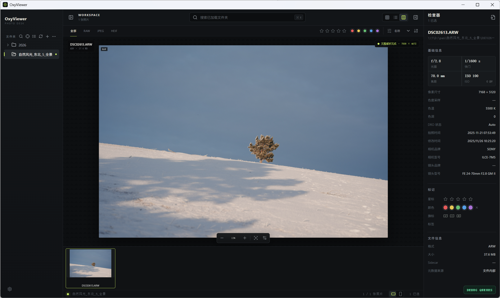

# OxyViewer

**English** | [中文](README.zh.md)

> OxyViewer is an experimental, fully AI-built Tauri project and is currently in pre-release.

OxyViewer is a local-first desktop application dedicated to smooth photo
browsing, reviewing, and management.

OxyViewer uses Tauri 2 for its desktop core. It supports modern photo workflows,
including RAW, JPEG, and HEIF previews, progressive full-detail viewing, color
management, and metadata filtering.

## Documentation

- See [CONTRIBUTING.md](CONTRIBUTING.md) for prerequisites, build commands,
  verification, and pull-request guidance.
- Use the [documentation index](docs/README.md) to find the current architecture,
  performance, format, packaging, task-plan, and research documents.

## License

OxyViewer is dual-licensed. You may use it under the
[GNU Affero General Public License version 3](LICENSE-AGPL-3.0), or obtain a
separate [OxyViewer Commercial License](LICENSE-COMMERCIAL.md) for proprietary
or other uses that do not comply with the AGPL. Commercial use is permitted
under the AGPL when all AGPL conditions are satisfied.

Commercial licensing is issued by the repository owner and copyright holder;
contact [oxygenkun.1@gmail.com](mailto:oxygenkun.1@gmail.com). Separately
licensed and third-party components retain their own license terms.
