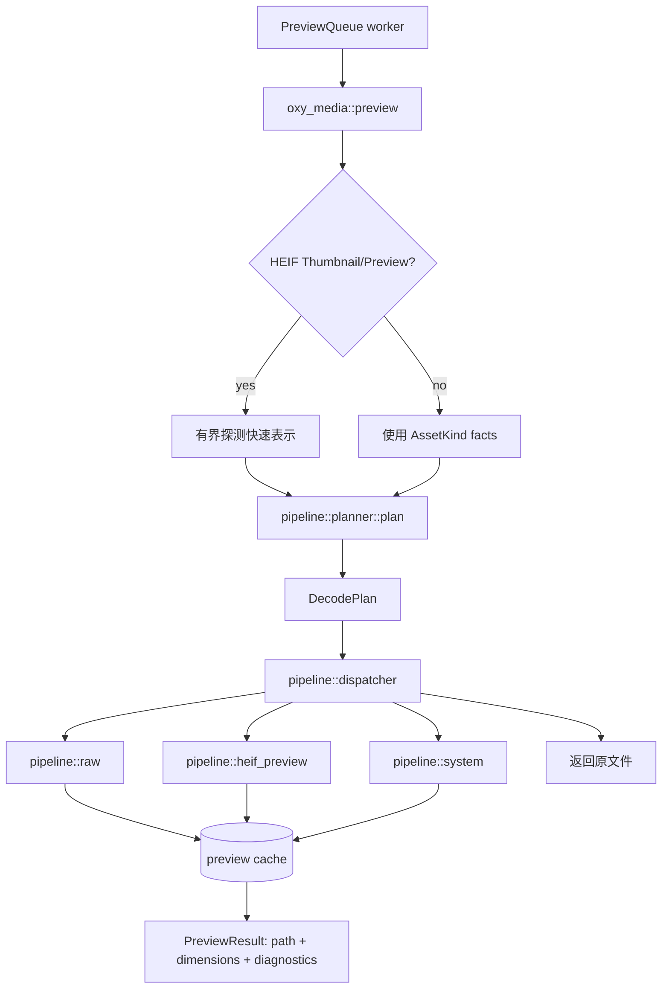
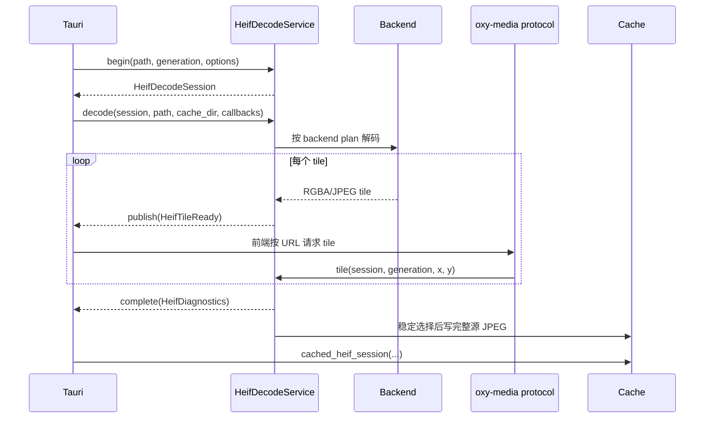

# oxy-media

`oxy-media` 是 OxyViewer 的媒体预览执行层。它负责把语义化的渲染请求转换为本地缓存
artifact，并管理 RAW/HEIF/TIFF 的解码后端、优先级、fallback、并发限制和 HEIF 渐进 tile
session。

本 crate 不负责目录扫描、资源分类、SQLite projection 状态或前端调度。调用者应先通过
`oxy-fs` 获得 `AssetKind`，再把具体资源交给这里处理。图片字节不会通过普通 JSON IPC 返回；
预览接口返回本地 artifact 路径，HEIF tile 则通过自定义协议读取。

更完整的架构背景见：

- [`../../docs/architecture/03-preview-pipeline.md`](../../docs/architecture/03-preview-pipeline.md)
- [`../../docs/adr/0005-unified-preview-pipeline.md`](../../docs/adr/0005-unified-preview-pipeline.md)
- [`../../docs/adr/0006-semantic-render-level-graph.md`](../../docs/adr/0006-semantic-render-level-graph.md)

## 公共接口

crate 根模块只提供稳定 API re-export；`backends`、`formats`、`pipeline` 和 `cache` 的内部实现
不应由其他 crate 直接调用。

### 统一预览

```rust
pub fn preview(
    path: &Path,
    cache_dir: &Path,
    level: RenderLevel,
    priority: DecodePriority,
    kind: AssetKind,
) -> Result<PreviewResult, MediaError>
```

这是普通预览请求的主入口，也是 Tauri preview worker 对可解码格式调用的唯一入口。

- `path`：源文件路径。
- `cache_dir`：应用拥有的扁平 preview cache 目录。
- `level`：语义等级 `Thumbnail | Preview | Full`；调用者不传具体像素尺寸。
- `priority`：Rust decode gate 的排队优先级。
- `kind`：调用者已识别的 `AssetKind`。
- 返回值：`oxy_domain::PreviewResult`，包含 artifact 路径、尺寸、表示种类、渲染等级和可选诊断。

当前语义映射：

| 格式 | Thumbnail | Preview | Full |
| --- | --- | --- | --- |
| JPEG/PNG/WebP 等普通栅格图 | 原文件 | 原文件 | 原文件 |
| RAW | 512 目标预览 | 4096 目标预览 | 近全尺寸相机 JPEG，或完整 development |
| HEIF/HIF | 160 快速表示或 512 decode | 160 快速表示或 4096 decode | 完整源图 JPEG |
| TIFF | macOS system preview 512 | macOS system preview 512 | macOS system preview 4096 |

Windows/Linux 当前没有 TIFF system-preview backend，会返回
`MediaError::NativeDecoderUnavailable`。

### 优先级转换

```rust
pub fn decode_priority_for(priority: PreviewPriority) -> DecodePriority
```

把 IPC/domain 层优先级转换为 decode gate 优先级：

| `PreviewPriority` | `DecodePriority` |
| --- | --- |
| `Loupe` | `Foreground` |
| `Visible` | `Visible` |
| `Nearby` | `Background` |
| `Preload` | `Background` |

高优先级请求可以越过尚未开始的低优先级请求，但不会抢占已经运行的 decode。
`HeifDecodePriority` 是 `DecodePriority` 的兼容别名；新代码应使用 `DecodePriority`。

### 尺寸读取

```rust
pub fn dimensions(path: &Path) -> Result<ImageDimensions, MediaError>
```

依次尝试普通栅格图片、libheif 和 LibRaw，只读取尺寸，不生成预览。返回的
`ImageDimensions` 包含 `width` 和 `height`。

尺寸读取仍可能访问媒体容器，因此不要在打开目录时对所有文件同步调用；应放在 metadata/detail
后台工作中。

### HEIF 完整图 session

```rust
pub struct HeifDecodeService;
```

`HeifDecodeService` 用于完整 HEIF 的渐进 tile 发布。一个 service 同时只维护一个 active
session；开始新 session 会取消旧 session，并清空旧 tile。

主要方法：

| 方法 | 用途 |
| --- | --- |
| `capabilities()` | 返回当前平台可用/不可用的 HEIF backend 及加速信息 |
| `begin(...)` | 选择 backend、替换旧 session，并返回 `HeifDecodeSession` |
| `decode(...)` | 在 blocking worker 中执行 decode，通过回调发布 tile 和完成状态 |
| `tile(...)` | 按 session、generation 和坐标读取已发布的 `HeifTile` |
| `cancel(session_id)` | 协作取消当前匹配的 session |
| `diagnostics()` | 返回最近一次成功 session 的诊断信息 |
| `status_event(...)` | 构造供 Tauri 发送的 `HeifStatusEvent` |

`decode` 是阻塞调用，不应运行在 async/UI 线程。`session.id + generation` 共同防止旧 decode
向新选择发布迟到 tile。

```rust
let service = oxy_media::HeifDecodeService::default();
let session = service.begin(path, generation, hardware_acceleration, display_sharpening)?;

let diagnostics = service.decode(
    &session,
    path.to_owned(),
    cache_dir,
    hardware_acceleration,
    |tile_ready| publish_tile_event(tile_ready),
    |diagnostics| publish_complete_event(diagnostics),
)?;
```

平台默认 tile 大小由 `DEFAULT_TILE_SIZE` 暴露：Windows 为 1024，macOS/Linux 为 512。
`HeifTile` 可能包含 RGBA bytes，或在 Windows FFmpeg tile-grid 路径中包含已编码 JPEG；这些
bytes 应通过 `oxy-media://` 协议提供，不应塞入 JSON IPC。

### HEIF cache 查询与尺寸型 benchmark 入口

```rust
pub fn cached_heif_session(
    path: &Path,
    cache_dir: &Path,
) -> Result<Option<PreviewResult>, MediaError>
```

这是只读查询：检查完整源 HEIF JPEG 是否已经存在，不会启动 decode。Tauri 用它实现
`get_cached_heif_full`，并在 session 完成后通知前端 cache 已就绪。

```rust
pub fn heif_preview(
    path: &Path,
    cache_dir: &Path,
    max_size: u32,
) -> Result<PreviewResult, MediaError>
```

该入口保留给 `heif_display_bench` 等需要明确像素尺寸的工具。应用业务代码应调用语义化的
`preview(...)`，避免在调用层复制尺寸和格式策略。

### Cache 管理

```rust
pub fn preview_cache_usage(cache_dir: &Path) -> Result<CacheUsage, MediaError>;
pub fn prune_preview_cache(
    cache_dir: &Path,
    max_size_bytes: u64,
    protected_path: Option<&Path>,
) -> Result<CacheUsage, MediaError>;
pub fn clear_preview_cache(cache_dir: &Path) -> Result<CacheUsage, MediaError>;
```

- `preview_cache_usage`：统计 cache 目录第一层普通文件。
- `prune_preview_cache`：按修改时间从旧到新删除，直到满足容量限制；可保护当前刚返回的 artifact。
- `clear_preview_cache`：只删除目录第一层普通文件，不递归删除子目录。
- `CacheUsage` 返回 `size_bytes` 和 `file_count`。

Cache 是可重建数据。调用者负责选择应用专属目录，并避免把任意用户目录直接交给清理接口。

### 版本和错误

```rust
pub const PREVIEW_POLICY_VERSION: &str;
pub enum MediaError;
```

`PREVIEW_POLICY_VERSION` 应包含在持久化 image projection 的 source revision 中。媒体行为发生
不兼容变化时，版本更新可防止数据库中的 ready projection 指向旧策略 artifact。

`MediaError` 区分 IO/image 错误、decoder 不可用、LibRaw/libheif/native backend 失败、颜色
转换失败、取消、完整 backend 尝试链失败和 system preview 失败。调用者应单独识别
`MediaError::Cancelled`；它不是允许继续尝试低优先级 fallback 的普通 decode 失败。

## 普通预览调用流程



执行阶段遵循以下顺序：

1. HEIF thumbnail/preview 在请求到达时执行有界 probe；目录扫描阶段不探测媒体内容。
2. planner 根据 `SourceFacts + RenderLevel + Platform + BackendCapabilities` 产生纯数据
   `DecodePlan`。
3. dispatcher 只执行 planner 明确给出的 step/fallback，不在 Tauri command 中复制格式分支。
4. pipeline 先检查精确 cache，再尝试复用更高等级 cache。
5. 需要源 decode 时先进入优先级 gate，再取得同源文件锁；取得锁后重新检查 cache。
6. 新 artifact 在 cache 目录中写临时文件，完成编码/校验后原子提交。
7. 返回 artifact 路径；调用方再更新最近使用时间、projection 状态并异步触发容量清理。

特殊并发规则：

- RAW full development 使用独立锁，不占用普通 thumbnail/preview decode gate。
- HEIF 缩略预览和 tile session 在内存 decode 完成后，会在后续 JPEG encode/fsync 前释放
  decode permit；直接生成 full artifact 的 backend transcode 作为一次完整操作受 gate 保护。
- 同一源文件的并发请求通过 source lock 合并，等待者在真正解码前再次检查 cache。
- Sony HIF 已验证的 160px 内嵌 JPEG 不进入 HEVC decode gate。

## Fallback 流程

dispatcher 当前只接受 planner 产生的两类有序 fallback：

1. RAW preview 失败后尝试 system preview；若二者都失败，保留原始 RAW 错误和 system
   fallback 错误文本。
2. HEIF full 失败后尝试 foreground 8192px HEIF preview，避免放大镜完全空白。

HEIF 内部 backend 顺序由 `pipeline::heif` 决定，并记录 backend 尝试诊断。取消会立即终止
计划，不会被解释为“尝试更慢兼容 backend”的许可。

## HEIF session 调用流程



## 内部模块边界

| 模块 | 职责 |
| --- | --- |
| `pipeline::planner` | 纯策略：语义等级、格式、平台和能力 → `DecodePlan` |
| `pipeline::dispatcher` | 执行 `DecodePlan` 和跨格式 fallback |
| `pipeline::raw` | RAW embedded/developed/full 流程及 backend 顺序 |
| `pipeline::heif` | HEIF backend 探测、选择、尝试诊断 |
| `pipeline::heif_preview` | HEIF preview/full artifact 和 source-JPEG cache |
| `pipeline::system` | 平台 system preview |
| `backends` | ImageIO、Core Image、WIC、FFmpeg、libheif、LibRaw 适配器 |
| `formats` | 文件格式知识和窄范围兼容规则，例如 Sony SHIF |
| `decode_control` | decode gate、RAW full 锁、HEIF cache-write 锁和同源锁 |
| `cache` | cache key、JPEG/bytes 编码、原子提交和容量管理 |
| `media_source` | 尺寸读取、JPEG 完整性检查和 `PreviewResult` 构造 |
| `presentation` | artifact 的方向、颜色和表示契约 |

新增格式时，应先扩展 domain `AssetKind` 和 planner 策略，再添加 pipeline executor 与必要
backend；不要在 Tauri command 中增加新的格式 `match`。
