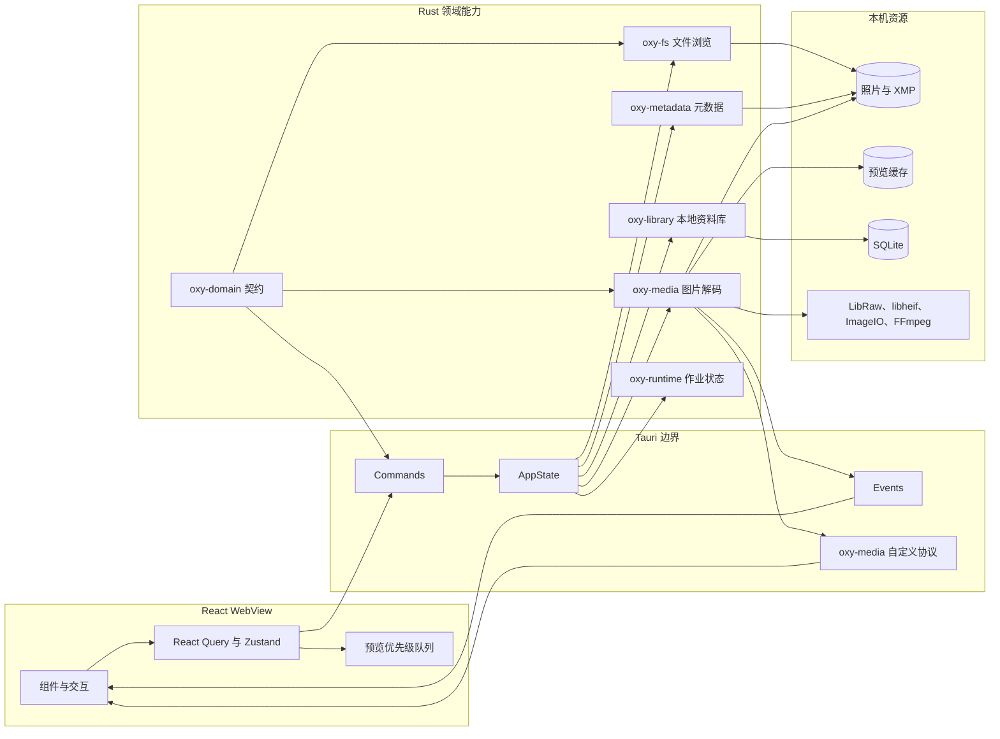
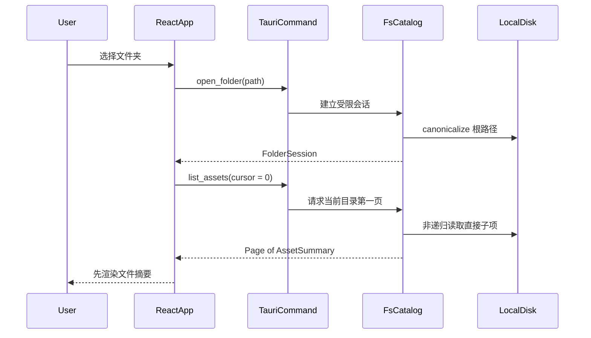

# OxyViewer 架构设计

本文是 OxyViewer 架构文档的入口。它先给出一张完整地图，再把读者带到各个专题。
即使你没有 Rust 或 Tauri 经验，也可以从本页开始；如果你已经熟悉桌面应用开发，
可以直接跳到感兴趣的实现章节。

> 文档描述的是当前仓库中的实现。尚未实现的能力会明确标记为“规划中”，不会把路线图
> 当成现状。最后核对日期：2026-09-01。

## 1. 一句话理解 OxyViewer

OxyViewer 是一个“React 界面 + Rust 本地能力”的桌面照片浏览器：

- React 负责界面、交互、可见区域判断和请求编排；
- Tauri 把 Web 界面装进原生桌面窗口，并提供 JavaScript 调用 Rust 的桥梁；
- Rust 负责文件系统访问、图片解码、缓存、元数据和 SQLite；
- 原始照片始终留在本机，SQLite 和预览图都只是可删除、可重建的缓存。

最重要的产品约束是：**打开文件夹不能等待递归导入、全量索引或图片解码。**
打开后先返回便宜的文件摘要，缩略图、详情和索引按需延后。这一决策记录在
[ADR 0001](adr/0001-no-blocking-import.md) 中。

## 2. 阅读路线

| 目标 | 建议阅读 |
| --- | --- |
| 10 分钟建立整体认识 | 本页第 3～8 节 |
| 第一次接触 Rust/Tauri | [01：Rust 与 Tauri 运行时](architecture/01-rust-tauri-runtime.md) |
| 理解打开文件夹为什么快 | [02：文件夹浏览与分页](architecture/02-folder-browsing.md) |
| 理解缩略图、RAW、HEIF | [03：统一预览流水线](architecture/03-preview-pipeline.md) |
| 深入 HEIF 全分辨率显示 | [04：HEIF 会话与瓦片协议](architecture/04-heif-tile-session.md) |
| 理解状态、SQLite、元数据 | [05：状态、数据与安全边界](architecture/05-data-and-state.md) |
| 准备新增功能或格式 | [06：扩展、调试与验证](architecture/06-extension-guide.md) |
| 查一个类型或命令属于哪里 | [架构索引](architecture/README.md) |

推荐按 `本页 → 01 → 02 → 03` 阅读。04～06 是按需深入章节。

## 3. 先补三个基础概念

### 3.1 Rust crate 是什么

crate 可以先理解成一个“有清晰公共接口的 Rust 包”。本仓库把不同职责拆到多个 crate，
例如 `oxy-fs` 只关心文件系统，`oxy-media` 只关心媒体解码。crate 之间通过 Rust 类型和
函数调用协作，不是通过网络通信，也不是多个后台进程。

### 3.2 Tauri 是什么

Tauri 应用包含两部分：

1. 一个系统 WebView，运行 React/TypeScript；
2. 一个本地 Rust 进程，拥有文件系统和原生 API 权限。

前端使用 `invoke("command_name", args)` 调用带 `#[tauri::command]` 的 Rust 函数。
参数和返回值会被序列化，效果类似调用本机 API，但没有 HTTP 服务器。

### 3.3 IPC 是什么

IPC 是 Inter-Process Communication，这里泛指前端 WebView 与 Rust 之间的通信边界。
OxyViewer 通过三种通道传递不同数据：

| 通道 | 方向 | 适合传递 | 当前示例 |
| --- | --- | --- | --- |
| Tauri command | 前端请求，Rust 返回 | 小型结构化数据 | 文件页、详情、预览路径 |
| Tauri event | Rust 主动通知前端 | 状态和事件元数据 | HEIF 瓦片已就绪 |
| 自定义协议 | 前端按 URL 读取 Rust 数据 | 二进制内容 | `oxy-media://...` RGBA 瓦片 |

关键规则是：**图片字节不放进 JSON command 返回值。** 普通预览返回文件 URL；HEIF
全分辨率像素通过自定义协议读取。这样避免大块二进制被 JSON 编码、复制和占用主线程。

## 4. 系统全景



这是一款单机应用，不是微服务系统。图中的“层”表示代码和权限边界，而不是需要独立部署
的服务。Rust crates 最终链接进同一个 Tauri 应用进程。

## 5. 仓库结构与职责

```text
apps/desktop/src/             React 前端
apps/desktop/src-tauri/       Tauri 启动、命令、状态和协议注册
crates/oxy-domain/            跨 Rust/TypeScript 边界的公共数据契约
crates/oxy-fs/                文件发现、会话、分页、路径校验、文件操作
crates/oxy-media/             尺寸读取、预览生成、RAW/HEIF/native adapters
crates/oxy-metadata/          XMP 写入和未来 ExifTool 边界
crates/oxy-library/           SQLite 资料库和显式根目录
crates/oxy-runtime/           作业 ID、优先级和取消标记
docs/adr/                     重要且难以逆转的架构决策
```

各层的“允许做什么”和“不能做什么”：

| 模块 | 主要职责 | 不应承担 |
| --- | --- | --- |
| React | 展示、交互、虚拟列表、可见性、请求生命周期 | 直接访问本机文件系统 |
| `src-tauri` | 参数转换、状态装配、阻塞任务转交、事件发布 | 承载可复用业务算法 |
| `oxy-domain` | 可序列化契约和共享词汇 | 文件 IO、解码、数据库操作 |
| `oxy-fs` | 安全路径、非递归扫描、分页、文件操作 | UI 状态、图片解码 |
| `oxy-media` | 解码、预览、缓存、HEIF 会话 | React/Tauri 组件逻辑 |
| `oxy-metadata` | XMP/ExifTool 策略 | 任意文件浏览 |
| `oxy-library` | 可重建索引、显式资料库根目录 | 成为照片的唯一事实来源 |
| `oxy-runtime` | 后台作业的通用控制词汇 | 具体媒体算法 |

## 6. 三条最重要的运行路径

### 6.1 打开文件夹



`open_folder` 本身不递归扫描，也不生成缩略图。第一次 `list_assets` 会建立当前目录的
内存快照，再按查询条件排序、过滤和切页。后续页复用快照。详见
[02：文件夹浏览与分页](architecture/02-folder-browsing.md)。

### 6.2 普通预览和 RAW 预览

```mermaid
flowchart LR
    visible["资源进入可见区域"] --> stage512["请求 512 px"]
    stage512 --> direct{WebView 可直接显示?}
    direct -->|是| original["返回原文件 URL"]
    direct -->|否| frontendQueue["前端优先级队列"]
    frontendQueue --> command["get_preview command"]
    command --> blocking["spawn_blocking"]
    blocking --> dispatcher["oxy_media::preview"]
    dispatcher --> cache{缓存命中?}
    cache -->|是| previewUrl["返回缓存 URL"]
    cache -->|否| decodeGate["后端 DecodeGate"]
    decodeGate --> decoder["格式解码器"]
    decoder --> cacheWrite["写入生成预览缓存"]
    cacheWrite --> previewUrl
    previewUrl --> upgrade{在放大镜中?}
    upgrade -->|否| display["显示缩略图"]
    upgrade -->|是| heif{HEIF?}
    heif -->|是| heifTiles["启动全分辨率瓦片会话"]
    heifTiles --> display
    heif -->|否| stage4096["升级到 4096 px"]
    stage4096 --> rawFull{RAW?}
    rawFull -->|否| display
    rawFull -->|是| fullStage["独立通道开发全分辨率"]
    fullStage --> display
```



预览采用渐进式替换：先有可看的图，再提升清晰度。优先级只重排尚未开始的任务，
不会中断已经进入原生解码器的工作。详见
[03：统一预览流水线](architecture/03-preview-pipeline.md) 和
[ADR 0005](adr/0005-unified-preview-pipeline.md)。

### 6.3 HEIF 全分辨率显示

HEIF 在放大镜中先保留 512 px JPEG 作为临时底图，不再额外生成 4096 px JPEG；同时启动一个只能有一个活跃实例的
解码会话。Rust 解码整图并按中心优先顺序发布 RGBA 瓦片，React Canvas 将其覆盖到底图上。
切换照片时使用 `generation` 和 `sessionId` 拒绝迟到瓦片。

详见 [04：HEIF 会话与瓦片协议](architecture/04-heif-tile-session.md) 和
[ADR 0004](adr/0004-heif-full-resolution-sessions.md)。

## 7. 为什么这样设计

### 7.1 立即打开，而不是先导入

照片目录可能包含十万文件。递归扫描、元数据提取和缩略图生成都可能耗时数秒到数分钟。
因此打开路径只建立会话，浏览路径只扫描当前目录，昂贵工作由可见性和选择状态触发。

### 7.2 把阻塞工作移出异步/UI 线程

文件枚举、图片解码和 SQLite 调用不是浏览器式的异步网络 IO。Tauri command 对这些操作
使用 `spawn_blocking`，避免卡住负责处理窗口与其他 command 的异步运行时线程。前端又用
虚拟列表控制实际挂载的缩略图数量，两个边界共同保护响应速度。

### 7.3 缓存不是事实来源

生成预览和 SQLite 资产记录都可以重建。真实照片、用户明确写入的 XMP，以及用户选择的
资料库根目录才是需要保护的数据。缓存版本进入文件名计算，算法变化后旧缓存会自然失效。

### 7.4 薄 Tauri 层

Tauri command 只负责：取状态、校验/转换参数、把阻塞工作转移到线程池、调用 crate、
把错误转成 IPC 可传输形式。这样媒体和文件逻辑可以用普通 Rust 单元测试验证，不必启动窗口。

## 8. 当前实现与规划边界

| 能力 | 当前状态 |
| --- | --- |
| 当前目录非递归扫描、内存快照、分页 | 已实现 |
| 排序、搜索、类型过滤、虚拟滚动 | 已实现 |
| RAW 512 → 4096 → full 渐进预览 | 已实现 |
| HEIF 512 临时底图 → 全分辨率瓦片 | 已实现 |
| 统一前端预览队列和后端解码门 | 已实现；不抢占运行中的解码 |
| XMP sidecar 写入 | RAW 已实现基础版本 |
| SQLite 显式资料库根目录 | 已实现 |
| SQLite 后台资产索引 | 数据表已存在，完整索引流程仍在规划中 |
| 文件系统 watcher 和 `folder_delta` | 规划中 |
| 解码过程中的协作式取消 | 规划中 |
| 10 万文件性能门槛实测 | 尚未完成 |

更细的进度以 [ROADMAP.md](ROADMAP.md) 为准；性能目标与历史测量见
[PERFORMANCE.md](PERFORMANCE.md)。

## 9. 架构不变量

修改代码时应优先保护以下约束：

1. 打开文件夹不能触发递归导入或同步索引。
2. 首屏只依赖便宜、可分页的文件摘要。
3. 图片字节不能通过 JSON IPC 返回。
4. 解码、预览和大量文件 IO 不能阻塞 UI/异步执行线程。
5. 公共 IPC 契约放在 `oxy-domain`，Rust serde 字段使用 camelCase 对齐 TypeScript。
6. Tauri 层保持薄，复用逻辑进入对应 crate。
7. 源照片不依赖缓存存活；SQLite 资产索引和预览文件必须可重建。
8. 文件操作必须经过 `oxy-fs` 的安全边界。
9. 新媒体路径必须尊重优先级、缓存版本和取消语义。

## 10. 从哪里看代码

| 想回答的问题 | 起点 |
| --- | --- |
| 前端怎样调用 Rust | `apps/desktop/src/lib/api.ts` |
| command 在哪里注册 | `apps/desktop/src-tauri/src/lib.rs` |
| IPC 数据长什么样 | `crates/oxy-domain/src/lib.rs` |
| 文件夹如何限制在根目录内 | `crates/oxy-fs/src/lib.rs` 的 `FsCatalog` |
| 预览怎样选择解码器 | `crates/oxy-media/src/lib.rs` 的 `preview` |
| HEIF 瓦片怎样管理 | `crates/oxy-media/src/heif_service.rs` |
| 组件怎样渐进升级图片 | `apps/desktop/src/components/Thumbnail.tsx` |
| HEIF Canvas 怎样取瓦片 | `apps/desktop/src/components/HeifTileCanvas.tsx` |
| UI 请求与选择状态 | `apps/desktop/src/App.tsx`、`store.ts` |

继续阅读：[架构专题索引](architecture/README.md)。
