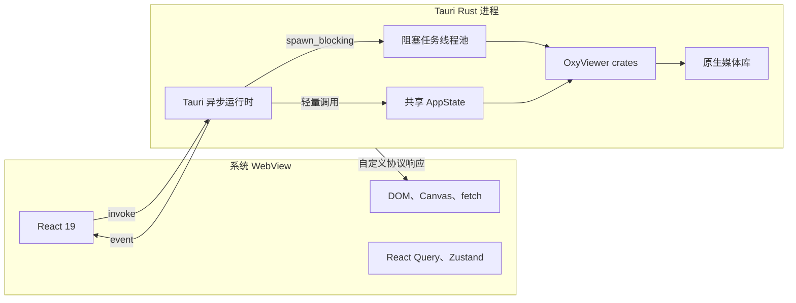
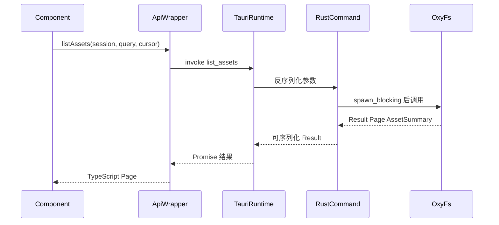
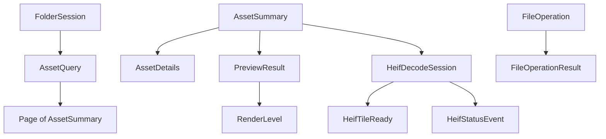

# 01：Rust 与 Tauri 运行时

本章解释 OxyViewer 是怎样从 React 进入 Rust 的。目标不是教授完整 Rust 语法，而是让熟悉
JavaScript、Java、C# 或其他语言的程序员能读懂项目的控制流和并发边界。

## 1. 进程模型

从开发者视角看，OxyViewer 有两个执行环境：



“两个执行环境”不要求你处理网络、端口或远程部署。Tauri 提供了本地 IPC 桥接，应用仍作为
一个桌面产品安装和启动。

## 2. 从 TypeScript 到 Rust command

以列出文件为例，调用链有四层：

1. React 组件通过 `useInfiniteQuery` 发起请求；
2. `apps/desktop/src/lib/api.ts` 的 `listAssets` 包装 `invoke`；
3. `apps/desktop/src-tauri/src/commands/folder.rs` 的 `list_assets` command 接收参数；
4. command 调用 `oxy_fs::FsCatalog::list_assets`。



### 2.1 命名转换

Rust 通常使用 `snake_case`，TypeScript 通常使用 `camelCase`。两处转换需要区分：

- command 名按 Rust 函数名调用，例如 `list_assets`；
- 参数对象由 Tauri 映射，前端传 `sessionId`，Rust 参数叫 `session_id`；
- domain struct 使用 `#[serde(rename_all = "camelCase")]`，所以 `root_path` 序列化为
  `rootPath`。

公共结构变化时必须同时核对 `oxy-domain` 和 `apps/desktop/src/types.ts`。当前项目没有自动
生成 TypeScript 类型，因此编译通过不代表跨语言结构一定一致。

## 3. Tauri command 应该多薄

一个理想 command 只做以下事情：

1. 从 `State<'_, AppState>` 取共享服务；
2. 做 IPC 边界需要的参数检查或默认值处理；
3. 必要时使用 `spawn_blocking`；
4. 调用某个 crate 的公共函数；
5. 把错误转为前端可接收的字符串或结构化错误。

媒体格式分派属于 `oxy-media`，路径安全属于 `oxy-fs`，SQLite 语句属于 `oxy-library`。
如果一个 command 出现大量算法、文件遍历或格式分支，通常说明逻辑放错层了。

## 4. `AppState`：Rust 侧的依赖容器

应用启动时，`run()` 创建并注册一个 `AppState`：

| 字段 | 类型概念 | 生命周期 | 作用 |
| --- | --- | --- | --- |
| `files` | `Arc<FsCatalog>` | 整个应用 | 文件夹会话和目录快照 |
| `jobs` | `JobRegistry` | 整个应用 | 后台作业 ID 和取消标记 |
| `library` | `Arc<Library>` | 整个应用 | SQLite 连接和资料库根目录 |
| `cache` | `Arc<CacheManager>` | 整个应用 | 当前预览目录、容量策略、使用量和清理协调 |
| `heif` | `Arc<HeifDecodeService>` | 整个应用 | 当前 HEIF 会话和内存瓦片 |
| `metadata` / `metadata_provider` | facade / provider manager | 整个应用 | 原生读取与可选 ExifTool 能力发现 |
| `metadata_queue` / `preview_queue` | 资源协调队列 | 整个应用 | 合并请求、优先级、projection 接受与发布 |
| `directory_tree_queue` | 目录加载队列 | 整个应用 | 按活动根目录/节点重排按层读取 |

`app.manage(state)` 把它交给 Tauri。command 参数中的 `State<'_, AppState>` 是借用，不会为
每次调用重新创建数据库或媒体服务。

## 5. 读懂项目中常见的 Rust 类型

### 5.1 `Result<T, E>`

Rust 用 `Result` 明确表示一次操作可能成功或失败：

```text
Ok(value)   成功并携带 T
Err(error)  失败并携带 E
```

`?` 表示“失败就立即返回该错误，成功则取出值”。项目内 crate 使用 `thiserror` 定义具体
错误；Tauri command 当前多用 `.map_err(|error| error.to_string())` 转成 IPC 字符串。

### 5.2 `Option<T>`

`Option` 表示值可能不存在：`Some(value)` 或 `None`。它对应 TypeScript 中常见的可选值，
例如未提供的 cursor、没有 sidecar 的照片或尚无诊断信息。

### 5.3 所有权、借用与 `Arc`

Rust 值默认有唯一所有者。`&Path` 是只在调用期间借用路径，`PathBuf` 是拥有路径数据。
`Arc<T>` 是线程安全的引用计数共享所有权，作用类似“多个任务共享同一个服务对象”。

这里使用 `Arc` 不等于对象自动线程安全。对象内部仍需 `Mutex` 或 `RwLock` 保护可变状态。

### 5.4 `Mutex` 与 `RwLock`

- `Mutex<T>`：同一时刻一个任务访问内部值；适合 SQLite 连接、单飞解码等。
- `RwLock<T>`：允许多个读者或一个写者；适合读取频繁、更新较少的会话和缓存映射。
- `parking_lot` 和标准库都提供锁，本仓库按 crate 需求混合使用。

不要在持锁时执行不必要的长解码。`oxy-media` 的门和 per-file lock 是有意设置的并发控制，
新增锁必须先明确保护的数据、锁顺序和持有时间。

## 6. 异步不等于自动并行

`async fn` 只表示函数可以挂起并让出执行线程。文件系统枚举和原生图片解码通常是阻塞
工作；如果直接在 async command 中运行，仍会卡住异步工作线程。

因此项目使用：

```text
async command
  -> clone 所需 Arc/PathBuf
  -> tauri::async_runtime::spawn_blocking(move || ...)
  -> 在线程池执行阻塞操作
  -> await 线程池结果
```

这里的 `move` 表示闭包取得所捕获值的所有权，使任务可以安全地在线程池中活到 command
当前栈帧结束之后。

适合 `spawn_blocking` 的工作包括：目录枚举、媒体解码、大量同步文件 IO。纯粹取一个内存
状态或设置取消标记不需要它。

## 7. 三种 Tauri 通信通道

### 7.1 Command：请求/响应

适合小型结构化数据。当前 command 包括：

- 文件：`open_folder`、`list_assets`、目录树/目录搜索、刷新和文件管理器操作；
- 详情/预览：`get_asset_details`、`request_metadata`、`get_preview` 与 scope 调度命令；
- 设置/写操作：缓存设置、`execute_file_operation`、`patch_metadata`、内嵌同步与 ExifTool 配置；
- 资料库：根目录添加、移除、排序和列出；
- 作业/HEIF：`cancel_job`、HEIF capability、`start_heif_full` 与 session 取消命令；
- 性能 harness：场景读取与 runner-owned 报告写入。

### 7.2 Event：Rust 主动推送状态

HEIF 后台解码不会让 command 等到所有瓦片完成。`start_heif_full` 要么返回已完成 artifact
projection，要么很快返回 session；后者通过 `app.emit` 发布 `heif-tile-ready` 和
`heif-decode-status`。前端用 `listen` 订阅。

Event 仍走序列化边界，所以只发送 session、坐标、尺寸、URL、状态和耗时，不发送像素。

### 7.3 自定义协议：二进制读取

`register_uri_scheme_protocol("oxy-media", ...)` 注册本地 URL handler。Canvas 收到瓦片事件
后 `fetch` 该 URL，Rust 从 `HeifDecodeService` 的内存映射中取出 RGBA 或已编码 JPEG tile
并返回。响应头携带内容类型、宽、高和 stride，响应 body 才是二进制图片数据。

## 8. Domain 契约是边界语言

`oxy-domain` 不做 IO。它定义跨层都能理解的名词：



把契约集中在一个 crate 有两个好处：Tauri 不会定义一套重复模型，媒体/文件系统也不会
各自发明不同的优先级和状态词汇。

## 9. 浏览器 demo 与桌面模式

`api.ts` 通过 `isTauri()` 判断是否存在 Tauri runtime。浏览器开发模式提供 demo assets 和
有限的模拟行为，使前端无需启动 Rust 就能开发布局。但任何涉及真实文件、原生解码、协议
或事件的行为，最终都必须在 Tauri 桌面模式验证。

## 10. 本章检查点

读完后应能回答：

- React 为什么不能直接 import 一个 Rust 函数？
- command、event、自定义协议分别传什么？
- 为什么图片字节不能作为 `get_preview` 的 JSON 返回值？
- 为什么 async command 中仍需要 `spawn_blocking`？
- `Arc<FsCatalog>` 与每次创建一个 `FsCatalog` 有什么生命周期差异？
- 新的公共字段为什么必须同时核对 Rust serde 和 TypeScript 类型？

下一章：[02：文件夹浏览与分页](02-folder-browsing.md)。
