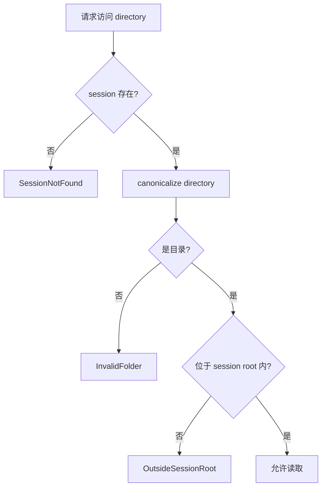
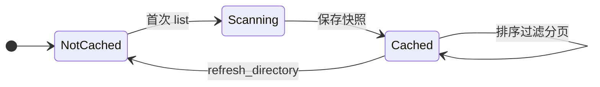
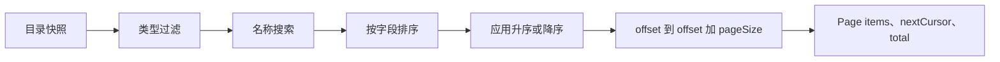
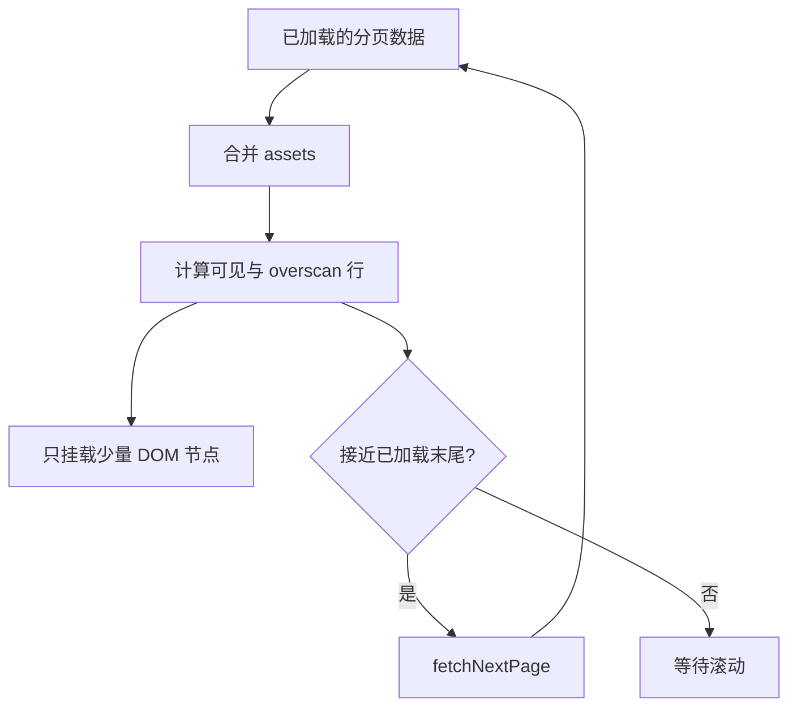

# 02：文件夹浏览与分页

本章跟踪“选择文件夹 → 看到首屏 → 滚动加载更多”的完整路径。这里最重要的不是某个函数，
而是把**安全边界、磁盘扫描、查询分页和 DOM 渲染**分成四个成本层级。

## 1. 性能目标怎样塑造架构

目标是本地 SSD 上，十万文件目录的第一页在 300 ms 内开始渲染。当前仓库尚未完成这个规模
的正式测量，但实现从一开始就遵守以下策略：

- 打开不递归；
- 首屏不读完整元数据，不解码图片；
- 当前目录只建立轻量摘要；
- 摘要快照在内存中复用；
- IPC 每次最多返回一页；
- React 只把可见行附近的节点挂到 DOM。

这四层经常被混淆：后端分页减少 IPC 数据量，虚拟列表减少 DOM 数量；后端当前仍会在首次
访问目录时扫描该目录的全部直接文件以形成内存快照。换句话说，当前实现是“非递归 + 返回
分页”，还不是能够中途停止 `read_dir` 的流式扫描器。

## 2. `FolderSession` 是安全能力，不只是 DTO

用户选定一个目录后，`FsCatalog::open_folder` 会：

1. `canonicalize` 路径，解析相对段和符号链接后的真实位置；
2. 验证它确实是目录；
3. 生成 session ID；
4. 在内存中记录 `sessionId -> canonical root`；
5. 返回 `FolderSession`。

随后 `list_assets`、`list_directories` 和 `refresh_directory` 都必须带 session ID。访问子目录
时，`resolve_session_directory` 会再次 canonicalize，并检查它是否 `starts_with(root)`。



这阻止前端仅通过构造路径就越过用户打开的根目录。session 只存于内存，应用重启后失效；
但用户在左侧打开的根目录由 `oxy-library` 持久化。下次启动时前端读取这些根目录并重新建立
session，同时恢复每个根目录最后浏览的子路径。根目录可独立添加和移除，也允许父目录与子目录
同时存在。

多个根目录不会复制图片缓存：`FsCatalog` 的目录快照以 canonical directory 为键并在所有 session
间共享，磁盘预览缓存也先 canonicalize 图片路径再生成 key。因此同一张图片从父根目录、子根目录
或符号链接别名访问时只对应一份预览缓存。

## 3. 摘要为何便宜

`scan_assets` 只迭代当前目录的直接子项。`summary_for_path` 对受支持文件读取：

| 字段 | 来源 | 成本 |
| --- | --- | --- |
| `id` | 路径稳定哈希 | 低 |
| `path`、`name`、`extension` | 目录项路径 | 低 |
| `kind` | 扩展名映射 | 低 |
| `sizeBytes` | 文件 metadata | 低 |
| `modifiedAtMs` | 文件 metadata | 低 |
| `hasSidecar` | 同名 `.xmp` 是否存在 | 低至中 |

它不打开图片解码像素，不提取 EXIF，不计算直方图，也不进入子目录。尺寸属于
`get_asset_details` 的按需路径，而不是列表摘要。

当前识别的类型：RAW（ARW、CR2、CR3、NEF、DNG、RAF、RW2、ORF）、JPEG、HEIF/HEIC/HIF、
PNG、TIFF 和 WebP。唯一事实来源是 `oxy-fs` 的 `kind_for_extension`；格式支持成熟度另见
[FORMAT_SUPPORT.md](../FORMAT_SUPPORT.md)。

## 4. 内存快照

`FsCatalog` 有两个缓存：

```text
asset_cache:     directory -> Arc<Vec<AssetSummary>>
directory_cache: directory -> Arc<Vec<DirectorySummary>>
```

第一次访问目录时读取磁盘，后续排序、过滤和分页基于同一份 `Vec`。使用 `Arc` 可让多个请求
共享不可变快照，`RwLock` 保护目录到快照的映射。



注意：当前没有文件系统 watcher。外部程序新增、删除或修改文件后，快照不会自动更新；用户
执行刷新时，后端删除该目录的两份快照，前端取消相关 query、调用刷新，再使 query 失效重取。

## 5. 查询、排序与 cursor 分页

`AssetQuery` 包含：

- 可选名称搜索；
- 可选 `AssetKind` 过滤；
- 排序字段；
- 升序/降序；
- 可选页大小。

`page_assets` 对快照执行过滤和排序，然后把 cursor 当作数组 offset。默认页大小是 250，后端
强制限制在 1～1000。返回：

```text
Page {
  items,                  本页项目
  nextCursor,             下一页 offset；没有则为空
  total                   当前查询的总命中数
}
```

cursor 是 offset，不是数据库游标或不透明 token。由于一组分页请求复用同一快照，所以同一次
浏览中顺序稳定；刷新后应从第一页重新查询。



目前每次翻页都会重新过滤和排序快照。快照避免了重复磁盘扫描，但十万文件下的 CPU 成本仍需
基准测试。这也是性能门槛尚未关闭的原因之一。

## 6. React Query 无限分页

`App.tsx` 用 `useInfiniteQuery` 管理服务器状态：

- query key 包含 session ID、当前路径和完整查询对象；
- `initialPageParam` 是 0；
- 下一页参数来自 `page.nextCursor`；
- `staleTime: Infinity` 表示除非明确失效，否则复用已取数据；
- 页面数组用 `flatMap` 合并成组件需要的 asset 列表。

搜索、类型或排序变化会改变 query key，自动形成独立缓存。session 或目录改变也不会误用
旧页。这里的“缓存”是前端请求结果缓存，与 Rust 目录快照和磁盘预览缓存是三种不同东西。

## 7. 虚拟列表与何时取下一页

`AssetBrowser` 使用 TanStack Virtual：

- 网格按“虚拟行”计算，只渲染可视区域和 3 行 overscan；
- 列表按单行计算，只渲染可视区域和 8 行 overscan；
- 网格接近最后 2 行、列表接近最后 10 项时触发 `fetchNextPage`；
- 行是否真正进入视口还会决定缩略图优先级是 `visible` 还是 `nearby`。



因此“页面大小 250”不代表同时创建 250 张图片节点。分页控制数据传输量，virtualizer 控制
渲染量，缩略图队列再控制解码量。

## 8. 目录树路径

`list_directories` 同样只列当前目录的直接子目录，并在这一次 `read_dir` 完成后立即返回。返回的
目录会先乐观标记为 `hasChildren`，避免为了画展开标记而提前读取每一个子目录；用户展开某项时，
前端才请求它的下一层，并用实际返回结果修正展开状态。结果按不区分大小写的名称排序并缓存。

因此目录树按层、按需推进：先展示当前层，再读取被展开的下一层。不要为了精确预测展开标记而
探测所有子目录，更不能递归构建整棵目录树。

## 9. 已知边界和后续方向

| 边界 | 当前行为 | 可能演进 |
| --- | --- | --- |
| 首次扫描 | 扫描当前目录全部直接文件 | 流式/增量快照，前提是排序语义明确 |
| 翻页 | 每页重新过滤排序内存快照 | 缓存查询视图或索引 |
| 外部变更 | 需手动刷新 | watcher + `folder_delta` event |
| 会话清理 | 应用生命周期内保留 | 关闭/淘汰长期不用 session |
| 目录树 | 按层、按需加载 | 极大单层目录下增量返回 |

任何优化都必须同时保持：不递归打开、结果排序稳定、路径不能逃逸 session root。

## 10. 本章检查点

- `open_folder` 为什么不会立即返回第一页？
- 返回分页与磁盘扫描分页有什么区别？
- Rust 快照、React Query 缓存、虚拟 DOM 各自减少哪一种成本？
- 为什么 `canonicalize + starts_with` 是 session 安全的一部分？
- 外部新增文件为什么不会自动出现？
- 调整页大小为什么不能替代虚拟列表？

下一章：[03：统一预览流水线](03-preview-pipeline.md)。
