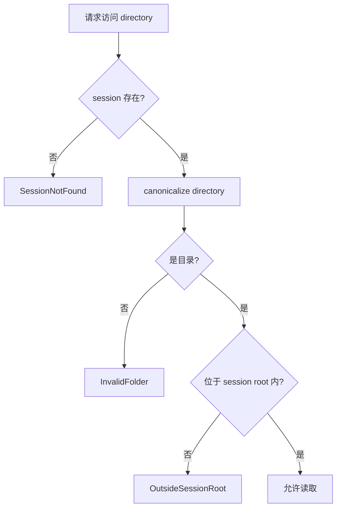
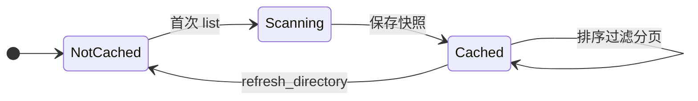
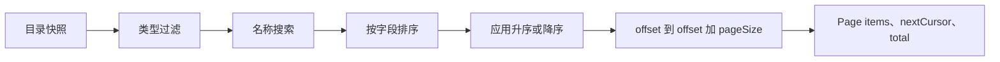
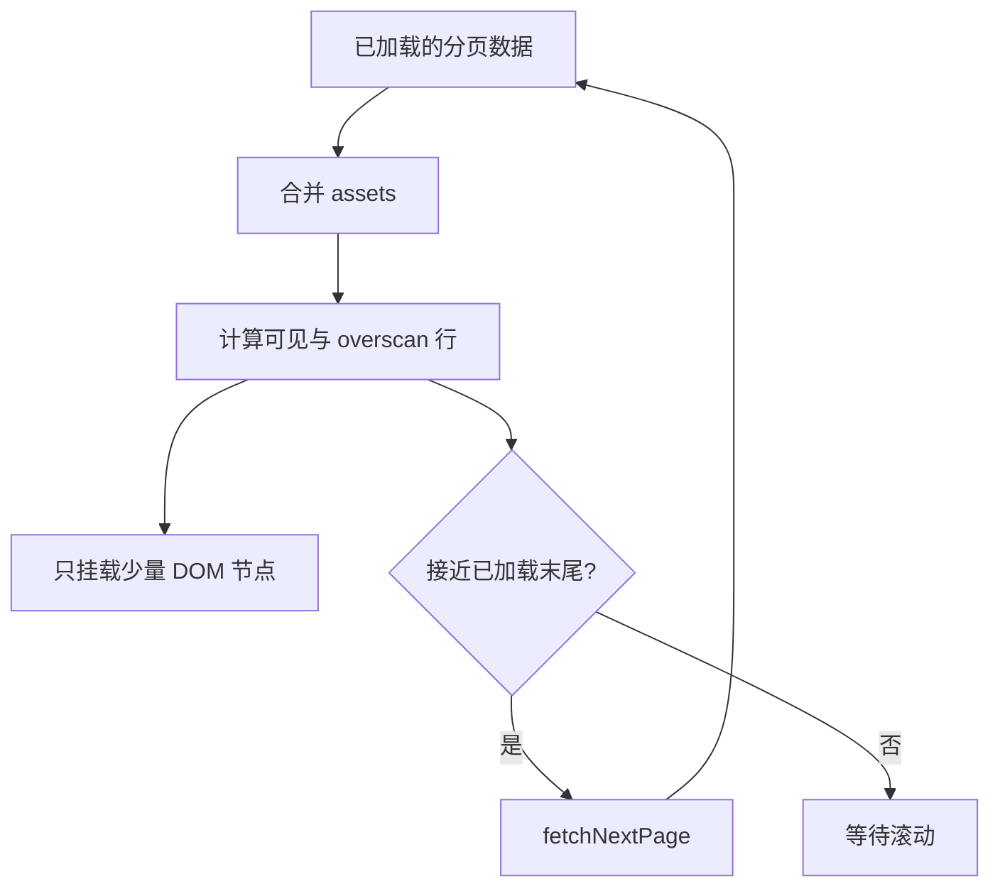

# 02：文件夹浏览与分页

本章跟踪“选择文件夹 → 看到首屏 → 滚动加载更多”的完整路径。这里最重要的不是某个函数，
而是把**安全边界、磁盘扫描、查询分页和 DOM 渲染**分成四个成本层级。

## 1. 性能目标怎样塑造架构

目标是本地 SSD 上，十万文件目录的第一页在 300 ms 内开始渲染。2026-09-02 的首次 release
E2E 测量约为 2.3 秒，说明当前同步建立完整目录快照的路径仍未达标；实现遵守以下策略：

- 打开不递归；
- 首屏不读完整元数据，不解码图片；
- 当前目录只建立轻量摘要；完整扫描一个目录即可保存独立的磁盘快照；
- 摘要快照跨重启复用，后台核对成功后再替换；
- IPC 每次最多返回一页；
- React 只把可见行附近的节点挂到 DOM。

这四层经常被混淆：后端分页减少 IPC 数据量，虚拟列表减少 DOM 数量。首次索引尚未完成时，
后端仍会扫描当前目录的全部直接文件形成快照；有独立目录快照时无需等待根索引。
非空名称搜索仍使用完整根索引的 SQL 分页。打开 command 始终不等待递归索引。

## 2. `FolderSession` 是安全能力，不只是 DTO

用户选定一个目录后，`FsCatalog::open_folder` 会：

1. `canonicalize` 路径，解析相对段和符号链接后的真实位置；
2. 验证它确实是目录；
3. 生成 session ID；
4. 在内存中记录 `sessionId -> canonical root`；
5. 返回 `FolderSession`。

随后 `list_assets`、`get_directory_tree`、`set_directory_expanded`、`set_active_directory` 和 `refresh_directory` 都必须带 session ID。访问子目录
时，`resolve_session_directory` 会再次 canonicalize，并检查它是否 `starts_with(root)`。



这阻止前端仅通过构造路径就越过用户打开的根目录。session 只存于内存，应用重启后失效；
但用户在左侧打开的根目录由 `oxy-library` 持久化。下次启动时前端读取这些根目录并重新建立
session，同时恢复每个根目录最后浏览的子路径。根目录可独立添加和移除，也允许父目录与子目录
同时存在。

多个根目录不会复制图片缓存：`FsCatalog` 的目录快照以 canonical directory 为键并在所有 session
间共享，磁盘预览缓存也先 canonicalize 图片路径再生成 key。因此同一张图片从父根目录、子根目录
或符号链接别名访问时只对应一份预览缓存。

## 3. 摘要为何便宜

`scan_assets` 只迭代当前目录的直接子项。`summary_for_path` 对受支持文件读取：

| 字段 | 来源 | 成本 |
| --- | --- | --- |
| `id` | 路径稳定哈希 | 低 |
| `path`、`name`、`extension` | 目录项路径 | 低 |
| `kind` | 扩展名映射 | 低 |
| `sizeBytes` | 文件 metadata | 低 |
| `modifiedAtMs` | 文件 metadata | 低 |
| `hasSidecar` | 同名 `.xmp` 是否存在 | 低至中 |

它不打开图片解码像素，不提取 EXIF，不计算直方图，也不进入子目录。尺寸属于
`get_asset_details` 的按需路径，而不是列表摘要。

当前识别的类型：RAW（ARW、CR2、CR3、NEF、DNG、RAF、RW2、ORF）、JPEG、HEIF/HEIC/HIF、
PNG、TIFF 和 WebP。唯一事实来源是 `oxy-fs` 的 `kind_for_extension`；格式支持成熟度另见
[FORMAT_SUPPORT.md](../FORMAT_SUPPORT.md)。

## 4. 内存快照

2026-09-05 起，普通浏览由 `oxy-library::browsing` 管理 `(root, directory)` 快照。
`directory_snapshots` 保存完整列表 JSON（包括空目录），不依赖根索引完成标记；已完成的旧根
索引可为首次迁移提供列表。JSON 解析与排序仍有 O(n) / O(n log n) 成本，十万文件须单独实测。
进程内复用 `Arc<Vec<AssetSummary>>`，同目录并发冷请求只扫描一次。重启先读本地列表，再由
最多一个后台核对任务完整枚举；成功原子替换，错误保留旧列表并显示状态。

恢复已登记的 canonical 根路径可直接重建 session，避免 NAS 离线时的 stat 等待。目录缓存
读取检查路径属于根且没有 `..`；冷扫描和后台核对仍 canonicalize 并检查包含关系。文件操作
继续遵循原有安全边界。当前扫描一次枚举文件和 XMP，Windows 复用 DirEntry 属性；准确的
size/mtime 仍供排序与预览缓存键使用，不发布临时文件系统顺序的页面。

macOS 使用 `getattrlistbulk` 将名字、类型、数据长度和精确 mtime 一起批量读取，避免每张照片
单独 stat；不支持该 API 的文件系统回退到 portable scanner。symlink 和缺失的属性仍按普通
metadata 规则读取目标。批量记录使用有界、对齐缓冲并校验长度/名字偏移；XMP 配对和完整排序
不变。诊断中批量调用耗时计入 enumeration，attributes 记录之后的配对工作，不能直接把它与
portable scanner 的逐项 stat 阶段做同名比较。

完整内存快照发布后，由容量 64、按目录合并的单 worker 持久化 JSON/SQLite；序列化不再阻塞
首屏。epoch/revision/快照身份与失效 tombstone 共用 fencing，防止旧写入恢复失效数据；正常
shutdown 排空已接受的持久化工作。队列压力采用背压，不丢弃已接受的正常重启持久化任务。

刷新和文件操作同时使相关磁盘/内存快照失效，以 epoch 拒绝迟到结果；磁盘失效标记阻止旧根
索引回填。分页携带 `snapshotRevision`，后台更新保留上一份不可变列表；收到更新事件后前端
从第一页重取，保留选中 asset ID。每次进程首次读取核对一次，之后外部变化需显式刷新；没有
watcher。离线失败不会循环重试，刷新或重启后再尝试。

下述 `FsCatalog` 内存缓存仍供目录树与其他文件系统调用使用：

`FsCatalog` 有两个缓存：

```text
asset_cache:     directory -> Arc<Vec<AssetSummary>>
directory_cache: directory -> Arc<Vec<DirectorySummary>>
```

第一次访问目录时读取磁盘，后续排序、过滤和分页基于同一份 `Vec`。使用 `Arc` 可让多个请求
共享不可变快照，`RwLock` 保护目录到快照的映射。



注意：当前没有文件系统 watcher。外部程序新增、删除或修改文件后，快照不会自动更新；用户
执行刷新时，后端删除当前目录的两份快照，前端取消相关 query、调用刷新，再使 query 失效重取。
同时刷新整个当前 session 的目录树扫描代次，并从根目录重新启动后台逐层发现，包括已经
加载、折叠和原本为空的节点。保留旧树直到各层扫描成功，再按路径合并，保留仍存在节点的
展开状态；新增、删除和重命名逐层反映到树中。扫描直接读取文件系统，旧代次的迟到结果不能
覆盖刷新后的树。刷新只同步读取当前层，不等待整棵树或根索引完成，其他根目录不受影响。

2026-09-13 Windows Release/WebView2 验证：停留在子目录，外部新增图片、根级兄弟目录、
空目录下的多层后代，并删除、重命名兄弟分支中的目录；点击刷新后文件列表和目录树均更新，
当前选择与已有展开状态保留。此检查使用隔离的小型真实目录，不是大目录性能预算测量。

## 5. 持久目录索引

显式加入侧边栏的根目录会在 `open_folder` 返回后启动后台索引。`oxy-library` 每次只允许一个根
目录扫描，并把工作拆成目录优先的两个阶段：

1. 第一阶段按层次优先遍历目录，只 upsert `indexed_directories`；完整目录树记录成功后清理旧目录、发布独立的目录完成标记和事件，此时文件夹搜索立即可用；
2. 第二阶段再逐目录取得轻量文件摘要；一次 `read_dir` 同时收集 XMP 路径，避免每张图片单独探测 sidecar；
3. SQLite 复用 prepared statement，并以最多 256 项的短 transaction 批量 upsert，超大单层目录会在批次间释放 connection；
4. 未变化行只更新 generation；仅为新增、修改、删除的资产增量维护 FTS；
5. 目录完成事件只使文件夹搜索重新获取；资源索引完成前，图片列表已可复用独立目录快照；
6. 移除根目录会同时删除其索引，扫描器也会在目录边界检查 root 是否仍然注册。

普通 `open_folder` 会先检查 `indexed_roots`：已有完整 generation 时直接复用，不再重复安排全量扫描。
显式刷新会删除完成标记，使对应 root 过期并重新建立 generation。由于当前没有文件系统 watcher，
外部变更仍以用户刷新作为缓存失效边界。

目录符号链接只有 canonical path 仍位于根目录且尚未访问过时才会进入队列，避免逃出授权根目录
或形成递归环。索引是可重建缓存，不读取图片像素，也不进入 preview/metadata 流水线。

## 6. 查询、排序与 cursor 分页

`AssetQuery` 包含：

- 可选名称搜索；
- 可选 `AssetKind` 过滤；
- 排序字段；
- 升序/降序；
- 可选页大小。

普通浏览由 `page_assets` 对快照引用过滤、排序，只复制返回页摘要；
非空名称搜索使用完整根索引的 FTS5 前缀查询和 SQL 分页，同时匹配文件名和
所在目录路径，因此可以从当前视图直接找到深层文件。默认页大小是 250，后端强制限制在
1～1000。返回：

```text
Page {
  items,                  本页项目
  nextCursor,             下一页 offset；没有则为空
  total                   当前查询的总命中数
  snapshotRevision        普通浏览后续页绑定的快照版本
  progress                缓存来源与分阶段耗时
}
```

cursor 是 offset，不是数据库游标或不透明 token。由于一组分页请求复用同一快照，所以同一次
浏览中顺序稳定；刷新后应从第一页重新查询。



rating/color 过滤仍需要读取元数据，因此与名称搜索组合时暂时回退当前目录的 metadata-aware
路径；索引当前只保存便宜的文件系统摘要。

## 7. React Query 无限分页

`App.tsx` 用 `useInfiniteQuery` 管理服务器状态：

- query key 包含 session ID、当前路径和完整查询对象；
- `initialPageParam` 是 0；
- 下一页参数来自 `page.nextCursor`；
- `staleTime: Infinity` 表示除非明确失效，否则复用已取数据；
- 页面数组用 `flatMap` 合并成组件需要的 asset 列表。

搜索、类型或排序变化会改变 query key，自动形成独立缓存。session 或目录改变也不会误用
旧页。这里的“缓存”是前端请求结果缓存，与 Rust 目录快照和磁盘预览缓存是三种不同东西。

## 8. 虚拟列表与何时取下一页

`AssetBrowser` 使用 TanStack Virtual：

- 网格按“虚拟行”计算，只渲染可视区域和 3 行 overscan；
- 列表按单行计算，只渲染可视区域和 8 行 overscan；
- 网格接近最后 2 行、列表接近最后 10 项时触发 `fetchNextPage`；
- 行是否真正进入视口还会决定缩略图优先级是 `visible` 还是 `nearby`。



因此“页面大小 250”不代表同时创建 250 张图片节点。分页控制数据传输量，virtualizer 控制
渲染量，缩略图队列再控制解码量。

## 9. 目录树路径

`oxy-fs::FsCatalog` 按 session 持有带单调 revision 的 `DirectoryTreeSnapshot`。快照记录节点的
展开状态，以及 `children = None`（尚未加载）和 `children = []`（已确认叶子）的区别。React
只发送展开、折叠或刷新意图，并拒绝覆盖较新 revision 的迟到响应，不再为每个节点维护独立
的展开状态或目录查询。

根 session 建立时不读取子目录；展开节点时只读取该目录的直接子目录。用户请求以独立的
阻塞任务执行，不等待旧节点的扫描或图片浏览的后台让行门控，同一节点的在途请求合并。
展开意图仅检查内存中已知路径，磁盘路径校验留在工作线程中。

首次加载后，单独的后台队列逐层遍历全部子目录，填充折叠节点的 children 并修正
hasChildren，不自动展开节点。后台任务仍服从图片浏览让行门控，且不遍历符号链接别名，
防止循环或越过根目录。未知或读取失败的节点保留可重试状态，不误判为叶子。
刷新已加载节点时保留仍存在子节点的展开状态。打开目录不等待递归遍历完成。

后台资料库索引在遍历某一层后会把该目录自身的 `has_children` 回写为真实值，因此目录搜索
也能使用准确的叶子信息；索引不是主目录树交互状态的所有者。

后台目录节点读取进入 Rust 的合并优先级队列；点击加载由 Rust 独立调度。React 在活动
收藏夹或当前目录变化时调用 `set_active_directory`：当前目录的待加载节点优先级最高，同一
收藏夹中的其他节点次之，其他收藏夹最后；同一层级继续保持请求先后顺序。切换收藏夹会同时
提升新收藏夹并降低旧收藏夹尚未开始的任务，已经进入单次 `read_dir` 的任务则自然完成，不做
破坏性的线程中断。活动节点只对照 Rust 已持有的树快照校验，不额外访问磁盘。折叠或刷新节点
会撤销其加载许可，即使旧任务稍后出队也不能写回过期结果。

“文件夹”标题栏提供独立的内联目录搜索，不占用工作区顶部的图片搜索。输入会短暂防抖，然后
对所有已加载根目录的持久索引执行文件夹名称包含查询。结果仍显示为树：每个根目录下仅保留
通向命中项的祖先路径，命中目录高亮；共享祖先在前端合并，不重复显示。点击任一结果树节点
沿用普通 `onNavigate` 进入该目录，并关闭搜索以显示其中图片。

目录搜索不在索引缺失时退化为同步递归磁盘扫描。目录阶段尚未完成的根显示建立索引状态；
目录阶段完成后会立即发布事件，使对应 React Query 自动重取，无需等待后续图片和 XMP 索引。
其他已完成根的搜索结果仍可先显示。

## 10. 已知边界和后续方向

| 边界 | 当前行为 | 可能演进 |
| --- | --- | --- |
| 首次扫描 | 当前目录可立即扫描；后台按目录批次索引 | 增加索引进度与暂停/续扫 |
| 翻页 | 索引可用时由 SQLite 分页 | 基于稳定排序键的不透明 cursor |
| 外部变更 | 需手动刷新 | watcher + `folder_delta` event |
| 会话清理 | 应用生命周期内保留 | 关闭/淘汰长期不用 session |
| 目录树 | 按层、按需加载 | 极大单层目录下增量返回 |

任何优化都必须同时保持：不递归打开、结果排序稳定、路径不能逃逸 session root。

## 11. 本章检查点

- `open_folder` 为什么不会立即返回第一页？
- 返回分页与磁盘扫描分页有什么区别？
- Rust 快照、React Query 缓存、虚拟 DOM 各自减少哪一种成本？
- 为什么 `canonicalize + starts_with` 是 session 安全的一部分？
- 外部新增文件为什么不会自动出现？
- 调整页大小为什么不能替代虚拟列表？

下一章：[03：统一预览流水线](03-preview-pipeline.md)。
