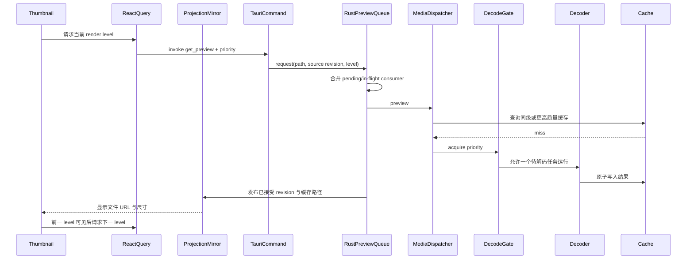
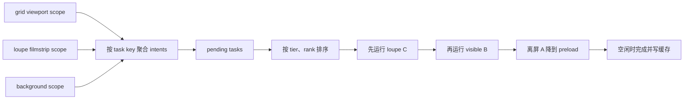
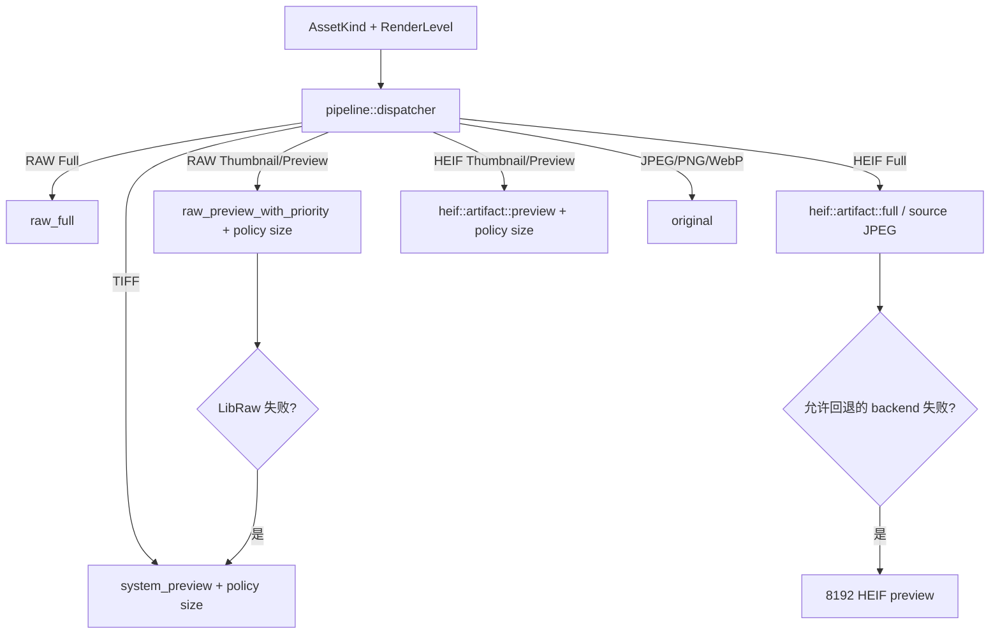

# 03：统一预览流水线

本章解释照片怎样从“一个文件摘要”变成屏幕上的 thumbnail、preview 或 full 表示。
这是 OxyViewer 最性能敏感的路径，也是格式差异最多的部分。

统一调度见 [ADR 0005](../adr/0005-unified-preview-pipeline.md)，语义等级图见
[ADR 0006](../adr/0006-semantic-render-level-graph.md)，状态归属见
[ADR 0008](../adr/0008-rust-owned-resource-projections.md)，多级 scope 调度契约见
[ADR 0009](../adr/0009-scoped-multilevel-work-scheduling.md)。

## 1. 为什么需要预览，而不是总显示原文件

JPEG、PNG、WebP 通常能由 WebView 直接显示。RAW、HEIF、TIFF 则可能需要相机格式库、
HEVC 解码器或操作系统预览服务。即使原文件可解码，也不应在网格里为每张照片解码全尺寸。

因此预览系统解决四件事：

1. 选择最合适的显示路径；
2. 先低清后高清，尽快让用户看到内容；
3. 让当前放大镜和可见缩略图优先；
4. 把昂贵结果写入可重建缓存。

## 2. 语义等级与格式/平台矩阵

| Windows 格式 | `thumbnail` | `preview` | `full` |
| --- | --- | --- | --- |
| JPEG/PNG/WebP | 原文件 URL | 原文件 URL | 原文件 URL |
| RAW | LibRaw 512 | LibRaw 4096 | 近全尺寸内嵌 JPEG；不足时 full development |
| HEIF/HIF | 内嵌 160×120 JPEG | 复用同一内嵌 JPEG | 源 HEIF 直接转换的完整 JPEG |
| TIFF | macOS ImageIO JPEG 512；Windows/Linux 暂不支持 | macOS ImageIO JPEG 512；Windows/Linux 暂不支持 | macOS ImageIO JPEG 4096；Windows/Linux 暂不支持 |

交互图不随格式改变：网格/列表只进入 `thumbnail`；放大镜固定执行 `preview → full`。
前端 `renderPlan(kind, surface, platform)` 把等级映射到 renderer 类；后端
`pipeline::dispatcher` 直接按 `AssetKind + RenderLevel` 分派，再由格式 executor 选择后端与
fallback。多个等级可以指向同一产物。
例如 Sony HIF 的 `preview` 是 `thumbnail` 的显式别名，而不是一个 160 px 特判。

## 3. 端到端调用链



实际缓存命中时会跳过 gate 和 decoder。JPEG/PNG/WebP 跳过 Rust 像素解码，但仍注册为受控
`oxy-media` resource；应用不再启用 unrestricted asset protocol。

当前应用发布链与图中的旧“先写 Cache 再更新 projection”不同：decoder 产出的 encoded bytes 或
native staged file 先进入 resource registry，UI 得到 process-namespaced immutable URL；有界 worker
随后持久化。encoded UI/cache 共享 `Arc`；native staged file 先原子移动到 publisher 持有、位于 v2
cache tree 之外的进程临时目录，cache clear 不会删除这个 UI 文件，cache worker 再使用文件 copy 提交，
均不重复 source decode。完成通知只在 state revision 仍匹配时把 Pending 改为
Persisted，并触发 completion-time prune；若写入期间已有 prune 在运行，pending latch 会要求该 worker
再跑一轮而不是丢失触发。SQLite 序列化前剥离 resource descriptor；重启恢复 managed path 时先通过
v2 manifest、尺寸、长度和 JPEG 完整性校验，再注册当前进程 resource 和 lease，不能用裸 `is_file`
绕过 cache repair。projection identity 包含媒体层 canonical path、平台文件身份和高精度 mtime 的
`SourceRevision`，不只依赖毫秒 mtime/size。

进程内 pending publication 也参与同一个 capability matcher，因此不同 semantic level 可以在 manifest
写完前订阅兼容产物；`ArtifactCache::coordinate_work` 还让兼容请求订阅 decoder-running source lane，
RAW development 不会因 Preview/Full 并发而重复执行。Interim 可显示但不是 Preview/Full 终态；queue
保留 active request、subscriber、priority 和 cancellation token，继续一个禁止 Interim 的升级，直到
Satisfied artifact 到达、失败或最后一个 subscriber 取消。RAW full lane、HEIF decode gate、Sony
embedded 快速探测和 tile session 保持各自原有资源隔离。

## 4. 前端等级升级

`Thumbnail` 组件只解释固定等级图：

1. 网格/列表请求 `thumbnail`；
2. 放大镜立即请求 `full`，被动复用已有 `thumbnail` 作为底图，不主动请求或等待缩略图；
3. renderer profile 决定等级是原图、生成图、tile session，还是另一个等级的复用；
4. 组件选择当前最高可用且未加载失败的 URL；
5. 新等级图片真正完成浏览器加载后才取代现有图。

这避免“高清请求已返回 URL，但文件尚未解码进浏览器”时让画面闪空。RAW full 失败也会继续
保留渐进预览，而不是让放大镜不可用。

只有识别为 Sony SHIF 且确实含 sidebar JPEG 的 HEIF 才让 `preview` 与 `thumbnail` 共享
160×120 产物；普通 HEIF 的 `preview` 会请求语义化 4096 目标。`start_heif_full` 由 Rust 统一决定
返回完整 artifact projection 或 tile session：关闭显示锐化且缓存可用时直接返回 artifact；开启
显示锐化时使用 tile display path，规范缓存仍保持未锐化。HEIF 冷 tile session 把本次已经取得的
规范 RGBA（Windows FFmpeg 则拼接已取得的 JPEG tiles）编码进 Full cache，不再重新打开源 HEIF
执行第二次 decode/transcode。前端不再按 user agent 复制这份策略；resource 和 tile URL 共用同一个
Windows WebView2 `http://oxy-media.localhost` 规范化 helper。

## 5. 第一层调度：Rust `PreviewQueue`

Rust `PreviewQueue` 按 render level 分流到独立的 `loupe` 与 `thumbnail` 队列，
各自拥有 pending、active、scope scheduler 和 worker。`full`（包括 HEIF tile session）进入 loupe；
`thumbnail` 与保留的 `preview` API 进入 thumbnail。分流依据是等级，不是 priority：filmstrip
选中项的 thumbnail 即使具有 loupe 优先级，也不会占 full worker。前端场景策略提交由选择、可见性和
overscan 产生的 scope intent，并可在拿到 artifact URL 后预热 WebView 图片解码。各队列内部规范化位置为
`(tier, rank)`，数值越小越重要：

```text
tier 0  loupe/selected  当前单图或选中项
tier 1  visible         真正位于视口内
tier 2  nearby          overscan 预加载
tier 3  preload         视口外缓存预热
```

Grid、list 和 loupe filmstrip 各自持有 viewport scope；稳定的已加载资产集合持有 background
scope。viewport 随虚拟列表产生的视窗快照提交有界全量 reconcile，background 只在分页、排序或选择变化时
更新。`epoch` 拒绝乱序到达的旧视窗快照。选中图排在 tier 0；可见图按选择或视窗中心产生 rank；
附近项进入 tier 2；grid/list 选中项离开真实可见区后按 nearby/离屏规则处理。Loupe filmstrip
仍保留当前大图的 thumbnail tier 0，并为全部可见项和 overscan 提交位置，滑入 overscan 的旧可见项
因此可以降级。离屏后
viewport intent 被释放；已有 consumer 的任务按其余 scope 降级，没有 consumer 且尚未开始的任务
会从队列删除。

前端 scope 不会为每次 render 立即调用 IPC。同一帧内的 viewport 快照按 latest-wins 合并并做内容
去重，发送间隔不小于 50ms；background 排序先防抖 150ms，再以 200ms 最小间隔发送。每个 scope
最多保留一个进行中的 IPC，后续更新继续在前端合并，从而让 native bridge 反压而不是堆积请求。
单个 Thumbnail 不再随 queueOrder 变化发送独立提权 IPC；可见项优先级统一由 viewport scope 更新。
滚动期间持续提交 viewport 快照，同时加载可见项和 overscan；不再等待 160 ms 滚动停稳。
Grid 预取前后 6 行、list 前后 16 项、filmstrip 前后 12 项。离开窗口的请求取消订阅，
仍在新旧窗口交集中的 filmstrip 预加载保持进行，不因组件重复 render 重启。

具体任务身份由 canonical path、source revision 和 semantic level 组成；相同请求无论尚在等待
还是已经运行，通常只挂接新的 consumer。已取消的 active 请求不能接收新 consumer；
附近任务升级为选中图时取消旧 token、迁移订阅者并重新以 loupe 优先级准入，避免继续等待旧 gate 优先级。
Thumbnail 的有效位置取当前各 scope 中最重要的 `(tier, rank)`；没有 scope 时才使用剩余 consumer
最重要的初始位置。Thumbnail consumer 不再建立独立 request-id scope，避免初始 visible 优先级
压住更新后的 nearby 排序。Preview/full 保留原有 scope/consumer 合并规则。
全量 `reconcile`、单项 `upsert(front/back)` 和 `release` 的通用实现位于 `oxy-runtime`。

`sharedThumbnailRequests` 在前端按路径、资产 ID、格式、修改时间和文件大小共享进行中的
thumbnail IPC。组件与预加载器各自取消订阅，最后一个订阅者离开后才取消共享请求；一个微任务
的合并窗口覆盖同轮 effect 替换。结果仍由 projection 管理，池内不保存已完成结果。刷新时清除
对应目录的共享请求，迟到且无人接收的资源走已有 lease 释放流程。Thumbnail 没有后续 upgrade，
即使结果标为 Interim，完成后也移除 abort listener；preview/full 的 Interim 升级取消仍保留。

开启搜索、格式、评级或颜色过滤时，另一个无过滤的廉价分页查询会继续枚举当前目录。未出现在
可见结果中的图片由 `BackgroundPreviewPreloader` 串行提交，每次只放入一个 `preload`
请求。这样过滤不再终止缓存预热，同时不会一次把整个目录塞进 Rust queue。Rust 返回 resource 后的
WebView raster fetch/decode（原图、generated thumbnail 与 filmstrip preview）也统一进入单个 priority queue，
不会由多个 `new Image()` 预载绕过并发控制。



thumbnail 使用 `available_parallelism()` 个 worker（按进程可用逻辑 CPU 数，探测失败回退 1），
优先走 RAW 内嵌图和 Sony HIF 快速 JPEG；缺少可用内嵌表示时仍允许现有格式回退。
loupe 使用独立的 2 个 worker，给取消中的旧 native 调用和当前图片分别留出执行位置，
不再从 thumbnail 的并发数中预留位置。HEIF session 的 begin/decode 同样在 full worker 执行。

Full 命令在源文件探测之前登记 selection epoch；切换路径立即取消旧 active task、删除 pending
并释放等待 artifact 的 IPC 订阅者，较早 epoch 的请求不能在探测完成后重新入队。前端卸载
发送 request-id 取消；未准入的请求由短期 tombstone 拦截。快速 A→B→A 使用新 epoch/token，
旧 worker 不能删除新的 active request，取消后不发布迟到结果，projection 的 validAt 围栏继续有效。

## 6. 第二层调度：后端 `DecodeGate`

Rust `DecodeGate` 位于 `crates/oxy-media/src/decode_control.rs`，与 RAW full 独立锁、
HEIF session 缓存写锁和同源锁表一起管理媒体资源准入；它不替代 `oxy-runtime` 的请求调度。
crate 根模块只负责稳定 API re-export；格式执行分别位于 `pipeline::raw`、
`pipeline::heif::artifact` 和 `pipeline::system`，HEIF backend 策略位于
`pipeline::heif::backend`。`DecodeGate` 有三档优先级：

| IPC priority | Rust priority | 等待规则 |
| --- | --- | --- |
| `loupe` | `Foreground` | 可越过所有未开始任务 |
| `visible` | `Visible` | 等待 foreground，不等 background |
| `nearby` | `Background` | 等待 foreground 和 visible |
| `preload` | `Background` | 与 nearby 共用后端 background 档；前端保证它最后提交 |

decode admission 同样按等级分成两个 gate：thumbnail 容量为可用 CPU 数，full 容量为 2；
缩略图无法占用 full gate。每个 gate 内后台任务老化最多提升到 Visible。等待 gate/同源锁时
检查取消，permit 由 Rust `Drop` 释放。FFmpeg/ffprobe 子进程轮询取消并 kill/wait 回收，
诊断写临时文件以避免管道写满，另设 120 秒进程超时；LibRaw 开发通过 progress callback
中断 unpack/process。未提供中断接口的 WIC/ImageIO/libheif 调用仍在返回后检查取消，
不会强杀 Rust 线程，旧结果不会被发布。

为什么有两层 Rust 调度：projection queue 负责资源身份、consumer 合并、优先级和状态提交；
`DecodeGate` 负责跨格式原生解码资源竞争。前端只提供视口/选择提示和浏览器预加载。

RAW full development 在 full worker 内仍使用 `RAW_FULL_DECODE_LOCK`，限制大尺寸开发的内存
占用；该锁与 thumbnail gate 独立。取消会传入 LibRaw 回调，而不是只在整张开发完成后检查。

### 资源注册表预算与前端租约（2026-09-09）

entry 上限为 512，encoded 常驻内存上限为 `max(1 GiB, system RAM / 8)`，在初始化时一次性探测，
失败回退 1 GiB。使用 workspace 已有 libc/windows API；文件型产物只计 entry 和 staged 磁盘统计，
不计 encoded bytes。协议复制单独限制 4 个并发 / 128 MiB，且仅覆盖 Rust materialization 阶段，
不包含 Tauri 接管之后的 body 或 WebView 解码内存。

descriptor 首次发布及再次交付使用 5 秒宽限，前端 renew 认领后为 30 秒，每 10 秒续租。
组件认领 displayed 和 pending，UI 图片缓存额外持有已解码资源的引用，直到 LRU 淘汰、目录
切换或显式失效。缓存最多 1024 项 / 512 MiB 解码像素，保留 HTMLImageElement 和完成后的
HEIF canvas 节点；返回缓存中的图片直接绘制，HEIF 也不再重新启动 tile session。
缓存额外持有的 native resource pin 最多 256 个，为 512 项原生注册表中的新请求留出容量；
释放较旧的 native pin 不删除 WebView 中的解码像素，仍挂载的组件也继续持有自己的租约。
不可变 resource URL 的 persistence/status 更新不会清除解码缓存；源 revision 改变仍会失效。
释放/过期资源在后续 publication/renew 时回收，read lease 保护文件及在途读取。超出缓存预算
或资源过期时允许恢复请求，不能把有限内存缓存理解为永久保留整个图库。

恢复一个已淘汰资源会产生新 ID，必须通过 Library 的既有 projection sequence 增加 revision，
不能让前端因旧 revision 拒收新 descriptor。恢复与普通 transition 共用 projection 锁和 validAt
围栏（文件验证在锁外，提交时复查 revision）；React Query 返回 null 表示成功完成，图片事实仍由
projection store 提供。HEIF artifact 的 Full 请求使用 UUID 订阅，同组件 AbortSignal 接入既有
cancel_preview_request，切图会取消等待，迟到 artifact/session 分别释放或取消；已运行 native 调用仍
不能抢占。取消先于请求进入队列的短窗口由最多 1024 项、120 秒过期的 admission tombstone 覆盖。
HEIF 完整文件 onLoad 后卸载下层 preview 组件；原有 tile 底图与传输策略保留。

## 7. Dispatcher：唯一格式分派入口

Tauri `get_preview` 的逻辑是：

1. 通过 `oxy-fs` 取得 asset kind；
2. 接收 `RenderLevel` 和 priority；
3. 向 Rust `PreviewQueue` 提交或挂接同源请求；
4. worker 调用 `oxy_media::preview(...)` 并把 artifact path 提交给 SQLite；
5. command 返回已接受、带 revision 的 `ImageProjection`，而不是另一份裸图片结果。

视窗调度另有三个轻量 IPC：`reconcile_preview_schedule` 原子替换一个 scope，
`upsert_preview_schedule` 把单项放到某 tier 的队首/队尾，`release_preview_schedule` 释放单项
intent。它们只更新队列元数据，不读取或传输图片。

`pipeline::dispatcher` 中的 `oxy_media::preview` 根据 `(platform, kind, level)` 查表分派。
IPC 不接收像素尺寸：



格式 fallback 放在 `oxy-media` 而不是 command 中，因此单元测试和非 Tauri 调用也能得到
同样策略。取消、source/cache generation 围栏及任何 ResourceBudgetExhausted 都禁止 HEIF Full
回退；容量错误记录具体 budget 和 current/limit/requested，不伪装成 decoder 失败。

## 8. RAW 路径

### 8.1 512 和 4096

RAW 由 vendored LibRaw 0.22.2 处理。预览优先尝试内嵌预览：相机通常已经在 RAW 容器里存了
JPEG，读取它远比 demosaic 原始感光数据快。若内嵌预览不适用，才执行 half-size development。

RAW `thumbnail` 映射 512，`preview` 映射 4096。thumbnail 请求让 LibRaw 选择满足目标尺寸的最小
内嵌图；若它是 JPEG，就和 HIF 快速路径一样原样写入缓存并由 WebView 缩放，不再为了生成严格
512 px 文件而串行执行完整 JPEG 解码、缩放和重编码。只有内嵌 bitmap 或缺少可用 JPEG 时才进入
像素转换/half-size development 回退。放大镜直接从 `preview` 开始，因为 Sony ARW
常见的近全尺寸内嵌 JPEG 可以在数毫秒内直接复制；先把它解码、缩放并重编码成 512 反而更慢。
4096 产物保留合适的
内嵌 JPEG，避免无意义的解码、缩放、重编码。内嵌表示失败后，macOS 的 512 请求按
ImageIO → Core Image → LibRaw development 回退，4096 请求按 Core Image → ImageIO →
LibRaw development 回退；Windows/Linux 使用 LibRaw development。所有生成结果均进入 JPEG
缓存，不再调用只能生成 PNG 的 Quick Look。

### 8.2 full

`full` 等级先检查内嵌 JPEG 是否覆盖 RAW 源尺寸的至少 90%。满足时直接复用 `preview` 缓存，提供
接近即时的 1:1 查看，也避免后台显影抢占 CPU、拖慢缩放和平移。只有内嵌预览明显不足时，
才对传感器数据执行完整开发、应用适度 sharpening 并生成高质量 JPEG；该 fallback 不属于冷
预览 800 ms 预算，UI 会一直保留 4096 图。

### 8.3 Sony 拍摄对焦区域

`get_asset_details` 在线程池中通过 `oxy-metadata` 与项目内纯 Rust 统一解析器读取 Sony MakerNote
`FocusLocation`/`FocusFrameSize`。ARW、JPEG、HEIF/HIF 只要带有这些字段，都通过同一个
`FocusInfo` 小型结构返回；图片字节仍不经过 IPC。EXIF 方向会先应用到坐标，HEIF 缺少 EXIF
方向而显示尺寸明确交换横竖轴时使用 Sony 常见的顺时针方向。前端再用当前真正显示的
JPEG/完整 RAW 自然尺寸映射坐标，
而不是假设内嵌预览与 RAW 的长宽比相同：同长宽比直接缩放，已知完整 RAW 可在相机裁剪外
扩展，否则使用保守的居中裁剪并隐藏落在裁剪外的点。对焦层位于 `.loupe__render` 内，因此
适应窗口、放大和平移时都与图片保持一致。

存在 `FocusFrameSize` 时显示精确实线框；仅有 `FocusLocation` 中心时显示带中心点的虚线
估算框，避免把估算大小冒充相机记录。

拍摄对焦信息和内嵌元信息读取都不依赖 ExifTool：后者只负责用户明确发起的
“同步到文件内部”。默认评分/颜色编辑写 sidecar。若系统未安装这个可选 worker，
`get_asset_details` 仍由原生引擎返回内嵌 XMP、拍摄参数和已解析的 `FocusInfo`。仓库 Sony HIF
fixture 同时覆盖 MakerNote 方向变换、
macOS ImageIO 竖拍尺寸映射和前端区域映射；CI 在三个桌面平台运行媒体、元数据和桌面桥接
回归测试。

同一次纯 Rust EXIF 解析还返回 `CaptureMetadata`，供检查器展示光圈、快门、焦距、ISO、曝光
补偿、拍摄时间、机身/镜头和 EXIF 色度采样。缺失字段单独留空，不影响图片详情中的其他数据，
也不会触发 ExifTool 安装或阻塞文件夹首屏。

## 9. HEIF 预览路径

原生/可移植适配器集中在 `crates/oxy-media/src/backends/`；其中 `libheif.rs` 是具体后端，
不是 HEIF 格式层。Sony 专用内嵌 JPEG 提取与方向兼容逻辑位于
`formats/heif/quirks/sony.rs`。

HEIF thumbnail/preview 请求到达执行器后才进行有界探测：先读 256 KiB，只有识别出完整的
top-level meta box 和有效 Sony JPEG 才提前返回；JPEG 或元数据不完整时继续读到原有 2 MiB
上限。目录发现和首屏枚举都不读取媒体内容。dispatcher 分别保留 512 thumbnail 和
4096 preview 的解码回退尺寸；执行器命中 embedded cache 或实际识别并验证出 Sony SHIF JPEG
时，直接把两个语义等级映射到同一个 160×120 产物。JPEG 注入正确 EXIF orientation 后原样写入
独立的 embedded cache namespace，不进入 HEVC gate，也不进行像素重编码。冷路径在一次探测中
完成识别和字节提取，避免重复扫描；热缓存可直接命中。

没有已识别快速表示的 HEIF 分别使用 512 thumbnail 和 4096 preview，并可使用 macOS ImageIO、
FFmpeg 或 libheif 等后端。前端不再把所有 HEIF preview 静态别名成 thumbnail；Sony 两个语义请求
仍会由 Rust 返回同一路径。HEIF full 是另一条渐进路径，用于放大检查。
后端直接从源 HEIF 生成未锐化全尺寸 JPEG 缓存。`start_heif_full` 由 Rust 根据缓存、平台和
显示锐化决定 artifact 或 tiles；开启锐化时即使缓存命中也从规范 JPEG 构造显示瓦片，缓存本身
不带锐化。
macOS 的完整 JPEG 使用 ImageIO 编码；解码 permit 在 primary image 解码完成
后立即释放，JPEG 编码与缓存同步不继续阻塞下一项解码。下一章专门解释 session。

## 10. 缓存键与原子写入

缓存键哈希至少包含：

- canonical 源路径；
- 平台稳定文件身份（Unix dev/inode 或 Windows volume/file index）；
- 文件大小；
- 高精度修改时间；
- 统一 policy revision；
- 目标尺寸。

上述字段使用 SHA-256 生成稳定键。源文件替换、修改或解码策略升级都会形成新键。旧文件可能暂时
留在 cache 目录，但不会被误用。

RAW/HEIF 的 JPEG 和部分 byte-cache 写入先在目标目录创建临时文件，编码完成后原子持久化到
目标路径。这样崩溃或取消不会留下看似有效但内容截断的最终文件。统一预览写 8-bit JPEG。
解码后的 HEIF primary 和 RAW development 明确按已应用方向、带 ICC 的 sRGB SDR 契约写入；
相机 JPEG 则保留原字节、EXIF 方向和原有/未知 profile，不能仅按尺寸冒充显影产物。
`system_preview` 同样先写临时 JPEG、校验首尾 marker，再原子提交。行为版本同时进入磁盘 cache key 和持久化 image projection 的
source revision，避免升级后继续返回指向旧策略产物的 ready projection。

### 10.1 更高质量缓存复用

当请求 512 时，通用 `larger_cached_preview` 会检查是否已有同 backend tag 的 4096 缓存；若有，
直接返回更大文件并由浏览器缩小显示。HEIF 还会显式检查自己的 full JPEG 并缩放复用。RAW 的
512/4096 查询会复用更大的 `.embedded.jpg` 或 `.developed.jpg`；RAW full 在内嵌 JPEG 覆盖源尺寸
至少 90% 时也直接返回该 4096 缓存。只有实际 LibRaw full development 才写入独立 cache version。
这些策略统称为 up-tier reuse。HEIF 快速 JPEG 与 decoded primary 使用不同 suffix，通用 HEIF
up-tier 只查询 decoded 产物；RAW full 的相机 JPEG 替代由表示契约和 90% display-space 覆盖共同
决定，不能把尺寸更大的 half development 当作 full development。

### 10.2 容量策略与自定义位置

Tauri `CacheManager` 为每个 preview 请求提供当前目录快照。默认目录来自平台
`app_cache_dir()/previews`；自定义父目录会追加应用专属的 `OxyViewer Cache/previews`。位置和
1–500 GB 容量上限写入 app data 配置，切换位置不迁移旧 artifact。

应用启动时会删除 app-owned preview 目录第一层的 pre-v2 平铺文件，不再读取、统计或裁剪旧布局。
v2 artifact 文件是不可变内容，不能 touch，否则会使 resource 记录的 file revision 失效；
recency/lease 位于 manifest 和 lease marker。同步 cache hit
返回后可后台清理；异步 publication 必须在真正提交完成后清理，同一时刻最多一个维护任务。当前
WebView resource 的磁盘 lease 会跨 cache instance 保护文件；clear 使它不再成为新 lookup 命中，但
延迟删除活跃文件。

未超容量时，prune 只统计用量，不扫描租约映射或重写 manifest；超容量时也只重写实际删去
artifact 记录的 manifest。前台 active resource lookup 读取 cache generation 时，只使用跨进程
cache shared lock，不等待后台 publish 持有的进程内 operation mutex；clear 仍使用 exclusive
lock，因此 generation 一致性不依赖异步持久化的文件写入速度。

前端 projection 可被缩略图和大图共享。`mediaResourceLease.ts` 按 resource ID 记录本地使用者，
仅最后一位退出时释放后端租约；释放延迟一个 microtask，以免 StrictMode/effect 替换在同一轮
中先释放再重新持有。组件仍负责定时续租和过期后的重新请求；IPC teardown 失败由后端 TTL
兜底，迟到且无使用者的 artifact 也走同一释放入口。

启动清理只删除第一层普通文件，不遍历子目录也不跟随符号链接。v2 容量维护受 cache lock 和
manifest 约束；目录项消失按并发删除处理，权限及其他 IO 错误仍返回。
扫描不再用 `exists()` 前置检查来掩盖错误，也不为此持有解码锁或阻塞缓存写入。

## 11. 取消的真实语义

需要准确区分三件事：

1. **前端 pending 取消**：尚未进入 `invoke`，可以真正丢弃；
2. **前端忽略结果**：command 已开始，React Query 不再使用返回值；
3. **后端协作取消**：解码器定期检查 flag 并提前退出。

统一 preview 通过独立 command 释放对应 request consumer：pending 工作在没有 consumer 时直接
摘出；active 工作在最后一个 consumer 离开时通常取消共享 token。同一活动目录、同一 generation
的 thumbnail 允许最多 `min(2, worker_count - 1)` 个已经被 worker 取出的任务继续完成，无人订阅
的 pending 工作不保留。单 worker 时上限为 0；重新进入视口可复用尚未取消的 active 工作。
切目录、刷新或源失效会取消相应保留任务，旧 generation 不能重新获得保留资格。该例外不适用于
preview/full。decode gate 与同源锁等待、后端
attempt 边界、tile 发布以及缓存提交前都会检查 token。已经进入不可中断 native codec 调用时仍需
等待调用返回，但迟到结果不会触发 fallback 或提交缓存。HEIF full session 另有 session token，
见下一章。

## 12. 诊断与性能

`PreviewResult` 包含路径、类型、宽高、必填 `renderLevel`，并可带 diagnostics。性能判断需要区分：

- cold decode；
- warm cache hit；
- JPEG 写盘；
- 浏览器加载和绘制；
- RAW full 等明确排除在首预览预算外的工作。

目标和历史数据在 [PERFORMANCE.md](../PERFORMANCE.md)。新增优化必须在同一 fixture、release
构建和相同冷/热条件下比较，不能只看单个内部函数耗时。

## 13. 本章检查点

- 为什么 RAW full 不进入 `DecodeGate`？
- visible 请求是否能中断正在运行的 nearby decode？
- React Query 取消一个已开始的 invoke 后，Rust 一定停止吗？
- 为什么 HEIF full 不属于 `` 的第三个 query？
- 为什么 160×120 不能成为交互状态判断条件？
- 缓存键为什么包含版本和修改时间？
- 原子写入避免了哪一类缓存损坏？

下一章：[04：HEIF 完整 JPEG 与旧瓦片协议](04-heif-tile-session.md)。
