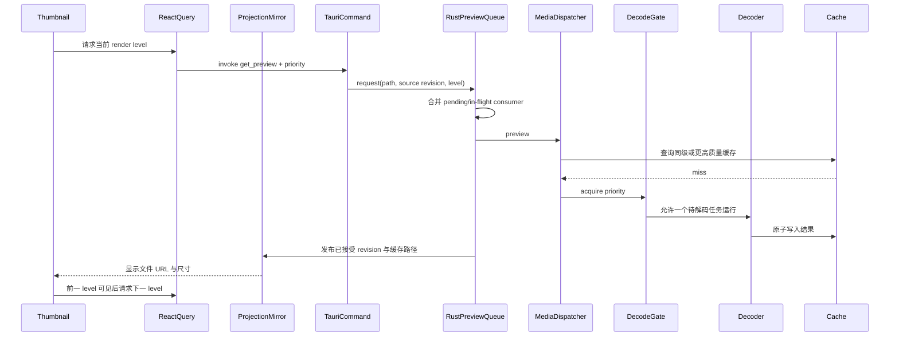
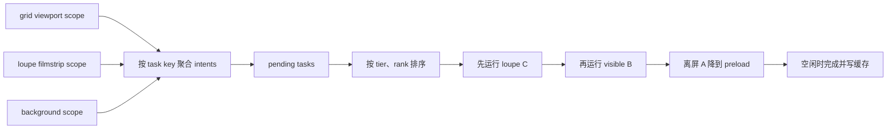
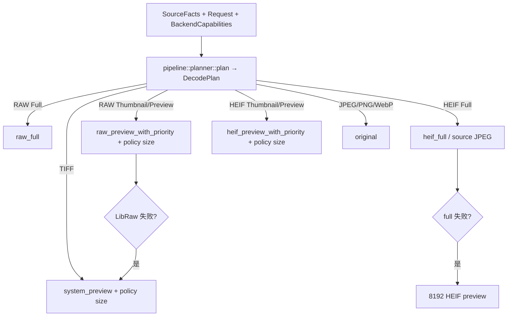

# 03：统一预览流水线

本章解释照片怎样从“一个文件摘要”变成屏幕上的 thumbnail、preview 或 full 表示。
这是 OxyViewer 最性能敏感的路径，也是格式差异最多的部分。

统一调度见 [ADR 0005](../adr/0005-unified-preview-pipeline.md)，语义等级图见
[ADR 0006](../adr/0006-semantic-render-level-graph.md)，状态归属见
[ADR 0008](../adr/0008-rust-owned-resource-projections.md)，多级 scope 调度契约见
[ADR 0009](../adr/0009-scoped-multilevel-work-scheduling.md)。

## 1. 为什么需要预览，而不是总显示原文件

JPEG、PNG、WebP 通常能由 WebView 直接显示。RAW、HEIF、TIFF 则可能需要相机格式库、
HEVC 解码器或操作系统预览服务。即使原文件可解码，也不应在网格里为每张照片解码全尺寸。

因此预览系统解决四件事：

1. 选择最合适的显示路径；
2. 先低清后高清，尽快让用户看到内容；
3. 让当前放大镜和可见缩略图优先；
4. 把昂贵结果写入可重建缓存。

## 2. 语义等级与格式/平台矩阵

| Windows 格式 | `thumbnail` | `preview` | `full` |
| --- | --- | --- | --- |
| JPEG/PNG/WebP | 原文件 URL | 原文件 URL | 原文件 URL |
| RAW | LibRaw 512 | LibRaw 4096 | 近全尺寸内嵌 JPEG；不足时 full development |
| HEIF/HIF | 内嵌 160×120 JPEG | 复用同一内嵌 JPEG | 源 HEIF 直接转换的完整 JPEG |
| TIFF | 系统 512 | 系统 512 | 系统 4096（当前最佳可用表示） |

交互图不随格式改变：网格/列表只进入 `thumbnail`；放大镜固定执行 `preview → full`。
前端 `renderPlan(kind, surface, platform)` 把等级映射到 renderer 类；后端
`pipeline::planner::plan(SourceFacts, Request, BackendCapabilities)` 生成 `DecodePlan`，再由
`oxy_media::preview` 执行对应解码器和尺寸。多个等级可以指向同一产物。
例如 Sony HIF 的 `preview` 是 `thumbnail` 的显式别名，而不是一个 160 px 特判。

## 3. 端到端调用链



实际缓存命中时会跳过 gate 和 decoder。JPEG/PNG/WebP 直接路径还会跳过整条生成流水线。

## 4. 前端等级升级

`Thumbnail` 组件只解释固定等级图：

1. 网格/列表请求 `thumbnail`；
2. 放大镜先请求并保留 `preview`，再启动 `full`；
3. renderer profile 决定等级是原图、生成图、tile session，还是另一个等级的复用；
4. 组件选择当前最高可用且未加载失败的 URL；
5. 新等级图片真正完成浏览器加载后才取代现有图。

这避免“高清请求已返回 URL，但文件尚未解码进浏览器”时让画面闪空。RAW full 失败也会继续
保留渐进预览，而不是让放大镜不可用。

HEIF 的 `preview` renderer 复用 `thumbnail` 的 160×120 JPEG。macOS 的 `full` 通过 ImageIO
直接生成完整 JPEG；Windows/Linux 的 `full` 由独立 tile session 渐进绘制，并在首次 session
结束后写入完整 JPEG供下次 loupe 加载。Windows/Linux full 工作不进入串行 preview queue，
因此不会阻塞屏内缩略图。

## 5. 第一层调度：Rust `PreviewQueue`

所有需要生成的格式和 stage 共用一个 Rust 多级队列。前端场景策略提交由选择、可见性和
overscan 产生的 scope intent，并可在拿到 artifact URL 后预热 WebView 图片解码。规范化位置为
`(tier, rank)`，数值越小越重要：

```text
tier 0  loupe/selected  当前单图或选中项
tier 1  visible         真正位于视口内
tier 2  nearby          overscan 预加载
tier 3  preload         视口外缓存预热
```

Grid、list 和 loupe filmstrip 各自持有 viewport scope；稳定的已加载资产集合持有 background
scope。viewport 随虚拟列表产生的视窗快照提交有界全量 reconcile，background 只在分页、排序或选择变化时
更新。`epoch` 拒绝乱序到达的旧视窗快照。选中图排在 tier 0；可见图按选择或视窗中心产生 rank；
附近项进入 tier 2；选中项离开真实可见区后不再保留 tier 0，而按 nearby/离屏规则处理。离屏后
viewport intent 被释放；已有 consumer 的任务按其余 scope 降级，没有 consumer 且尚未开始的任务
会从队列删除。

前端 scope 不会为每次 render 立即调用 IPC。同一帧内的 viewport 快照按 latest-wins 合并并做内容
去重，发送间隔不小于 50ms；background 排序先防抖 150ms，再以 200ms 最小间隔发送。每个 scope
最多保留一个进行中的 IPC，后续更新继续在前端合并，从而让 native bridge 反压而不是堆积请求。
单个 Thumbnail 不再随 queueOrder 变化发送独立提权 IPC；可见项优先级统一由 viewport scope 更新。
滚动期间仍持续提交这个轻量 viewport 快照，只暂停实际文件读取和 WebView 图片解码；因此快速跳到
冷缓存区域时，native 队列在滚动停止前就已收到最新区域，旧的尚未开始请求也会被取消并摘出队列。

具体任务身份由 canonical path、source revision 和 semantic level 组成；相同请求无论尚在等待
还是已经运行，都只挂接新的 consumer，不启动第二次解码。有效位置取所有 scope/consumer 中
最重要的 `(tier, rank)`，所以一个离屏组件不能把另一个仍可见组件的共享任务错误降级。
全量 `reconcile`、单项 `upsert(front/back)` 和 `release` 的通用实现位于 `oxy-runtime`。

开启搜索、格式、评级或颜色过滤时，另一个无过滤的廉价分页查询会继续枚举当前目录。未出现在
可见结果中的图片由 `BackgroundPreviewPreloader` 串行提交，每次只放入一个 `preload`
请求。这样过滤不再终止缓存预热，同时不会一次把整个目录塞进 Rust queue。



PreviewQueue 使用两个有界 worker，避免一个已经开始且不可抢占的慢任务完全堵住当前视窗。
具体媒体解码器仍通过下一节的 gate 限制自身并发，防止快速滚动压垮 CPU、内存或磁盘。

## 6. 第二层调度：后端 `DecodeGate`

Rust `DecodeGate` 位于 `crates/oxy-media/src/decode_control.rs`，与 RAW full 独立锁、
HEIF session 缓存写锁和同源锁表一起管理媒体资源准入；它不替代 `oxy-runtime` 的请求调度。
根模块保留兼容入口。`DecodeGate` 有三档优先级：

| IPC priority | Rust priority | 等待规则 |
| --- | --- | --- |
| `loupe` | `Foreground` | 可越过所有未开始任务 |
| `visible` | `Visible` | 等待 foreground，不等 background |
| `nearby` | `Background` | 等待 foreground 和 visible |
| `preload` | `Background` | 与 nearby 共用后端 background 档；前端保证它最后提交 |

gate 只允许一个参与统一 gate 的 decode 活跃。高优先级可以插队等待者，但**不能抢占已经运行
的 decode**。permit 离开作用域时由 Rust `Drop` 自动释放并通知等待者。

为什么有两层 Rust 调度：projection queue 负责资源身份、consumer 合并、优先级和状态提交；
`DecodeGate` 负责跨格式原生解码资源竞争。前端只提供视口/选择提示和浏览器预加载。

RAW full development 是例外。它可能耗时数十秒，使用独立 `RAW_FULL_DECODE_LOCK`，不进入
统一 gate，否则一张 full RAW 会阻塞所有缩略图。

## 7. Dispatcher：唯一格式分派入口

Tauri `get_preview` 的逻辑是：

1. 通过 `oxy-fs` 取得 asset kind；
2. 接收 `RenderLevel` 和 priority；
3. 向 Rust `PreviewQueue` 提交或挂接同源请求；
4. worker 调用 `oxy_media::preview(...)` 并把 artifact path 提交给 SQLite；
5. command 返回已接受、带 revision 的 `ImageProjection`，而不是另一份裸图片结果。

视窗调度另有三个轻量 IPC：`reconcile_preview_schedule` 原子替换一个 scope，
`upsert_preview_schedule` 把单项放到某 tier 的队首/队尾，`release_preview_schedule` 释放单项
intent。它们只更新队列元数据，不读取或传输图片。

`oxy_media::preview` 根据 `(platform, kind, level)` 查表分派。IPC 不接收像素尺寸：



格式 fallback 放在 `oxy-media` 而不是 command 中，因此单元测试和非 Tauri 调用也能得到
同样策略。

## 8. RAW 路径

### 8.1 512 和 4096

RAW 由 vendored LibRaw 0.22.2 处理。预览优先尝试内嵌预览：相机通常已经在 RAW 容器里存了
JPEG，读取它远比 demosaic 原始感光数据快。若内嵌预览不适用，才执行 half-size development。

RAW `thumbnail` 映射 512，`preview` 映射 4096。thumbnail 请求让 LibRaw 选择满足目标尺寸的最小
内嵌图；若它是 JPEG，就和 HIF 快速路径一样原样写入缓存并由 WebView 缩放，不再为了生成严格
512 px 文件而串行执行完整 JPEG 解码、缩放和重编码。只有内嵌 bitmap 或缺少可用 JPEG 时才进入
像素转换/half-size development 回退。放大镜直接从 `preview` 开始，因为 Sony ARW
常见的近全尺寸内嵌 JPEG 可以在数毫秒内直接复制；先把它解码、缩放并重编码成 512 反而更慢。
4096 产物保留合适的
内嵌 JPEG，避免无意义的解码、缩放、重编码。最终结果进入 JPEG 缓存，macOS Quick Look 是
兼容性 fallback。

### 8.2 full

`full` 等级先检查内嵌 JPEG 是否覆盖 RAW 源尺寸的至少 90%。满足时直接复用 `preview` 缓存，提供
接近即时的 1:1 查看，也避免后台显影抢占 CPU、拖慢缩放和平移。只有内嵌预览明显不足时，
才对传感器数据执行完整开发、应用适度 sharpening 并生成高质量 JPEG；该 fallback 不属于冷
预览 800 ms 预算，UI 会一直保留 4096 图。

### 8.3 Sony 拍摄对焦区域

`get_asset_details` 在线程池中通过 `oxy-metadata` 与项目内纯 Rust 统一解析器读取 Sony MakerNote
`FocusLocation`/`FocusFrameSize`。ARW、JPEG、HEIF/HIF 只要带有这些字段，都通过同一个
`FocusInfo` 小型结构返回；图片字节仍不经过 IPC。EXIF 方向会先应用到坐标，HEIF 缺少 EXIF
方向而显示尺寸明确交换横竖轴时使用 Sony 常见的顺时针方向。前端再用当前真正显示的
JPEG/完整 RAW 自然尺寸映射坐标，
而不是假设内嵌预览与 RAW 的长宽比相同：同长宽比直接缩放，已知完整 RAW 可在相机裁剪外
扩展，否则使用保守的居中裁剪并隐藏落在裁剪外的点。对焦层位于 `.loupe__render` 内，因此
适应窗口、放大和平移时都与图片保持一致。

存在 `FocusFrameSize` 时显示精确实线框；仅有 `FocusLocation` 中心时显示带中心点的虚线
估算框，避免把估算大小冒充相机记录。

拍摄对焦信息和内嵌元信息读取都不依赖 ExifTool：后者只负责用户明确发起的
“同步到文件内部”。默认评分/颜色编辑写 sidecar。若系统未安装这个可选 worker，
`get_asset_details` 仍由原生引擎返回内嵌 XMP、拍摄参数和已解析的 `FocusInfo`。仓库 Sony HIF
fixture 同时覆盖 MakerNote 方向变换、
macOS ImageIO 竖拍尺寸映射和前端区域映射；CI 在三个桌面平台运行媒体、元数据和桌面桥接
回归测试。

同一次纯 Rust EXIF 解析还返回 `CaptureMetadata`，供检查器展示光圈、快门、焦距、ISO、曝光
补偿、拍摄时间、机身/镜头和 EXIF 色度采样。缺失字段单独留空，不影响图片详情中的其他数据，
也不会触发 ExifTool 安装或阻塞文件夹首屏。

## 9. HEIF 预览路径

原生/可移植适配器集中在 `crates/oxy-media/src/backends/`；其中 `libheif.rs` 是具体后端，
不是 HEIF 格式层。Sony 专用内嵌 JPEG 提取与方向兼容逻辑位于
`formats/heif/quirks/sony.rs`。

HEIF thumbnail/preview 请求到达后才进行最多 2 MiB 的有界探测，目录发现和首屏枚举不读取媒体
内容。只有实际识别并验证出 Sony SHIF 快速 JPEG 时，planner 才把 `thumbnail` 与 `preview`
映射到同一个 160×120 产物；vendor 名称或 unknown 事实本身不会启用该路径。JPEG 注入正确 EXIF
orientation 后原样写入独立的 embedded cache namespace，不进入 HEVC gate，也不进行像素重编码。
探测结果会把已读取的 JPEG 交给 executor，避免冷路径重复扫描；热缓存的 embedded suffix 本身
证明此前识别成功，可直接命中。

没有已识别快速表示的 HEIF 分别使用 512 thumbnail 和 4096 preview，并可使用 macOS ImageIO、
FFmpeg 或 libheif 等后端。前端不再把所有 HEIF preview 静态别名成 thumbnail；Sony 两个语义请求
仍会由 Rust 返回同一路径。HEIF full 是另一条渐进路径，用于放大检查。
后端直接从源 HEIF 生成全尺寸 JPEG 缓存。再次进入相同 HIF 时，loupe 直接显示该 JPG，
跳过源解码。macOS 冷缓存路径直接生成完整 JPEG，不启动 tile session；Windows/Linux
冷缓存路径仍启动 session 渐进发布 tile，并在完成后写入这份热缓存。
macOS 的完整 JPEG 使用 ImageIO 编码；解码 permit 在 primary image 解码完成
后立即释放，JPEG 编码与缓存同步不继续阻塞下一项解码。下一章专门解释 session。

## 10. 缓存键与原子写入

缓存键哈希至少包含：

- 源路径；
- 文件大小；
- 修改时间；
- backend/cache version；
- 由 `(platform, kind, RenderLevel)` 策略解析出的实际尺寸。

源文件修改或解码算法版本升级都会形成新键。旧文件可能暂时留在 cache 目录，但不会被误用。

RAW/HEIF 的 JPEG 和部分 byte-cache 写入先在目标目录创建临时文件，编码完成后原子持久化到
目标路径。这样崩溃或取消不会留下看似有效但内容截断的最终文件。统一预览主要写 8-bit JPEG。解码后的 HEIF primary 和 RAW development 明确按已应用方向、
带 ICC 的 sRGB SDR 契约写入；相机 JPEG 则保留原字节、EXIF 方向和原有/未知 profile，不能仅按
尺寸冒充显影产物。`system_preview` 当前使用系统生成的 PNG 路径，不应把 JPEG/原子写入描述成
所有 backend 都已具备的统一保证。行为版本同时进入磁盘 cache key 和持久化 image projection 的
source revision，避免升级后继续返回指向旧策略产物的 ready projection。

### 10.1 更高质量缓存复用

当请求 512 时，通用 `larger_cached_preview` 会检查是否已有同 backend tag 的 4096 缓存；若有，
直接返回更大文件并由浏览器缩小显示。HEIF 还会显式检查自己的 full JPEG 并缩放复用。RAW 的
512/4096 查询会复用更大的 `.embedded.jpg` 或 `.developed.jpg`；RAW full 在内嵌 JPEG 覆盖源尺寸
至少 90% 时也直接返回该 4096 缓存。只有实际 LibRaw full development 才写入独立 cache version。
这些策略统称为 up-tier reuse。HEIF 快速 JPEG 与 decoded primary 使用不同 suffix，通用 HEIF
up-tier 只查询 decoded 产物；RAW full 的相机 JPEG 替代由表示契约和 90% display-space 覆盖共同
决定，不能把尺寸更大的 half development 当作 full development。

### 10.2 容量策略与自定义位置

Tauri `CacheManager` 为每个 preview 请求提供当前目录快照。默认目录来自平台
`app_cache_dir()/previews`；自定义父目录会追加应用专属的 `OxyViewer Cache/previews`。位置和
1–500 GB 容量上限写入 app data 配置，切换位置不迁移旧 artifact。

preview 返回时会刷新命中文件的最近使用时间，并在后台触发 blocking 清理；同一时刻最多运行
一个清理任务。清理按修改时间从旧到新删除，避免把目录统计和清理延迟算进首图返回。刚返回给
WebView 的文件会在这轮清理中保留，容量小于单个 artifact 时允许暂时超限，而不是删除正在显示
的结果。“清空缓存”同样只处理专属目录第一层的普通文件，不做任意路径的递归删除。

容量扫描是并发目录的近似快照，不是事务：原子写入可能在枚举临时文件后、读取属性前完成
重命名。目录打开、枚举和属性读取遇到 `NotFound` 时按已消失处理；权限及其他 IO 错误仍返回。
扫描不再用 `exists()` 前置检查来掩盖错误，也不为此持有解码锁或阻塞缓存写入。

## 11. 取消的真实语义

需要准确区分三件事：

1. **前端 pending 取消**：尚未进入 `invoke`，可以真正丢弃；
2. **前端忽略结果**：command 已开始，React Query 不再使用返回值；
3. **后端协作取消**：解码器定期检查 flag 并提前退出。

统一 preview 当前完整支持第 1 项；第 2 项会通过独立 command 释放对应 request consumer：若工作
仍在 Rust pending 队列中且已无其他 consumer，它会被直接摘出；若原生解码已经开始，则后端仍会
完成并温热缓存。第 3 项尚未普遍实现。Tauri `invoke` 本身不能携带浏览器 `AbortSignal` 去中断
Rust 原生解码。文档或 UI 不应把“停止等待结果”描述成“停止了 CPU 解码”。HEIF full session
有自己的取消 flag，语义更强，见下一章。

## 12. 诊断与性能

`PreviewResult` 包含 URL、类型、宽高，并可带 `renderLevel` 与 diagnostics。性能判断需要区分：

- cold decode；
- warm cache hit；
- JPEG 写盘；
- 浏览器加载和绘制；
- RAW full 等明确排除在首预览预算外的工作。

目标和历史数据在 [PERFORMANCE.md](../PERFORMANCE.md)。新增优化必须在同一 fixture、release
构建和相同冷/热条件下比较，不能只看单个内部函数耗时。

## 13. 本章检查点

- 为什么 RAW full 不进入 `DecodeGate`？
- visible 请求是否能中断正在运行的 nearby decode？
- React Query 取消一个已开始的 invoke 后，Rust 一定停止吗？
- 为什么 HEIF full 不属于 `` 的第三个 query？
- 为什么 160×120 不能成为交互状态判断条件？
- 缓存键为什么包含版本和修改时间？
- 原子写入避免了哪一类缓存损坏？

下一章：[04：HEIF 完整 JPEG 与旧瓦片协议](04-heif-tile-session.md)。
