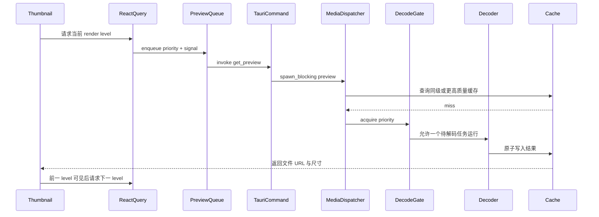
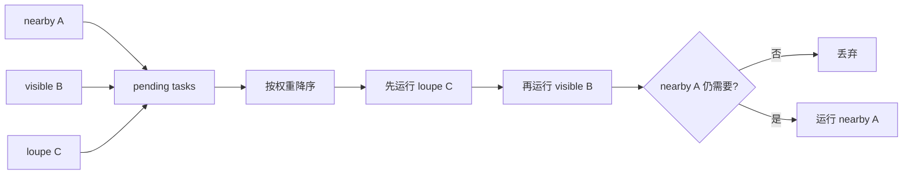
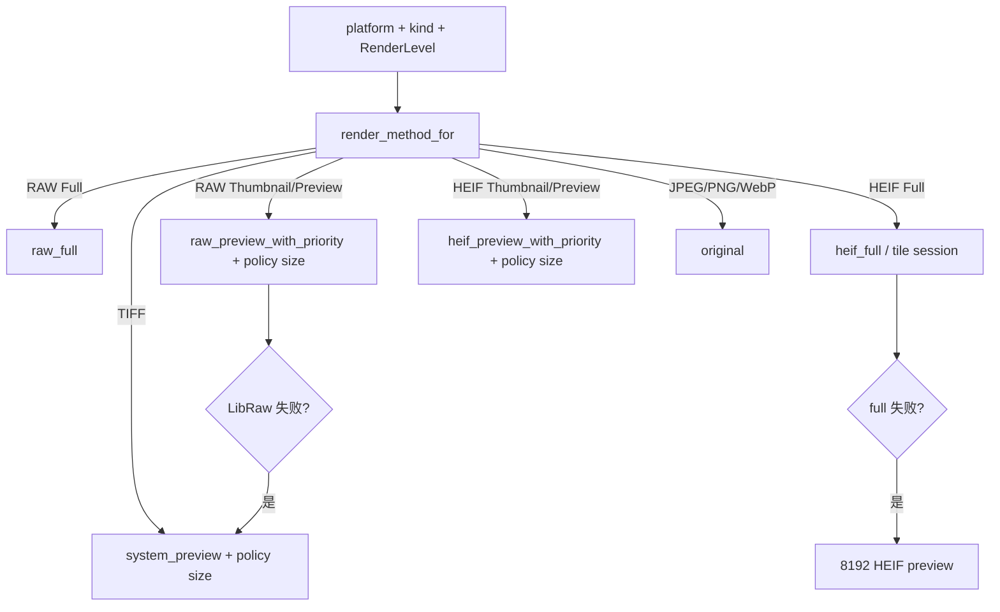

# 03：统一预览流水线

本章解释照片怎样从“一个文件摘要”变成屏幕上的 thumbnail、preview 或 full 表示。
这是 OxyViewer 最性能敏感的路径，也是格式差异最多的部分。

统一调度见 [ADR 0005](../adr/0005-unified-preview-pipeline.md)，语义等级图见
[ADR 0006](../adr/0006-semantic-render-level-graph.md)。

## 1. 为什么需要预览，而不是总显示原文件

JPEG、PNG、WebP 通常能由 WebView 直接显示。RAW、HEIF、TIFF 则可能需要相机格式库、
HEVC 解码器或操作系统预览服务。即使原文件可解码，也不应在网格里为每张照片解码全尺寸。

因此预览系统解决四件事：

1. 选择最合适的显示路径；
2. 先低清后高清，尽快让用户看到内容；
3. 让当前放大镜和可见缩略图优先；
4. 把昂贵结果写入可重建缓存。

## 2. 语义等级与格式/平台矩阵

| Windows 格式 | `thumbnail` | `preview` | `full` |
| --- | --- | --- | --- |
| JPEG/PNG/WebP | 原文件 URL | 原文件 URL | 原文件 URL |
| RAW | LibRaw 512 | LibRaw 4096 | 近全尺寸内嵌 JPEG；不足时 full development |
| HEIF/HIF | 内嵌 160×120 JPEG | 复用同一内嵌 JPEG | 独立 HEIF tile session |
| TIFF | 系统 512 | 系统 512 | 系统 4096（当前最佳可用表示） |

交互图不随格式改变：网格/列表只进入 `thumbnail`；放大镜固定执行 `preview → full`。
前端 `renderPlan(kind, surface, platform)` 把等级映射到 renderer 类；后端
`render_method_for(kind, level, platform)` 再选择实际解码器和尺寸。多个等级可以指向同一产物。
例如 Sony HIF 的 `preview` 是 `thumbnail` 的显式别名，而不是一个 160 px 特判。

## 3. 端到端调用链



实际缓存命中时会跳过 gate 和 decoder。JPEG/PNG/WebP 直接路径还会跳过整条生成流水线。

## 4. 前端等级升级

`Thumbnail` 组件只解释固定等级图：

1. 网格/列表请求 `thumbnail`；
2. 放大镜先请求并保留 `preview`，再启动 `full`；
3. renderer profile 决定等级是原图、生成图、tile session，还是另一个等级的复用；
4. 组件选择当前最高可用且未加载失败的 URL；
5. 新等级图片真正完成浏览器加载后才取代现有图。

这避免“高清请求已返回 URL，但文件尚未解码进浏览器”时让画面闪空。RAW full 失败也会继续
保留渐进预览，而不是让放大镜不可用。

Windows HEIF 的 `preview` renderer 复用 `thumbnail` 的 160×120 JPEG，`full` 则由 Canvas tile
session 负责。该 JPEG 保留在 Canvas 下方，直到瓦片逐步覆盖。这样不会让重复的全图解码和 JPEG
编码占住串行 preview queue，阻塞屏内缩略图。

## 5. 第一层调度：前端 `previewQueue`

所有需要生成的格式和 stage 共用一个串行队列。权重为：

```text
loupe  = 2   当前单图查看
visible = 1  真正位于视口内
nearby  = 0  overscan 预加载
preload = -1 过滤后未显示的同目录图片
```

队列每次从 pending 中选最高权重，只允许一个 `invoke` 在途。`AbortSignal` 若在任务开始前已
取消，任务直接丢弃。React Query key 只描述产物身份，不包含 priority；同一产物从 sidebar
进入 loupe 时通过 `raisePriority` 原地提升 pending task，并把提升后的 priority 传给后端。
这既避免重复解码，也保留 `loupe > visible > nearby > preload` 的调度顺序。

开启搜索、格式、评级或颜色过滤时，另一个无过滤的廉价分页查询会继续枚举当前目录。未出现在
可见结果中的图片由 `BackgroundPreviewPreloader` 串行提交，每次只放入一个 `preload`
请求；追加下一页、改变过滤或图片重新可见时会取消尚未开始的旧请求。这样过滤不再终止缓存
预热，同时不会一次把整个目录塞进 preview queue。



前端串行不是媒体库的理论最大吞吐方案，而是防止快速滚动时堆积大量无法及时显示的本地
decode command。并发度若要提高，必须用基准证明不会恶化 UI、内存和磁盘压力。

## 6. 第二层调度：后端 `DecodeGate`

Rust `DecodeGate` 有三档优先级：

| IPC priority | Rust priority | 等待规则 |
| --- | --- | --- |
| `loupe` | `Foreground` | 可越过所有未开始任务 |
| `visible` | `Visible` | 等待 foreground，不等 background |
| `nearby` | `Background` | 等待 foreground 和 visible |
| `preload` | `Background` | 与 nearby 共用后端 background 档；前端保证它最后提交 |

gate 只允许一个参与统一 gate 的 decode 活跃。高优先级可以插队等待者，但**不能抢占已经运行
的 decode**。permit 离开作用域时由 Rust `Drop` 自动释放并通知等待者。

为什么前后端都要调度：前端知道视口和请求是否仍有意义；后端知道原生解码资源是否正在被
占用，也防御来自多个 command 的竞争。两层当前都偏保守串行。

RAW full development 是例外。它可能耗时数十秒，使用独立 `RAW_FULL_DECODE_LOCK`，不进入
统一 gate，否则一张 full RAW 会阻塞所有缩略图。

## 7. Dispatcher：唯一格式分派入口

Tauri `get_preview` 的逻辑是：

1. 通过 `oxy-fs` 取得 asset kind；
2. 接收 `RenderLevel` 和 priority；
3. 映射 priority；
4. 在线程池调用 `oxy_media::preview(...)`。

`oxy_media::preview` 根据 `(platform, kind, level)` 查表分派。IPC 不接收像素尺寸：



格式 fallback 放在 `oxy-media` 而不是 command 中，因此单元测试和非 Tauri 调用也能得到
同样策略。

## 8. RAW 路径

### 8.1 512 和 4096

RAW 由 vendored LibRaw 0.22.1 处理。预览优先尝试内嵌预览：相机通常已经在 RAW 容器里存了
JPEG，读取它远比 demosaic 原始感光数据快。若内嵌预览不适用，才执行 half-size development。

RAW `thumbnail` 映射 512，`preview` 映射 4096。放大镜直接从 `preview` 开始，因为 Sony ARW
常见的近全尺寸内嵌 JPEG 可以在数毫秒内直接复制；先把它解码、缩放并重编码成 512 反而更慢。
4096 产物保留合适的
内嵌 JPEG，避免无意义的解码、缩放、重编码。最终结果进入 JPEG 缓存，macOS Quick Look 是
兼容性 fallback。

### 8.2 full

`full` 等级先检查内嵌 JPEG 是否覆盖 RAW 源尺寸的至少 90%。满足时直接复用 `preview` 缓存，提供
接近即时的 1:1 查看，也避免后台显影抢占 CPU、拖慢缩放和平移。只有内嵌预览明显不足时，
才对传感器数据执行完整开发、应用适度 sharpening 并生成高质量 JPEG；该 fallback 不属于冷
预览 800 ms 预算，UI 会一直保留 4096 图。

### 8.3 Sony 拍摄对焦区域

`get_asset_details` 在线程池中通过 `oxy-metadata` 与纯 Rust `fpexif` 读取 Sony MakerNote
`FocusLocation`/`FocusFrameSize`。ARW、JPEG、HEIF/HIF 只要带有这些字段，都通过同一个
`FocusInfo` 小型结构返回；图片字节仍不经过 IPC。EXIF 方向会先应用到坐标，HEIF 缺少 EXIF
方向而显示尺寸明确交换横竖轴时使用 Sony 常见的顺时针方向。前端再用当前真正显示的
JPEG/完整 RAW 自然尺寸映射坐标，
而不是假设内嵌预览与 RAW 的长宽比相同：同长宽比直接缩放，已知完整 RAW 可在相机裁剪外
扩展，否则使用保守的居中裁剪并隐藏落在裁剪外的点。对焦层位于 `.loupe__render` 内，因此
适应窗口、放大和平移时都与图片保持一致。

存在 `FocusFrameSize` 时显示精确实线框；仅有 `FocusLocation` 中心时显示带中心点的虚线
估算框，避免把估算大小冒充相机记录。

## 9. HEIF 预览路径

HEIF preview 优先尝试容器内 thumbnail，接受尺寸不足的内嵌图作为快速第一阶段。Windows Sony
HIF 会直接读取前 2 MiB 内的 160×120 MJPEG item，注入正确 EXIF orientation 后原样写入缓存，
不进入 HEVC gate，也不进行像素重编码。需要解码
primary image 时，可使用 macOS ImageIO、FFmpeg 或 libheif 等后端，并限制线程数避免后台
缩略图吃满 CPU。

HEIF `preview` 与全分辨率 tile session 是两条配合路径：前者提供持久底图，后者提供放大检查。
当前各平台都将 Sony HIF 的 `thumbnail` 与 `preview` 映射到 160×120 产物；平台策略以后可以在
有独立 fixture 基准证据时分化。
macOS 的预览 JPEG 使用 ImageIO 编码；解码 permit 在 primary image 解码完成
后立即释放，JPEG 编码与缓存同步不继续阻塞下一项解码。下一章专门解释 session。

## 10. 缓存键与原子写入

缓存键哈希至少包含：

- 源路径；
- 文件大小；
- 修改时间；
- backend/cache version；
- 由 `(platform, kind, RenderLevel)` 策略解析出的实际尺寸。

源文件修改或解码算法版本升级都会形成新键。旧文件可能暂时留在 cache 目录，但不会被误用。

RAW/HEIF 的 JPEG 和部分 byte-cache 写入先在目标目录创建临时文件，编码完成后原子持久化到
目标路径。这样崩溃或取消不会留下看似有效但内容截断的最终文件。统一预览主要写 8-bit JPEG，
并可嵌入 ICC profile；`system_preview` 当前使用系统生成的 PNG 路径，不应把 JPEG/原子写入
描述成所有 backend 都已具备的统一保证。

### 10.1 更高质量缓存复用

当请求 512 时，通用 `larger_cached_preview` 会检查是否已有同 backend tag 的 4096 缓存；若有，
直接返回更大文件并由浏览器缩小显示。HEIF 还会显式检查自己的 full JPEG 并缩放复用。RAW 的
512/4096 查询会复用更大的 `.embedded.jpg` 或 `.developed.jpg`；RAW full 在内嵌 JPEG 覆盖源尺寸
至少 90% 时也直接返回该 4096 缓存。只有实际 LibRaw full development 才写入独立 cache version。
这些策略统称为 up-tier reuse。

## 11. 取消的真实语义

需要准确区分三件事：

1. **前端 pending 取消**：尚未进入 `invoke`，可以真正丢弃；
2. **前端忽略结果**：command 已开始，React Query 不再使用返回值；
3. **后端协作取消**：解码器定期检查 flag 并提前退出。

统一 preview 当前完整支持第 1 项，第 2 项是运行中请求的行为，第 3 项尚未普遍实现。Tauri
`invoke` 本身不能携带浏览器 `AbortSignal` 去中断 Rust 原生解码。文档或 UI 不应把“停止等待
结果”描述成“停止了 CPU 解码”。HEIF full session 有自己的取消 flag，语义更强，见下一章。

## 12. 诊断与性能

`PreviewResult` 包含 URL、类型、宽高，并可带 `renderLevel` 与 diagnostics。性能判断需要区分：

- cold decode；
- warm cache hit；
- JPEG 写盘；
- 浏览器加载和绘制；
- RAW full 等明确排除在首预览预算外的工作。

目标和历史数据在 [PERFORMANCE.md](../PERFORMANCE.md)。新增优化必须在同一 fixture、release
构建和相同冷/热条件下比较，不能只看单个内部函数耗时。

## 13. 本章检查点

- 为什么 RAW full 不进入 `DecodeGate`？
- visible 请求是否能中断正在运行的 nearby decode？
- React Query 取消一个已开始的 invoke 后，Rust 一定停止吗？
- 为什么 HEIF full 不属于 `` 的第三个 query？
- 为什么 160×120 不能成为交互状态判断条件？
- 缓存键为什么包含版本和修改时间？
- 原子写入避免了哪一类缓存损坏？

下一章：[04：HEIF 会话与瓦片协议](04-heif-tile-session.md)。
