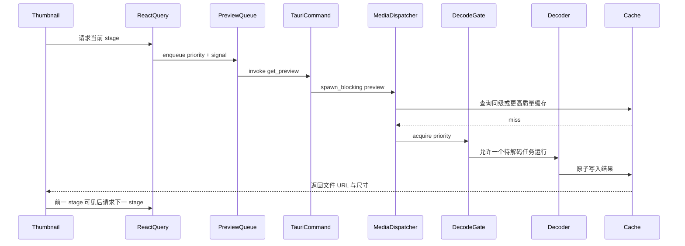
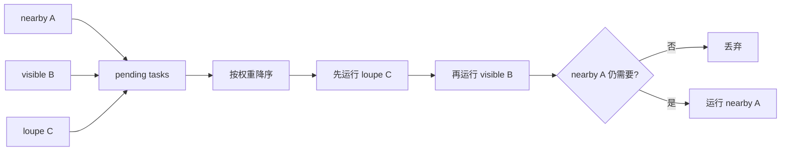
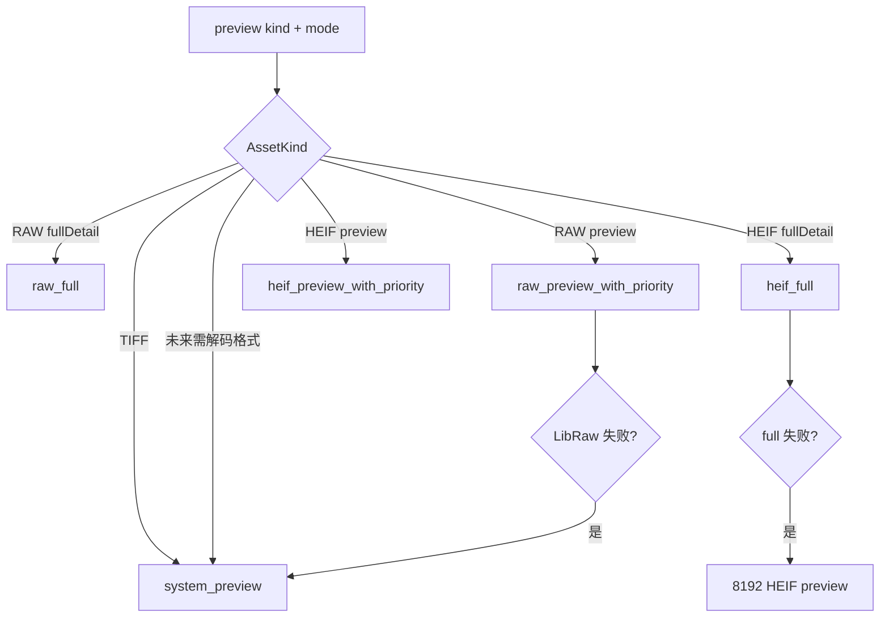

# 03：统一预览流水线

本章解释照片怎样从“一个文件摘要”变成屏幕上的缩略图、4096 px 预览或全分辨率图。
这是 OxyViewer 最性能敏感的路径，也是格式差异最多的部分。

设计决策详见 [ADR 0005](../adr/0005-unified-preview-pipeline.md)。

## 1. 为什么需要预览，而不是总显示原文件

JPEG、PNG、WebP 通常能由 WebView 直接显示。RAW、HEIF、TIFF 则可能需要相机格式库、
HEVC 解码器或操作系统预览服务。即使原文件可解码，也不应在网格里为每张照片解码全尺寸。

因此预览系统解决四件事：

1. 选择最合适的显示路径；
2. 先低清后高清，尽快让用户看到内容；
3. 让当前放大镜和可见缩略图优先；
4. 把昂贵结果写入可重建缓存。

## 2. 格式与阶段矩阵

| 格式 | 网格/列表 | 放大镜渐进阶段 | 全分辨率 |
| --- | --- | --- | --- |
| JPEG/PNG/WebP | 原文件 URL | 原文件 URL | WebView 直接显示 |
| RAW | 512 JPEG | 512 → 4096 → full JPEG | LibRaw full development |
| HEIF/HIF | 512 JPEG | 512 JPEG 临时底图 | 独立 HEIF tile session |
| TIFF | 系统 512 预览 | 系统 512 → 4096 预览 | 当前没有独立 full stage |

前端 `previewStages(kind, large)` 决定渐进请求序列。后端 `needs_decode(kind)` 决定是直接返回
原文件还是进入统一 dispatcher。两者表达不同问题，新增格式时需要一起核对。

## 3. 端到端调用链



实际缓存命中时会跳过 gate 和 decoder。JPEG/PNG/WebP 直接路径还会跳过整条生成流水线。

## 4. 前端阶段升级

`Thumbnail` 组件使用多个 React Query：

1. 512 stage 首先启用；
2. 大图模式下，RAW/TIFF 在 512 成功后启用 4096 stage；HEIF 跳过该 stage；
3. RAW 在 4096 成功或失败后启用 full stage；
4. 组件选择当前最高可用且未加载失败的 URL；
5. 新 stage 图片真正完成浏览器加载后才取代低清图。

这避免“高清请求已返回 URL，但文件尚未解码进浏览器”时让画面闪空。RAW full 失败也会继续
保留渐进预览，而不是让放大镜不可用。

HEIF 不在 `` 链里请求 4096 或 full，因为它的 full 由 Canvas tile session 负责。512 JPEG
保留在 Canvas 下方作为临时占位，直到瓦片逐步覆盖。这样不会让一个重复的全图解码和 JPEG
编码占住串行 preview queue，阻塞屏内缩略图。

## 5. 第一层调度：前端 `previewQueue`

所有需要生成的格式和 stage 共用一个串行队列。权重为：

```text
loupe  = 2   当前单图查看
visible = 1  真正位于视口内
nearby  = 0  overscan 预加载
```

队列每次从 pending 中选最高权重，只允许一个 `invoke` 在途。`AbortSignal` 若在任务开始前已
取消，任务直接丢弃。React Query key 包含 priority；项目从 nearby 变为 visible 时会建立新的
高优先级请求，旧 pending 请求被取消。



前端串行不是媒体库的理论最大吞吐方案，而是防止快速滚动时堆积大量无法及时显示的本地
decode command。并发度若要提高，必须用基准证明不会恶化 UI、内存和磁盘压力。

## 6. 第二层调度：后端 `DecodeGate`

Rust `DecodeGate` 有三档优先级：

| IPC priority | Rust priority | 等待规则 |
| --- | --- | --- |
| `loupe` | `Foreground` | 可越过所有未开始任务 |
| `visible` | `Visible` | 等待 foreground，不等 background |
| `nearby` | `Background` | 等待 foreground 和 visible |

gate 只允许一个参与统一 gate 的 decode 活跃。高优先级可以插队等待者，但**不能抢占已经运行
的 decode**。permit 离开作用域时由 Rust `Drop` 自动释放并通知等待者。

为什么前后端都要调度：前端知道视口和请求是否仍有意义；后端知道原生解码资源是否正在被
占用，也防御来自多个 command 的竞争。两层当前都偏保守串行。

RAW full development 是例外。它可能耗时数十秒，使用独立 `RAW_FULL_DECODE_LOCK`，不进入
统一 gate，否则一张 full RAW 会阻塞所有缩略图。

## 7. Dispatcher：唯一格式分派入口

Tauri `get_preview` 的逻辑是：

1. 通过 `oxy-fs` 取得 asset kind；
2. 可直接显示则 `oxy_media::original(path)`；
3. 需要解码则限制 `maxSize` 在 128～8192；
4. 映射 priority；
5. 在线程池调用 `oxy_media::preview(...)`。

`oxy_media::preview` 再根据 `(kind, mode)` 分派：



格式 fallback 放在 `oxy-media` 而不是 command 中，因此单元测试和非 Tauri 调用也能得到
同样策略。

## 8. RAW 路径

### 8.1 512 和 4096

RAW 由 vendored LibRaw 0.22.1 处理。预览优先尝试内嵌预览：相机通常已经在 RAW 容器里存了
JPEG，读取它远比 demosaic 原始感光数据快。若内嵌预览不适用，才执行 half-size development。

4096 stage 可保留合适的内嵌 JPEG，避免无意义的解码、缩放、重编码。最终结果进入 JPEG
缓存，macOS Quick Look 是兼容性 fallback。

### 8.2 full

full stage 对传感器数据执行完整开发，应用适度 sharpening 并生成高质量 JPEG。它不属于冷
预览 800 ms 预算；UI 必须一直保留 4096 图。当前参考 ARW 的历史测量约 23.75 秒，说明把它
隔离出统一 gate 是必要的。

## 9. HEIF 预览路径

HEIF preview 优先尝试容器内 thumbnail，接受尺寸不足的内嵌图作为快速第一阶段。需要解码
primary image 时，可使用 macOS ImageIO、FFmpeg 或 libheif 等后端，并限制线程数避免后台
缩略图吃满 CPU。

本章所说的 HEIF 512 JPEG 与全分辨率 tile session 是两条配合路径：前者提供快速临时底图，
后者提供放大检查。macOS 的预览 JPEG 使用 ImageIO 编码；解码 permit 在 primary image 解码完成
后立即释放，JPEG 编码与缓存同步不继续阻塞下一项解码。下一章专门解释 session。

## 10. 缓存键与原子写入

缓存键哈希至少包含：

- 源路径；
- 文件大小；
- 修改时间；
- backend/cache version；
- `maxSize`。

源文件修改或解码算法版本升级都会形成新键。旧文件可能暂时留在 cache 目录，但不会被误用。

RAW/HEIF 的 JPEG 和部分 byte-cache 写入先在目标目录创建临时文件，编码完成后原子持久化到
目标路径。这样崩溃或取消不会留下看似有效但内容截断的最终文件。统一预览主要写 8-bit JPEG，
并可嵌入 ICC profile；`system_preview` 当前使用系统生成的 PNG 路径，不应把 JPEG/原子写入
描述成所有 backend 都已具备的统一保证。

### 10.1 更高质量缓存复用

当请求 512 时，通用 `larger_cached_preview` 会检查是否已有同 backend tag 的 4096 缓存；若有，
直接返回更大文件并由浏览器缩小显示。HEIF 还会显式检查自己的 full JPEG 并缩放复用。RAW full
使用独立 cache version，当前不会自动满足 RAW 512/4096 请求。这个策略统称为 up-tier reuse。

## 11. 取消的真实语义

需要准确区分三件事：

1. **前端 pending 取消**：尚未进入 `invoke`，可以真正丢弃；
2. **前端忽略结果**：command 已开始，React Query 不再使用返回值；
3. **后端协作取消**：解码器定期检查 flag 并提前退出。

统一 preview 当前完整支持第 1 项，第 2 项是运行中请求的行为，第 3 项尚未普遍实现。Tauri
`invoke` 本身不能携带浏览器 `AbortSignal` 去中断 Rust 原生解码。文档或 UI 不应把“停止等待
结果”描述成“停止了 CPU 解码”。HEIF full session 有自己的取消 flag，语义更强，见下一章。

## 12. 诊断与性能

`PreviewResult` 包含 URL、类型、宽高，并可带 stage 与 diagnostics。性能判断需要区分：

- cold decode；
- warm cache hit；
- JPEG 写盘；
- 浏览器加载和绘制；
- RAW full 等明确排除在首预览预算外的工作。

目标和历史数据在 [PERFORMANCE.md](../PERFORMANCE.md)。新增优化必须在同一 fixture、release
构建和相同冷/热条件下比较，不能只看单个内部函数耗时。

## 13. 本章检查点

- 为什么 RAW full 不进入 `DecodeGate`？
- visible 请求是否能中断正在运行的 nearby decode？
- React Query 取消一个已开始的 invoke 后，Rust 一定停止吗？
- 为什么 HEIF full 不属于 `` 的第三个 query？
- 缓存键为什么包含版本和修改时间？
- 原子写入避免了哪一类缓存损坏？

下一章：[04：HEIF 会话与瓦片协议](04-heif-tile-session.md)。
