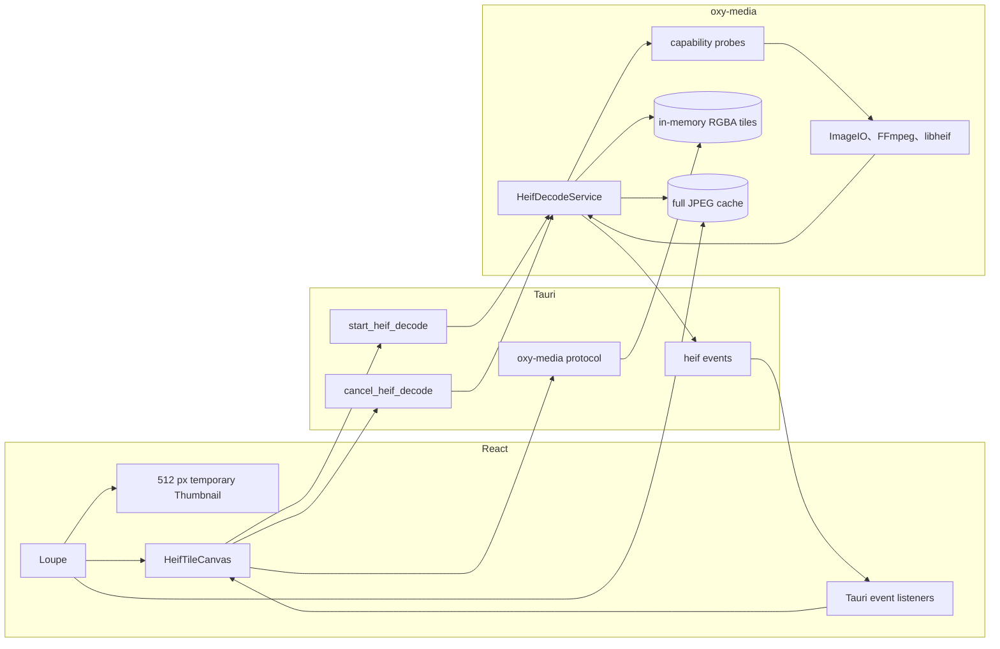
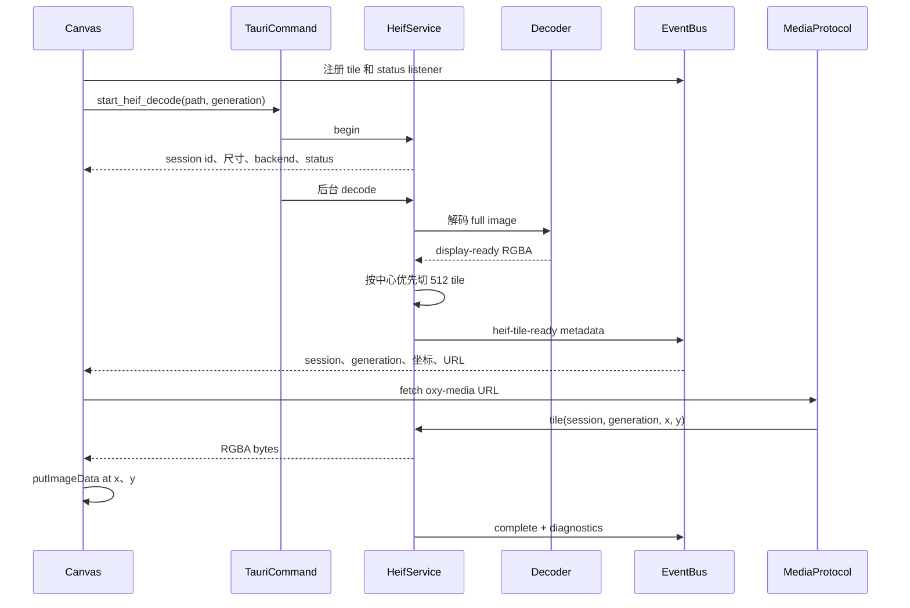
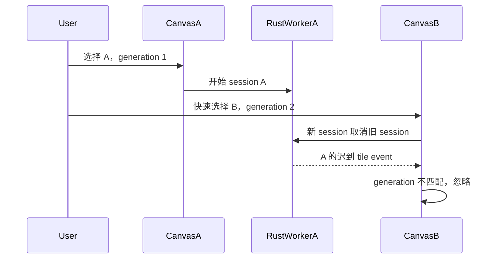
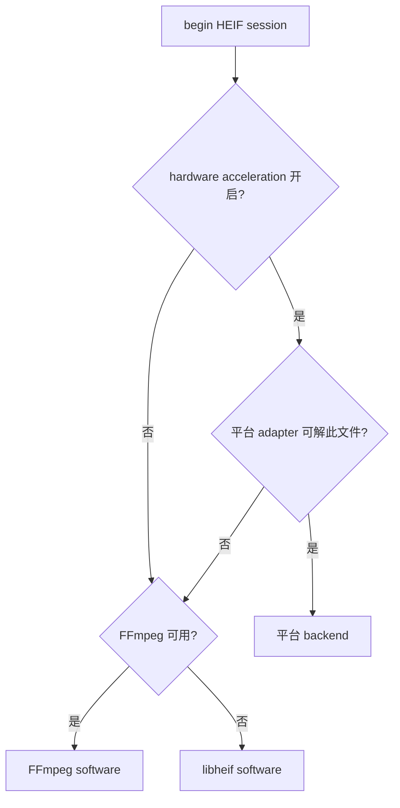

# 04：HEIF 完整 JPEG 与旧瓦片协议

当前 loupe 已停用 Canvas 分片传输。活动路径只有两级：先显示源文件内嵌的小 JPEG，再由
统一 preview pipeline 将源 HEIF 直接转换为 quality 95 的完整 JPEG，并以文件 URL 一次加载。
macOS 转换停留在 ImageIO 的 `CGImageSource → CGImageDestination` 内，不把约 125 MiB 的整幅
RGBA 缓冲区传回 Rust 再压缩；Windows/Linux 使用 FFmpeg 从 HEIF tile grid 直接合成 JPEG。
缓存命中时不再解码源 HEIF。

`HeifDecodeService`、`HeifTileCanvas`、event 和 `oxy-media://` tile protocol 暂时保留为诊断与
回退实现，但 `Loupe` 不再挂载 `HeifTileCanvas`，所以正常浏览不会启动 session 或传输任何 tile。
下文记录的是已停用的旧协议，便于后续安全删除。

架构决策见 [ADR 0004](../adr/0004-heif-full-resolution-sessions.md)。

## 1. 为什么单独设计 HEIF full path

高分辨率 HEIF 可能是高位深 HEVC tile grid。完整解码会消耗明显 CPU、内存和时间。如果让
`` 等一个全尺寸临时文件生成完再显示，用户会经历长时间无反馈；如果把 RGBA 像素塞进
command JSON，又会发生 base64/数组序列化和多次复制。

旧方案曾把问题拆开：

- preview JPEG：统一 preview pipeline 提供，快速、可缓存、作为临时底图；
- full RGBA：一次有身份的后台 session 解码；
- tile metadata：通过 Tauri event 发送；
- tile bytes：通过 `oxy-media://` 自定义协议按 URL 读取；
- display：Canvas 按坐标覆盖到底图；
- warm display：首次 session 在发布瓦片后原子写入全分辨率 JPEG；相同源文件和显示设置再次
  进入 loupe 时直接加载该文件，不再启动 session 或重复传输瓦片。

## 2. 组件关系



`HeifDecodeService` 属于 `AppState`，因此 command、protocol handler 和后台 worker 访问的是
同一份会话状态与 tile store。

## 3. 从选中照片到绘制瓦片



解码完成前，前端保留 Canvas，因此首次打开仍能渐进绘制。后端使用本次 session 已经得到的
完整像素（Windows FFmpeg 网格路径则拼接已经生成的 JPEG tiles）写缓存，不会为了缓存再次解码
HEIF。缓存键包含源文件身份、硬件解码偏好和显示锐化设置；任一项变化都会安全地回到 tile path。
瓦片发布后会立即释放前台 decode gate 并报告显示完成；JPEG 落盘使用独立的串行锁，不属于
loupe 完成条件。写入前还有一个可取消的短暂稳定期，快速掠过的照片不会排队编码大图；即使某个
已经开始的缓存写入无法中途停止，也不会阻塞新选中照片的解码。

前端先安装 listener 再启动 command，避免非常快的后台事件在订阅前丢失。即使 event 早于
`sessionId` 赋值到达，组件也会暂存 `pendingTiles`，拿到 session 后再筛选并绘制。

## 4. Session 数据结构

`HeifDecodeSession` 是发给前端的公开信息：

| 字段 | 作用 |
| --- | --- |
| `id` | 区分不同 session |
| `generation` | 区分前端选择代次 |
| `width`、`height` | 设置 Canvas 像素尺寸 |
| `tileSize` | Windows fallback 为 1024；macOS 等平台为 512，以保留更快、更稳定的中心优先渐进绘制。Windows FFmpeg 源网格 JPEG 路径按容器网格发布，不受该 fallback 大小限制 |
| `backend` | 实际计划使用的后端 |
| `acceleration` | hardware/software/unknown |
| `status` | decoding 或 compatibility fallback 等 |

service 内部的 `ActiveSession` 还持有 `AtomicBool cancelled`。启动新 session 时：

1. 取出旧 active session；
2. 设置旧取消 flag；
3. 清空旧 tile store；
4. 安装新 session；
5. 返回新 session metadata。

因此模型是“全应用同一时间最多一个选中 HEIF full session”，与放大镜只有一个 active asset
相匹配。

## 5. `generation` 与 `sessionId` 为什么都需要

异步系统的典型问题是：用户快速切到 B，A 的晚到结果却覆盖 B。



- `generation` 由前端递增，保护组件选择代次；
- `sessionId` 由 Rust 生成，保护后端会话身份；
- tile store key 同时包含 session、generation、x、y；
- event listener 同时校验 generation 和 session ID。

两层身份使 UI remount、command/event 时序交错和后台迟到结果都更难污染当前画面。

## 6. 后端选择

`begin` 先读取图片尺寸，再按运行平台和设置选择：

1. 硬件加速开关已启用、平台 adapter 可用且能接受该文件时，选平台后端；
2. 否则尝试 FFmpeg tile-grid 路径；
3. 最后使用 libheif software compatibility backend。

macOS 当前平台 adapter 是 ImageIO，Windows 有 WIC 探测；代码中还保留后续 Media Foundation、
VAAPI 等枚举空间。能力“存在”不代表一定使用，更不代表确认了 GPU。无法从公开 API 验证时，
acceleration 必须报告 `Unknown`，不能为了 UI 好看标成 `Hardware`。



真正 decode 时仍可能失败，适配器内部必须保留 fallback 和可操作的 diagnostics。

## 7. 解码、切片和中心优先

当前非 grid-aware early decode 路径先得到完整 `DynamicImage`，再按 512 tile 裁切。瓦片坐标按
tile 中心到整图中心的平方距离排序，因此最接近画面中心的 tile 先发布。对默认居中的放大镜，
这比严格左上到右下更快呈现用户关注区域。

每个 `HeifTile` 包含：宽、高、stride 和 `Arc<[u8]>` RGBA。tile 放入 service 的 HashMap，event
只携带可定位它的 metadata 和 URL。

macOS 的“标准”高倍查看锐化在完整 RGBA 图上通过 Accelerate/vImage 执行轻量亮度 unsharp
mask，再切成瓦片。它只改变内存中的显示瓦片，不修改原文件或缓存；先整图处理也保证 512 px
瓦片边界能够读取相邻像素，不产生格状接缝。用户可在设置中关闭该显示增强。

需要准确理解：当前中心优先优化的是**完整解码之后的发布顺序**。对于非 grid-aware backend，
它并没有让 HEVC 只解中心区域。真正的 early tile decode 仍属于未来 adapter 优化。

## 8. 自定义协议响应

协议 URL 形如：

```text
oxy-media://localhost/tile/{session}/{generation}/{x}/{y}
```

Tauri handler 解析五段 path，读取 tile，并返回：

- `Content-Type: application/octet-stream`；
- `Access-Control-Allow-Origin: *`；
- `x-oxy-width`、`x-oxy-height`、`x-oxy-stride`；
- body 为紧密排列的 RGBA8 bytes。

Canvas 当前主要信任 event 中的宽高来构造 `ImageData`。找不到 tile 返回 404。协议不是公开
网络服务，只在应用内部为 WebView 提供二进制桥梁。

## 9. 取消语义

HEIF session 比统一 preview 有更强的取消：

- 新 session 会设置旧 session 的 atomic flag；
- React effect cleanup 调用 `cancel_heif_decode`；
- worker 在 decode 前和每个 tile 发布前检查 flag；
- backend decode 已经进入一次不可中断调用时，仍可能要等该调用返回后才能观察 flag。

因此它是“阶段间协作取消”，还不是所有 native codec 都支持的即时抢占。取消后 worker 发布
`Cancelled` status；前端卸载后也会通过 `disposed` 防止绘制。

## 10. 状态与诊断

状态枚举包括 probing、decoding、compatibilityFallback、complete、failed、cancelled。当前 begin
主要返回 decoding 或 compatibility fallback，后台完成后 event 再给出 terminal status。

`HeifDiagnostics` 记录 backend、acceleration、codec、decode 时间、tile publish 时间、总时间和
fallback reason。性能问题应先看 decode 还是 publish 慢，而不是把两者统称为“HEIF 慢”。

## 11. 内存边界

full RGBA8 的理论内存约为：

```text
width × height × 4 bytes
```

例如 7008 × 4672 约 125 MiB，仅计算一份紧密 RGBA；decoder 中间帧、完整 `DynamicImage`、
tile copies 和 Canvas backing store 会继续增加峰值。当前开始新 session 时清空旧 tile，但单个
session 仍可能同时持有完整图和所有瓦片。进行并发或预加载优化前必须测量峰值 RSS。

## 12. 本章检查点

- 为什么 event 不直接携带 RGBA 数组？
- 为什么 512 JPEG 要保留到 Canvas 瓦片覆盖？
- 中心优先发布是否等于中心优先 HEVC 解码？
- 新选择怎样阻止旧 tile 覆盖？
- “取消 session”为什么仍可能等 native decoder 返回？
- acceleration 为 Unknown 与 Software 有何区别？

下一章：[05：状态、数据与安全边界](05-data-and-state.md)。
