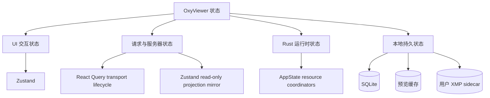
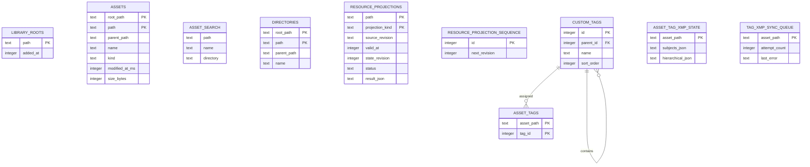
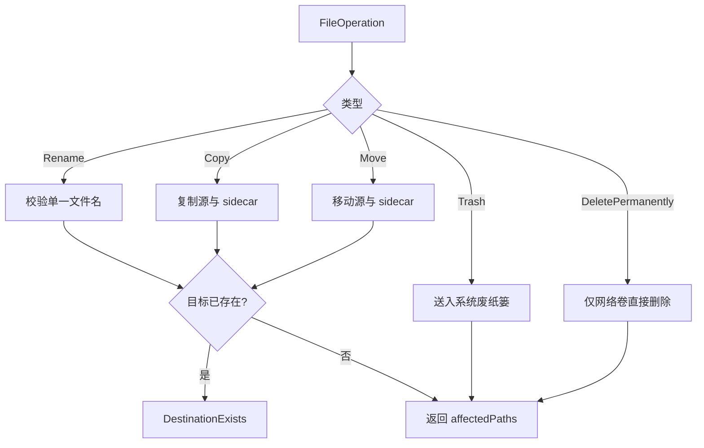

# 05：状态、数据与安全边界

本章说明 OxyViewer 的状态存在哪里、哪些数据可重建、哪些写操作会影响用户文件，以及当前
安全边界的真实范围。

## 1. 四类状态

把这四类混在一个 store 中会造成生命周期不清：例如清除 React Query 不应删除用户 XMP，
切换视图也不应重建 SQLite 连接。

## 2. Zustand：同步 UI 意图

`useWorkspaceStore` 保存：

- grid/list/loupe 视图与网格偏好；
- selected IDs 和 active ID；
- 左侧栏、Inspector、Settings、Navigator 的开关；
- locale 和显示锐化偏好；
- 搜索、类型过滤、排序和方向。

这些值由用户交互立即修改，主要决定“界面想显示什么”。它们不代表磁盘事实，也不保存预览
Promise。store 没有通用持久化 middleware；`workspacePersistence.ts` 只显式保存当前根目录/
子目录、文件夹排序，以及焦点框、面板尺寸、元数据可见性和 loupe 控件等少量偏好。其他值重启后
恢复默认值。

选择模型中，普通选择把数组替换为单个 ID；按 meta/ctrl 的 additive 选择切换成员，并把操作
对象设为 active。打开新目录时调用 `clearSelection`，避免旧 ID 指向新 session。

## 3. React Query：异步结果生命周期

React Query 保存通过 Tauri 或 demo API 得到的数据：

- assets 的多页结果；
- 普通目录子节点和按名称命中的目录搜索结果；
- library roots；
- asset details transport；
- 各 stage preview request 的 loading/error 生命周期。

query key 是请求身份的一部分。典型 key 包含 asset ID、修改时间和 semantic render level；
priority 是可提升的调度提示，不是 artifact 身份。

React Query 管理 loading/error/retry/abort lifecycle，但不决定 metadata/image artifact 哪个
版本有效。`metadataProjection` 和 `imageProjection` Zustand store 只镜像 Rust 已接受的递增
`stateRevision`；grid、loupe、inspector 和过滤从这份镜像派生显示。刷新目录时同时使
Rust projection 与前端显示镜像失效。

## 4. Rust `AppState`：共享服务状态

`AppState` 在 Tauri setup 中创建一次。它持有：

- `FsCatalog` 的 folder sessions 与内存目录快照；
- `JobRegistry` 的作业取消 flags；
- `Library` 的 SQLite 写连接、浏览读取连接和资源缓存读取连接；
- `CacheManager`（当前 preview cache directory、容量策略和配置文件）；
- `MetadataQueue` / `PreviewQueue` 的 priority、pending/in-flight consumer 与 live projection；
- `DirectoryTreeQueue` 的分层目录读取优先级；
- `HeifDecodeService` 当前 session、tiles 和 diagnostics；
- `ResourceRegistry` 的受控、进程命名空间资源和 UI/read lease。

队列、resource ID 和 HEIF tiles 只活在 Rust 进程内。已接受的 metadata/image projection 写入 SQLite，
但 image result 序列化前会剥离 resource descriptor，Pending/Skipped 且没有稳定文件的结果不持久化。
重启后只有有效 managed/original path 可恢复，并须重新注册当前进程 resource；旧 URL 永远不会因为
计数器复用指向另一张图。
图片 result JSON 若因结构变化或损坏无法解析，按缓存未命中重新生成；保留原 projection 的
`valid_at` / `state_revision`，继续阻止过期请求覆盖较新的状态，而不让坏缓存阻断加载或写回。

## 5. SQLite 资料库

磁盘资料库使用一个共享写连接和两个只读 WAL 连接：文件列表、目录搜索及标签查询走浏览
连接，metadata/image projection 查询走缓存连接。读取不获取写连接的互斥锁；列表与目录
查询的完成标记、计数和结果在同一个只读事务快照中读取。内存测试库保留单连接行为。

目录与资产索引写入每批最多 256 条，并在记录之间检查 8 ms 软时间片，达到后提前提交。
提交后公平释放写锁，让已有等待者先执行；所有写入继续共享同一连接，保留资源 revision
的事务顺序。单条 SQL、磁盘提交与 WAL checkpoint 无法中途抢占，完成 generation 时的
旧行清理仍是原子事务。预览与元数据入队阶段仍有持队列锁进行 projection 写入的路径，
这些写入受益于批次交接，但尚未与队列锁完全解耦。

`oxy-library::Library::open` 在 app data 目录创建 `oxyviewer.sqlite`，启用 WAL，并确保以下逻辑
结构存在：

Mermaid 图只画用户标签关系；可重建 cache schema 不用外键约束事实来源。只有用户明确添加的 canonical
root 才会持久化和索引；同一路径可分别属于父、子两个显式 root，因此文件与目录以
`(root_path, path)` 为复合身份。后台先使用目录优先队列记录完整目录树，目录深度越小（层次越高）权重越大，同层按稳定入队顺序处理；目录阶段结束后清理旧目录并发布独立完成标记，使目录搜索立即可用，然后才逐目录扫描并记录文件。SQLite 写入复用 prepared statement，并将单层目录切成最多 256 项的短事务；未变化资产只推进 generation，新增、修改和删除资产同步增量更新 `indexed_asset_search`。完整资源 generation 结束时仅清理旧行，不再重建整个 FTS。普通目录分页、目录树和跨子目录
图片名称搜索优先读取该缓存；侧栏目录名称搜索只读取已完成的目录索引，并由每个命中项携带必要的
祖先摘要供前端合并成结果树。首次索引未完成或 metadata-aware 图片过滤时回退 `oxy-fs`，但
目录搜索不会触发递归磁盘回退。

SQLite connection 放在 `Mutex` 内，因为 `rusqlite::Connection` 的访问需要串行化。WAL 改善
读写并存和崩溃恢复，但不会自动使单个 connection 并发执行。资源请求和接受结果均在
`BEGIN IMMEDIATE` 事务中从同一序列取得 revision；另一个 connection 的旧 worker 结果会
得到当前较新的 row，而不会覆盖它。显式刷新写入 revision tombstone，阻止刷新前已开始的
任务把旧结果重新写回。

自定义标签是用户资料，不属于可重建索引。`custom_tags` 保存同级名称唯一的任意深度树，
`asset_tags` 以资产路径保存明确分配的标签（不会隐式分配祖先）。标签改名、移动、删除及资产标签
变更先事务提交数据库，再进入持久化 `tag_xmp_sync_queue`。写入成功后
`asset_tag_xmp_state` 记录 OxyViewer 管理的 `dc:subject` 与 `lr:hierarchicalSubject` 项，使后续同步
只替换受管值。相邻 XMP sidecar 的普通及层级关键词在详情读取时与 `asset_tags` 对账；存在待写队列
时暂停反向导入，防止旧 XML 恢复刚删除的数据库状态。图片内嵌关键词不进入数据库，和 sidecar
重叠时只显示一次，内嵌独有项作为灰色只读标签显示。失败不回滚数据库，可在目录重新打开或由
用户手动重试。

重启后的 metadata cache 采用两阶段恢复：先用 `AssetSummary` 已有的 size/mtime 逐项发布
SQLite ready snapshot，再在 Rust worker 中核验 sidecar/嵌入 XMP digest。完整 revision 不同
时，旧评级只在 loading 期间充当显示占位，核验结果会以新的事务 revision 同时更新 grid、
loupe、inspector 和过滤。

## 6. 预览缓存

preview cache 默认位于 Tauri `app_cache_dir()/previews`。用户可以在设置中选择一个父目录；
自定义缓存总是落到该目录下的 `OxyViewer Cache/previews`，不会把用户选择的目录本身当成可清空
空间。缓存设置是用户配置，持久化在 app data 下的 `cache-settings.json`，由
`oxy-userdata::DocumentStore` 原子提交（无法解析时改名隔离后以默认值启动，来自更新版本的
文件保留原样并拒绝写入）。它满足：

- 删除不会损坏源照片；
- 下次请求可重新生成；
- source revision 包含 canonical path、文件身份、长度和高精度 mtime；variant 包含目标与呈现策略，独立 ArtifactFacts 保存真实来源、尺寸、覆盖与处理过程；
- `media-cache-v3/<prefix>/<source-revision>/manifest.json` 允许同图多能力 artifact 共存；
- matcher 只允许兼容高清向下满足，低清只能作为显式 Interim；
- encoded/staged resource 先供 UI，再由有界 worker 原子持久化；完成后更新 projection 并清理容量；
- 容量上限为 1–500 GB，默认 10 GB；同一时刻最多运行一个清理任务；
- registry lease 和跨进程 marker 保护活跃 artifact；clear 后旧资源可读但不再成为新 lookup 命中；
- clear/prune 只识别固定 owned layout、manifest/artifact extension 和 staging 目录，不跟随 symlink。

切换缓存位置只影响后续请求，不自动搬迁或删除旧位置中的缓存。这样切换是快速且可恢复的，
同时不会把目录迁移 I/O 放进照片浏览关键路径。旧位置可由用户切回后显式清空。

## 7. 元数据读取与 XMP sidecar

拍摄参数先读取跨厂商通用 EXIF，再经过两个独立维度归一化：`capture/format.rs` 处理
JPEG、HEIF、RAW、TIFF 等容器或编码字段，`capture/vendor/` 下的厂商模块处理各自
MakerNotes。厂商路由同时接收图片类型，因此同一厂商在 JPEG、HEIF 和 RAW 中采用不同私有
标签时可以局部处理。不得把 Sony、Canon、Nikon、Fujifilm 等厂商的同名私有标签和值表互相
复用；未知厂商只返回通用 EXIF。

### XMP sidecar：用户数据，不是缓存

`oxy-metadata` 对所有格式的 rating/color/flag 默认读写同名 XMP sidecar；更新时只替换
`rdf:Description` 上对应的 `xmp:Rating` / `xmp:Label` / `digiKam:PickLabel` 属性，保留其他
XMP 字段。旗标采用 digiKam 的 `0/1/2/3 = none/rejected/pending/accepted` 约定，并保持独立于
星级；读取标准 `xmp:Rating=-1` 时投影为 rejected 旗标。首次写入时创建最小 Adobe 风格 XMP。
读取优先级为 sidecar、原生解析的内嵌 XMP、空值，因此存在 sidecar
时它明确覆盖文件内部的旧值。普通图片/RAW 由 `oxy-metadata-parser` 在进程内解析；HEIF/HIF
优先通过 `libheif-rs` 的 item table 读取 XMP，只有 libheif 拒绝损坏或合成容器时才使用有界扫描。
批量兼容入口可在原生解析失败后调用已配置的 ExifTool，但正常详情读取不依赖它。

Sony HIF 需要额外遵循 Imaging Edge Viewer 的写法：XMP 使用 compact shorthand，五种界面
颜色写为小写 `red` / `yellow` / `green` / `blue` / `purple`，清除值写作
`Rating=0` / `Label=None`。检查器对所有格式提供同一套五色选择；sidecar 保持通用 Adobe
标签语义，显式同步进 Sony HIF 时再转换为 Viewer 使用的小写值。读取 HIF 内嵌 XMP 时对这
五种颜色不区分大小写并规范化为界面值；`Label=None` 明确表示无颜色，不能回退到容器解析
阶段的旧值。存在同名 sidecar 时，仍由 sidecar 的完整可编辑投影覆盖内嵌 XMP。

sidecar 是持久用户数据，与 preview cache 不同，不能随意删除。只有用户主动选择“同步到
文件内部”时才会写 JPEG/HEIF/HIF 容器，并按用户路径、应用数据目录中的版本化能力包、
`OXY_EXIFTOOL_PATH`、`PATH` 顺序查找 ExifTool。能力缺失时才提示直接下载经过 SHA-256 校验
的固定版本官方包，或指定并验证已有执行文件。核心安装包不捆绑 worker；体积、发现顺序及
下载安全边界见
[`ADR 0007`](../adr/0007-optional-exiftool-capability.md)。sidecar 更新统一先写入同目录唯一
临时文件，再以平台原子替换语义提交到目标路径；高频标记操作不逐次调用 `fsync`，避免在
SMB/NAS 上产生延迟或不支持错误。

`patch_metadata` 在 blocking worker 中把多选编辑写入各自 sidecar；独立的
`sync_metadata_to_embedded` 才调用 ExifTool。完成后使对应目录摘要缓存失效，并刷新
详情与列表查询。普通目录打开仍先使用廉价分页，首屏返回后再异步批量补全已加载分页的
rating/color/flag；只有启用 rating/color/flag 中任一筛选时才批量读取整个当前目录的元数据，然后进行过滤和分页。

## 8. 文件操作

`FileOperation` 是 tagged enum：Rename、Copy、Move、Trash、DeletePermanently。实际操作集中在 `oxy-fs`：

- rename 只接受单个 normal filename component，拒绝空值和路径穿越式名称；
- 目标存在时拒绝覆盖；
- copy/move 同步处理 XMP sidecar；
- trash 使用系统废纸篓，并同时处理 sidecar；
- Windows 上打开目录时使用卷类型识别 UNC 与映射的网络驱动器。网络卷的右键菜单明确显示
  “直接删除”，确认框提示不可恢复，再由 DeletePermanently 递归删除目录或删除文件及其 sidecar；
  本地卷仍只提供可恢复的 trash 操作；
- 返回所有受影响路径。

### 8.1 必须知道的当前限制

浏览 command 会验证路径位于 `FolderSession` 根目录内；`execute_file_operation` 当前没有接收
session ID，也没有对 source/destination 做同样的 root containment 校验。它依赖调用方提供
明确路径和平台 capability 策略。

因此应准确表述为“文件操作集中到 `oxy-fs`，并具备名称、覆盖、sidecar 和 trash 安全语义”，
而不是“所有写操作都被 folder session 沙箱限制”。如果未来开放更广泛 UI 写操作，应考虑把
session/root policy 显式加入 command 契约并增加符号链接测试。

## 9. 作业注册与取消

`oxy-runtime::JobRegistry` 为作业生成 `job-N`，保存 `Arc<AtomicBool>`，返回含 priority 的
`JobTicket`。`cancel(id)` 设置 flag；worker 必须主动调用 `ticket.is_cancelled()` 才会提前退出；
`finish(id)` 从 registry 删除。

这是“取消词汇”，不是线程池或完整 scheduler。当前统一预览使用自己的 queue/gate，HEIF 使用
自己的 session flag，metadata 使用 JobRegistry。长期方向应统一可观察性，但不能假设已有一个
全局 worker runtime 在自动执行和抢占所有任务。

## 10. 事实来源与恢复策略

| 数据 | 事实来源? | 可自动删除重建? | 典型恢复 |
| --- | --- | --- | --- |
| 原始照片 | 是 | 否 | 用户备份 |
| XMP sidecar | 是 | 否 | 用户备份 |
| 显式 library root | 用户配置 | 不应无故删除 | SQLite/配置恢复 |
| SQLite asset/directory/FTS rows | 否 | 是 | 后台重新索引显式根目录 |
| 生成预览文件 | 否 | 是 | 重新解码 |
| React Query cache | 否 | 是 | 重新 invoke |
| Rust directory snapshot | 否 | 是 | 重新 `read_dir` |
| HEIF tiles | 否 | 是 | 重启 session |
| 人脸观测 / embedding / 裁切 JPEG / 候选 / 聚类 | 否 | 是 | 重新解码并运行 analyzer；旧扫描缺裁切时按需补全 |
| 人物、人工决策与可撤销操作日志 | 是 | 不应无故删除 | `app_data_dir/people.json`（`oxy-userdata::PersonStore`，原子写入）；SQLite 的 `persons` / `face_decisions` 只是它的投影 |
| 预览缓存位置与容量 | 是 | 不应无故删除 | `app_data_dir/cache-settings.json`（`oxy-userdata::DocumentStore`，原子写入；无法解析时移到 `.corrupt` 并以默认值启动，不覆盖原文件） |
| 外部应用列表 | 是 | 不应无故删除 | `app_data_dir/external-apps.json`（同上；来自更新版本或校验不通过的文档保留原样并拒绝写入） |

人脸功能把「机器观测」和「用户事实」拆成两张表族：`face_observations` /
`face_embeddings` / `face_crops` / `face_candidates` / `face_clusters` 与其它 projection 一样是可重建
缓存；`persons` / `face_decisions` / `face_decision_events` 镜像耐久用户数据。检测器升级时，
人工决策按归一化区域重叠（IoU ≥ 0.5）重新绑定到新的观测，因此换模型不会让已确认的人物
消失。

文件重命名、移动、复制与删除会把人脸用户数据一起迁移，与标签的做法一致：
`PersonStore` 的 move/copy/remove 决策迁移先于缓存迁移，随后整体重建投影；
`Library::move_asset_face_state` 只搬运机器侧缓存，绝不写 `face_decisions`，
以保证用户数据只有一个权威来源。

SQLite 之外的耐久落点集中在 `oxy-userdata`。`DocumentStore<T>` 承载所有「不可重建的用户
数据」共有的四件事：版本信封、`oxy_fs::write_atomic` 原子替换、先持久化后可见，以及
**绝不覆盖自己没读懂的文件**——无法解析的文件被改名隔离，来自更新版本的文档保留原样并
拒绝写入。每个域一份文件，互不连坐：`people.json` 是人物与决策的权威，`cache-settings.json`
是缓存位置与容量的权威，`external-apps.json` 是外部应用列表的权威。权威方向是单向的：
这些文件是权威，SQLite 的 `persons` / `face_decisions` 只是人物那份的投影，
`Library::replace_user_data` 全量重建投影。因此删除 `oxyviewer.sqlite` 只损失机器缓存，
重新分析后确认会按区域重新绑定；详见[人脸与人物方案](../tasks/face-people-plan.md) §3.8。

## 11. 本章检查点

- 搜索文本为什么属于 Zustand，而搜索结果属于 React Query？
- 删除 preview cache 会丢失什么，删除 XMP 又会丢失什么？
- SQLite 中已有 `indexed_assets` 行是否等于某个 root 的完整 generation 已经完成？
- `cancel_job` 为什么必须有 worker 主动检查才能生效？
- 当前文件写操作是否受 FolderSession root 限制？
- 为什么 sidecar 的 rename/copy/trash 必须与源照片一起设计？

下一章：[06：扩展、调试与验证](06-extension-guide.md)。

## 顶部自定义标签筛选

Workspace 的 `tagIds` 和 `tagMatch` 是同步 UI 查询意图，不持久化；搜索组件独立持有
`#` 补全文字、焦点、候选项及会话最近使用。标签树复用 `custom-tags` 查询，改名/移动刷新
显示路径，成功刷新后删除已不存在的 ID。

`AssetQuery.tagIds` / `tagMatch` 在 `oxy-domain` 定义（camelCase，默认空集合 / `all`）。
有标签时绕过资料库 FTS，`oxy-library::filter_assets_by_tags` 对当前目录快照路径执行一次
递归 CTE 集合查询：每个选中标签扩展其后代，按明确分配命中，再按 `all` / `any` 合并。
筛选结果进入既有文件名/类型/评级/颜色/旗标排序分页逻辑。标签条件本身不要求元数据富化，
也不改变标签分配事实；Tauri 只在已有 blocking worker 中连接这些调用。

React Query 的完整 query key 包含标签 ID 与模式，旧请求不能覆盖新查询；同目录请求等待
或失败时保留最近成功结果并显示更新状态/错误。最近成功结果不跨目录展示。

## 人脸 Analyzer 的运行与持久化边界

第一方 `oxy-analyzer-host::Analyzer` 接收 display-oriented RGB、asset ID 和统一
`SourceRevision`；源路径、解码和提交前 revision 验证留在 Host。媒体与分析都调用
`oxy_fs::observe_source_revision`，使用 canonical path、文件身份、长度和高精度 mtime。
同尺寸、同 mtime 的文件替换仍因文件身份变化而失效；同一 inode 原地改写且人为恢复
mtime 不是内容哈希能识别的情形，此 revision 不宣称覆盖它。

默认 SCRFD-10G KPS 与 AdaFace IR-101 不随应用打包。用户在人脸工作台分别触发下载，Host
流式写入应用数据目录、验证固定 SHA-256 并原子安装；只有两个校验回执都存在时才构造分析器。
模型替换会使 analyzer fingerprint 变化并清除检测、embedding、裁切、聚类与建议缓存，但不
删除人物或人工决策。SCRFD/AdaFace 是唯一生产组合，其 URL、文件名、尺寸、SHA-256 与许可摘要
只定义在 `3rdpart/face-models/managed.json`。Host 总是通过已校验的第一方 analyzer 子进程执行
纯 Rust `tract` 推理；没有应用内推理或旧模型回退。子进程提供故障隔离，**不是 OS 文件系统
沙箱**。RGB 和 embedding 经有界二进制帧传输，JSON 只载控制与几何。Cancel 控制消息触发
协作取消；2 秒内未结束则终止并回收子进程，单请求上限 120 秒。

`FaceAnalysisQueue` 保留领域调度，但 ID、取消和退出回收由共享 `JobRegistry` 持有。
同一时刻一项 face 工作，逐资产等待 foreground gate，Full 使用 Preload 优先级。
refresh 同样是可取消 job；clustering 和 matching 的内部循环检查取消。精确聚类超过
20,000 个 unknown 或 matching 超过 50,000 个 unresolved 时显式失败，不提交截断结果。
聚类不再把全局阈值边直接做单链接连通分量：先保留 exact reciprocal-kNN 局部边，再按相似度
从高到低做平均链接合并；任意两个 component 含同一 asset 的不同人脸时禁止合并。这样低置信度
边不能把两个稠密身份簇桥接成一个人物建议，同照片约束也会随 component 传播，而不只过滤直接边。

目标按 path keyset 每页 256 项，`face_runs` 保存 cursor 和索引 generation；generation
变化重新遍历并复用已完成 per-asset checkpoints。命令入口只接受已注册的 canonical
library roots，路径和目录经过 `oxy-fs` 边界验证；处理和写 sidecar 前再次验证。
这不是任意路径授权，也不保证抵抗另一个进程在最后一次验证之后恶意替换路径。

`resource_projections` 的 `faces:v1` 是每资产 ready/error、source revision 和请求
validAt/stateRevision 的入口；提交与 observations、embedding、crop、scan 同事务。
机器表的 schema owner 是 faces v1。清除人脸缓存保留人物与人工决策；更强的删除人物
与标注操作独立确认，并为已知 sidecar 事实保留删除 tombstones。
启动时将缺少 `policy_version` 的旧 `face_crops` 表原子重建为按渲染策略区分的缓存；
仅丢弃无法验证策略的旧头像，保留 observations、人物与人工决策。

人物持久化增加双向 XMP 通道：`people.json` v4 保存本地事实、base/desired、冲突与重试
状态，SQLite 仍是镜像。`https://oxyviewer.app/ns/faces/1.0/` 只存 stable fact/person ID、
随机 revision、display-normalized region、人工决策和人物名称；不含 observation ID、
embedding、crop、score 或 cluster。文件原子替换、读回一致后才确认同步；与普通 XMP
编辑共用进程内 sidecar 锁。不同事实可三方合并，同一事实分歧、区域冲突或已有人物名称
分歧保留双方供用户选择；不用时钟决定覆盖。离线/只读失败持久重试，未来版本拒绝覆盖。
后台导入按索引 generation 分页；未重新索引且没有本地编辑的外部 sidecar 变化不会
实时推送。人物默认关联 `人物|姓名` 标签，工作台可编辑为 `人物|家人|姓名` 等多级
分类。`PersonRecord.tagPath` 持久化路径，`linkedTagId` 仅是可重建的本地映射；启动时
为旧人物补齐路径，并在 SQLite 重建后按路径恢复标签，避免复用 ID 指向其他标签。
标签树中的移动/改名也回写人物路径。人物改名更新路径末级，正向确认投影到关联标签，
后台同步标准 `dc:subject` 和 `lr:hierarchicalSubject`；未确认或否定结果不产生人物关键词。
投影单独记录所有权，撤销确认、改名或更换分类时移除旧的自动关联，保留手动标签。
主窗口监听人物更新事件刷新标签、照片标签分配和筛选结果；现有标签子树筛选包含
分类下的所有人物。分类路径同时写入结构化人工事实的可选 `personTagPath` 属性，
便于从 XMP 恢复人物资料；路径分歧与姓名分歧采用同样的显式冲突处理。

Host 的 `RegionOverlay`、`AssetCollectionView`、`SettingsRenderer` 共用声明式契约。
face 与 focus 共用几何 renderer。人脸工作台通过专用照片卡片组合整图、区域和身份操作，
复用既有复核分页与白名单 API；通用 `AssetCollectionView` 仍用于声明式集合。
现阶段 descriptor 由第一方 Host adapter 构造，不加载第三方 UI 或任意 RPC 名称。

### 人脸手动清晰度

`FaceReviewItem.manualBlurry` 是可选布尔值：true 表示手动模糊，false 表示手动清晰，缺省
使用机器 clarity 与视图阈值。`set_face_clarity(observationIds, blurry)` 接收布尔值或 null
（恢复自动）；Host 在 blocking worker 中解析全部观测后，由 `oxy-userdata::PersonStore`
一次原子写入 people.json v4 的 `clarityMarks`。身份决定、机器分数和相似簇不受修改。
读复核列表和单图复核时按路径/区域重叠填充字段；区域匹配沿用身份重绑定的 0.5 IoU 门槛。
标记随文件移动、复制、删除；缓存清理保留，删除人工标注清除。旧版 v3 文档以空标记迁移，
旧应用拒绝写入 v4，避免丢失新字段。此字段暂不加入 XMP 身份同步协议。
