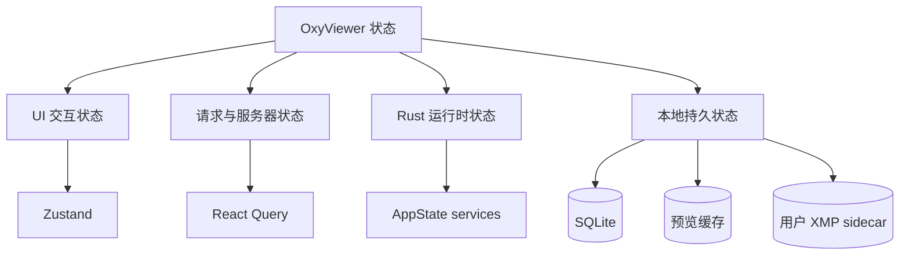
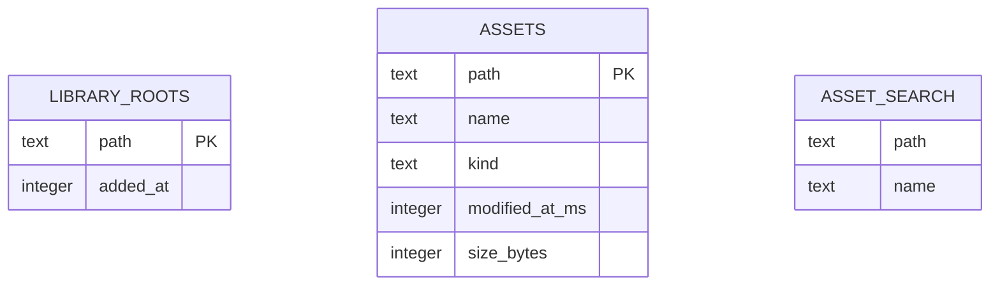
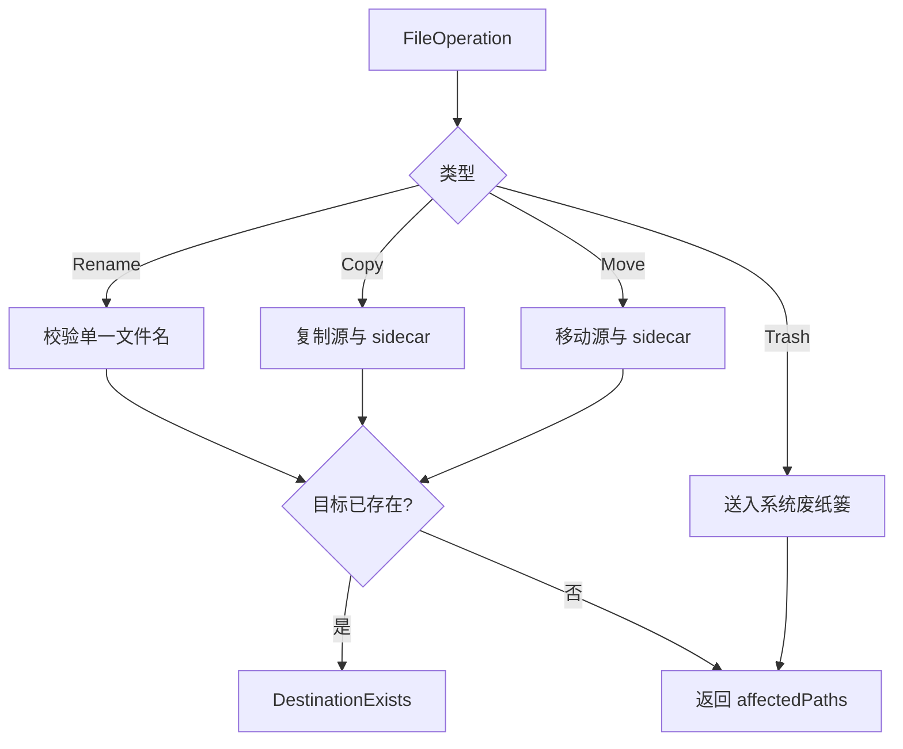

# 05：状态、数据与安全边界

本章说明 OxyViewer 的状态存在哪里、哪些数据可重建、哪些写操作会影响用户文件，以及当前
安全边界的真实范围。

## 1. 四类状态

把这四类混在一个 store 中会造成生命周期不清：例如清除 React Query 不应删除用户 XMP，
切换视图也不应重建 SQLite 连接。

## 2. Zustand：同步 UI 意图

`useWorkspaceStore` 保存：

- grid/list/loupe 视图与网格偏好；
- selected IDs 和 active ID；
- 左侧栏、Inspector、Settings、Navigator 的开关；
- locale 和硬件加速偏好；
- 搜索、类型过滤、排序和方向。

这些值由用户交互立即修改，主要决定“界面想显示什么”。它们不代表磁盘事实，也不保存预览
Promise。当前 store 没有持久化 middleware，应用重启后恢复默认值。

选择模型中，普通选择把数组替换为单个 ID；按 meta/ctrl 的 additive 选择切换成员，并把操作
对象设为 active。打开新目录时调用 `clearSelection`，避免旧 ID 指向新 session。

## 3. React Query：异步结果生命周期

React Query 保存通过 Tauri 或 demo API 得到的数据：

- assets 的多页结果；
- library roots；
- asset details；
- 各 stage preview result。

query key 是缓存身份的一部分。典型 key 包含 asset ID、修改时间、size/stage 和 priority。
修改时间变化会让旧预览 query 不再匹配；priority 变化允许建立高优先级请求。

React Query 管理 loading/error/retry/cache/abort lifecycle，但它不是 Rust 缓存的替代品。刷新
目录时要同时让 Rust snapshot 和相关 React Query 失效，否则任一层都可能继续返回旧数据。

## 4. Rust `AppState`：共享服务状态

`AppState` 在 Tauri setup 中创建一次。它持有：

- `FsCatalog` 的 folder sessions 与内存目录快照；
- `JobRegistry` 的作业取消 flags；
- `Library` 的 SQLite connection；
- `CacheManager`（当前 preview cache directory、容量策略和配置文件）；
- `HeifDecodeService` 当前 session、tiles 和 diagnostics。

这些状态只活在 Rust 进程内，除了明确写入 SQLite/文件的部分。关闭应用后 sessions、jobs、
目录快照和 HEIF tiles 全部消失。

## 5. SQLite 资料库

`oxy-library::Library::open` 在 app data 目录创建 `oxyviewer.sqlite`，启用 WAL，并确保三张逻辑
结构存在：

Mermaid 图没有画关系线，因为当前 schema 没有外键，也没有代码维护 `assets` 与 FTS 表的同步
关系。当前已完整使用的是 `library_roots`：只有用户明确添加的 canonical path 才持久化。
`assets` 和 `asset_search` 为后续可重建索引打基础，完整索引流程尚未落地。

SQLite connection 放在 `Mutex` 内，因为 `rusqlite::Connection` 的访问需要串行化。WAL 改善
读写并存和崩溃恢复，但不会自动使单个 connection 并发执行。

## 6. 预览缓存

preview cache 默认位于 Tauri `app_cache_dir()/previews`。用户可以在设置中选择一个父目录；
自定义缓存总是落到该目录下的 `OxyViewer Cache/previews`，不会把用户选择的目录本身当成可清空
空间。缓存设置持久化在 app data 下的 `cache-settings.json`。它满足：

- 删除不会损坏源照片；
- 下次请求可重新生成；
- key 包含源文件身份和 decoder version；
- 先写临时文件再原子持久化；
- 同 backend tag 的 4096 stage 可以满足 512 请求；HEIF 另有 full-cache 复用路径。
- 容量上限为 1–500 GB，默认 10 GB；预览返回后在后台按最近使用时间清理最旧文件，同一时刻
  最多运行一个清理任务；
- 当前请求返回的 artifact 在当次清理中受保护，避免 WebView 首次读取与清理竞争；
- “清空缓存”只删除专属 `previews` 目录第一层的普通文件，不递归跟随任意用户路径。

切换缓存位置只影响后续请求，不自动搬迁或删除旧位置中的缓存。这样切换是快速且可恢复的，
同时不会把目录迁移 I/O 放进照片浏览关键路径。旧位置可由用户切回后显式清空。

## 7. XMP sidecar：用户数据，不是缓存

`oxy-metadata` 对所有格式的 rating/color 默认读写同名 XMP sidecar；更新时只替换
`rdf:Description` 上对应的 `xmp:Rating` / `xmp:Label` 属性，保留其他 XMP 字段。首次写入时
创建最小 Adobe 风格 XMP。读取优先级为 sidecar、ExifTool 读取的内嵌 XMP、空值，因此存在
sidecar 时它明确覆盖文件内部的旧值，且不启动 ExifTool。

Sony HIF 需要额外遵循 Imaging Edge Viewer 的写法：XMP 使用 compact shorthand，颜色值为
小写 `red` / `yellow` / `green` / `blue`，清除值写作 `Rating=0` / `Label=None`。Sony Viewer
没有紫色标签，因此 HIF 检查器只提供上述四种颜色；其他格式仍使用通用 Adobe 标签语义。

sidecar 是持久用户数据，与 preview cache 不同，不能随意删除。只有用户主动选择“同步到
文件内部”时才会写 JPEG/HEIF/HIF 容器，并按用户路径、应用数据目录中的版本化能力包、
`OXY_EXIFTOOL_PATH`、`PATH` 顺序查找 ExifTool。能力缺失时才提示直接下载经过 SHA-256 校验
的固定版本官方包，或指定并验证已有执行文件。核心安装包不捆绑 worker；体积、发现顺序及
下载安全边界见
[`ADR 0007`](../adr/0007-optional-exiftool-capability.md)。

`patch_metadata` 在 blocking worker 中把多选编辑写入各自 sidecar；独立的
`sync_metadata_to_embedded` 才调用 ExifTool。完成后使对应目录摘要缓存失效，并刷新
详情与列表查询。普通目录打开仍先使用廉价分页，首屏返回后再异步批量补全已加载分页的
rating/color；只有启用 rating/color 筛选时才批量读取整个当前目录的元数据，然后进行过滤和分页。

## 8. 文件操作

`FileOperation` 是 tagged enum：Rename、Copy、Move、Trash。实际操作集中在 `oxy-fs`：

- rename 只接受单个 normal filename component，拒绝空值和路径穿越式名称；
- 目标存在时拒绝覆盖；
- copy/move 同步处理 XMP sidecar；
- trash 使用系统废纸篓，并同时处理 sidecar；
- 返回所有受影响路径。

### 8.1 必须知道的当前限制

浏览 command 会验证路径位于 `FolderSession` 根目录内；`execute_file_operation` 当前没有接收
session ID，也没有对 source/destination 做同样的 root containment 校验。它依赖调用方提供
明确路径和平台 capability 策略。

因此应准确表述为“文件操作集中到 `oxy-fs`，并具备名称、覆盖、sidecar 和 trash 安全语义”，
而不是“所有写操作都被 folder session 沙箱限制”。如果未来开放更广泛 UI 写操作，应考虑把
session/root policy 显式加入 command 契约并增加符号链接测试。

## 9. 作业注册与取消

`oxy-runtime::JobRegistry` 为作业生成 `job-N`，保存 `Arc<AtomicBool>`，返回含 priority 的
`JobTicket`。`cancel(id)` 设置 flag；worker 必须主动调用 `ticket.is_cancelled()` 才会提前退出；
`finish(id)` 从 registry 删除。

这是“取消词汇”，不是线程池或完整 scheduler。当前统一预览使用自己的 queue/gate，HEIF 使用
自己的 session flag，metadata 使用 JobRegistry。长期方向应统一可观察性，但不能假设已有一个
全局 worker runtime 在自动执行和抢占所有任务。

## 10. 事实来源与恢复策略

| 数据 | 事实来源? | 可自动删除重建? | 典型恢复 |
| --- | --- | --- | --- |
| 原始照片 | 是 | 否 | 用户备份 |
| XMP sidecar | 是 | 否 | 用户备份 |
| 显式 library root | 用户配置 | 不应无故删除 | SQLite/配置恢复 |
| SQLite asset rows | 否 | 是 | 重新索引 |
| 生成预览文件 | 否 | 是 | 重新解码 |
| React Query cache | 否 | 是 | 重新 invoke |
| Rust directory snapshot | 否 | 是 | 重新 `read_dir` |
| HEIF tiles | 否 | 是 | 重启 session |

## 11. 本章检查点

- 搜索文本为什么属于 Zustand，而搜索结果属于 React Query？
- 删除 preview cache 会丢失什么，删除 XMP 又会丢失什么？
- SQLite 中已有 `assets` 表是否等于后台索引已经完成？
- `cancel_job` 为什么必须有 worker 主动检查才能生效？
- 当前文件写操作是否受 FolderSession root 限制？
- 为什么 sidecar 的 rename/copy/trash 必须与源照片一起设计？

下一章：[06：扩展、调试与验证](06-extension-guide.md)。
