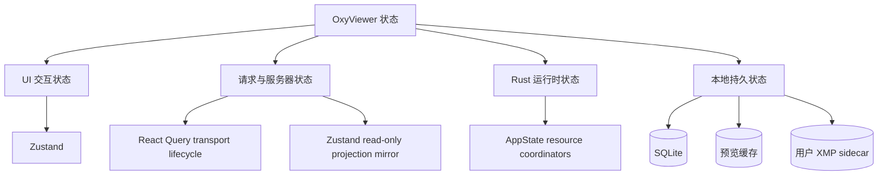
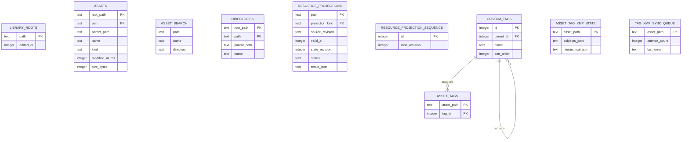
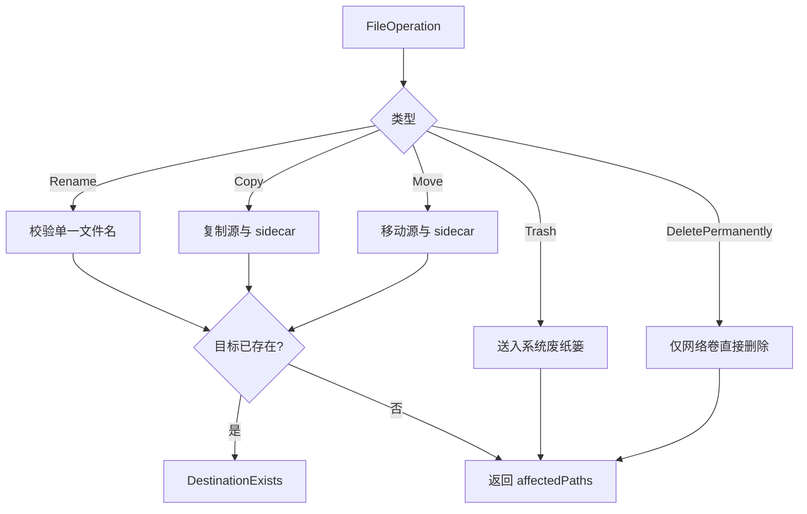

# 05：状态、数据与安全边界

本章说明 OxyViewer 的状态存在哪里、哪些数据可重建、哪些写操作会影响用户文件，以及当前
安全边界的真实范围。

## 1. 四类状态


```mermaid
flowchart TD
    app["OxyViewer 状态"] --> uiState["UI 交互状态"]
    app --> requestState["请求与服务器状态"]
    app --> runtimeState["Rust 运行时状态"]
    app --> persistentState["本地持久状态"]

    uiState --> zustand["Zustand"]
    requestState --> reactQuery["React Query transport lifecycle"]
    requestState --> projectionMirror["Zustand read-only projection mirror"]
    runtimeState --> appState["AppState resource coordinators"]
    persistentState --> sqlite[("SQLite")]
    persistentState --> previews[("预览缓存")]
    persistentState --> xmp[("用户 XMP sidecar")]
```

把这四类混在一个 store 中会造成生命周期不清：例如清除 React Query 不应删除用户 XMP，
切换视图也不应重建 SQLite 连接。

## 2. Zustand：同步 UI 意图

`useWorkspaceStore` 保存：

- grid/loupe 视图与网格偏好；
- selected IDs 和 active ID；
- 左侧栏、Inspector、Settings、Navigator 的开关；
- locale 和显示锐化偏好；
- 搜索、类型过滤、排序和方向。

这些值由用户交互立即修改，主要决定“界面想显示什么”。它们不代表磁盘事实，也不保存预览
Promise。store 没有通用持久化 middleware；`workspacePersistence.ts` 只显式保存当前根目录/
子目录、文件夹排序，以及焦点框、面板尺寸、元数据可见性和 loupe 控件等少量偏好。其他值重启后
恢复默认值。

选择模型中，普通选择把数组替换为单个 ID；按 meta/ctrl 的 additive 选择切换成员，并把操作
对象设为 active。打开新目录时调用 `clearSelection`，避免旧 ID 指向新 session。

## 3. React Query：异步结果生命周期

React Query 保存通过 Tauri 或 demo API 得到的数据：

- assets 的多页结果；
- 普通目录子节点和按名称命中的目录搜索结果；
- library roots；
- asset details transport；
- 各 stage preview request 的 loading/error 生命周期。

query key 是请求身份的一部分。典型 key 包含 asset ID、修改时间和 semantic render level；
priority 是可提升的调度提示，不是 artifact 身份。

React Query 管理 loading/error/retry/abort lifecycle，但不决定 metadata/image artifact 哪个
版本有效。`metadataProjection` 和 `imageProjection` Zustand store 只镜像 Rust 已接受的递增
`stateRevision`；grid、loupe、inspector 和过滤从这份镜像派生显示。刷新目录时同时使
Rust projection 与前端显示镜像失效。

## 4. Rust `AppState`：共享服务状态

`AppState` 在 Tauri setup 中创建一次。它持有：

- `FsCatalog` 的 folder sessions 与内存目录快照；
- `JobRegistry` 的作业取消 flags；
- `Library` 持有的 `oxy_store::Store`——SQLite 写连接、浏览读取连接和资源缓存读取连接；
- `Tags`——同一个 `Store` 上的标签词汇、赋值与 XMP 镜像，与 `Library` 平级而非其方法；
- `CacheManager`（当前 preview cache directory、容量策略和配置文件）；
- `MetadataQueue` / `PreviewQueue` 的 priority、pending/in-flight consumer 与 live projection；
- `DirectoryTreeQueue` 的分层目录读取优先级；
- `HeifDecodeService` 当前 session、tiles 和 diagnostics；
- `ResourceRegistry` 的受控、进程命名空间资源和 UI/read lease。

队列、resource ID 和 HEIF tiles 只活在 Rust 进程内。已接受的 metadata/image projection 写入 SQLite，
但 image result 序列化前会剥离 resource descriptor，Pending/Skipped 且没有稳定文件的结果不持久化。
重启后只有有效 managed/original path 可恢复，并须重新注册当前进程 resource；旧 URL 永远不会因为
计数器复用指向另一张图。
图片 result JSON 若因结构变化或损坏无法解析，按缓存未命中重新生成；保留原 projection 的
`valid_at` / `state_revision`，继续阻止过期请求覆盖较新的状态，而不让坏缓存阻断加载或写回。

## 5. SQLite 资料库

磁盘资料库使用一个共享写连接和两个只读 WAL 连接：文件列表、目录搜索及标签查询走浏览
连接，metadata/image projection 查询走缓存连接。读取不获取写连接的互斥锁；列表与目录
查询的完成标记、计数和结果在同一个只读事务快照中读取。内存测试库保留单连接行为。

目录与资产索引写入每批最多 256 条，并在记录之间检查 8 ms 软时间片，达到后提前提交。
提交后公平释放写锁，让已有等待者先执行；所有写入继续共享同一连接，保留资源 revision
的事务顺序。单条 SQL、磁盘提交与 WAL checkpoint 无法中途抢占，完成 generation 时的
旧行清理仍是原子事务。预览与元数据入队阶段仍有持队列锁进行 projection 写入的路径，
这些写入受益于批次交接，但尚未与队列锁完全解耦。

存储机制与数据含义分属两个 crate。`oxy-store` 拥有 `oxyviewer.sqlite` 本身——连接、WAL 只读读
连接、事务、表声明宏、每一句 `CREATE TABLE`、每一句语句（`repo`，一个函数一句 SQL），以及把旧
文件升级到当前格式的迁移。它不知道照片、标签或人物的*规则*，但知道每一行数据属于哪一类。这些行
*意味着什么*由三个互不依赖的领域 crate 分担——`oxy-library`、`oxy-tags`、`oxy-people`——它们各自
持有同一个 `oxy_store::Store`，磁盘上仍是同一个 `oxyviewer.sqlite`。分类跨越领域：人的姓名是
`user`，从他的照片算出来的特征向量是 `cache`，而这两张表现在同属 `oxy-people`：

| 类别 | 含义 | 谁能删 |
| --- | --- | --- |
| `cache` | 由照片或用户数据推导出的状态：`indexed_*`、FTS、`resource_projections`、`directory_snapshots`、人物检测/特征缓存、`person_analysis_*` | 缓存清空直接清掉 |
| `user` | 用户输入的事实：`library_roots`、标签树与资产标签、人物身份与审阅、历史关联、人物↔标签映射、`person_request_results` 幂等账本 | 只由显式、经过确认的用户操作删除 |
| `marker` | 分配器与缓存格式版本：`*_sequence`、`*_cache_meta` | 任何清空都不动 |

**删除跟随所有权，而不是跟随一份名单。** 每张表在 `oxy-store/src/schema` 里声明一次，类别直接写在
声明里：

```rust
// oxy-store/src/schema/cache.rs
oxy_store::table::tables! {
    cache  create   indexed_assets =
        "root_path TEXT NOT NULL, path TEXT NOT NULL, PRIMARY KEY(root_path, path)";
    marker create   library_index_sequence =
        "id INTEGER PRIMARY KEY CHECK(id = 1), next_scan_id INTEGER NOT NULL";
    cache  external indexed_asset_search;
}
```

第一个词是类别，第二个词说明这张表由谁创建：`create` 产出 `CREATE TABLE`，`external` 只登记一张由
别处创建的表（FTS5 虚表、需要独立事务回填的 `asset_tag_sources`、`indexed_asset_search_keys`），
但仍参与清空。

一份声明同时产出三样东西：`CREATE TABLE`、这张表所属的清单、以及清空它的 `DELETE`。新增一张表
不可能「建了但没清」，因为清空读的就是建表用的那份声明。

类别是声明里的一个词，而不是从「声明写在哪个目录」推导出来的——现在一个 schema 文件里同时声明
三种类别：某个人的姓名是 `user`，从他的照片算出来的特征向量是 `cache`，两者相隔几行。

声明顺序即创建顺序；**清空按声明的逆序执行**，因此引用别人的表总是先被清空，外键不会中途悬空
（`person_features_cache` → `person_feature_spaces`、`person_analysis_tasks` → `_runs`）。用户表
整体先于缓存表创建，所以一次缓存迁移永远不会是第一个定义用户存储的东西。

`oxy-store::schema` 里没有注册表：分类只是读取每份声明自己的字段，这个模块负责审计与测试：

- 测试枚举 `sqlite_master`，断言每张表都被声明过，新增表不会被默认当成可清理缓存；
- `clear_rebuildable_cache()` 之后，断言每张可清空表已清空、每张 `user` 表行数不变，因此把某张表
  声明成 `cache` 却没在 schema 里清它，测试同样会失败；
- 序列表（`*_sequence`）和缓存格式标记（`*_cache_meta`）声明为 `marker`，清理时保留，否则清空前
  启动的 worker 可能用旧的更高 revision 覆盖新结果，或让一份仍然有效的缓存被无谓重建。

**结果行一律按列名取值。** `row.get("path")` 而不是 `row.get(0)`：后者依赖 `SELECT` 列表的顺序，
调整字段顺序会静默错位且编译器不会报警。少数表达式本身没有列名（`COUNT(*)`、`EXISTS(...)`、
`COALESCE(...)`、标量子查询），这些查询必须显式写 `AS` 别名——`row_person` 依赖的两个标量子查询
就是因此加上了 `AS reference_instance_id` / `AS pending_count`。

因为类别就是声明里的一个词，把一张用户表标成可缓存清空的唯一办法是改那个词——而那样做会立刻触发
「该表在清空后仍有行」的失败。不存在一个可以填错的字段。

命名空间之间允许**读**、禁止**写**。`cache` 会查询 `library_roots` 判断根是否已注册，但删除索引行
必须走 `cache::index::forget_root`；标签域在移动或删除照片时清理人物缓存，走的是
`oxy_store::repo::cross::{relocate_asset, forget_asset}`，而不是自己写 SQL。`oxy-library/src/audit.rs`
里有一个源码级测试扫描 `src/cache` 与 `src/user`，任何跨命名空间的写 SQL 都会让测试失败，这样跨界
删除在 review 里是一次命名函数调用，而不是藏在 SQL 字符串里。标签与人物两个领域已经各自独立成
crate，这条审计在那里由编译器接手：拿不到另一方的表，就写不出它的 SQL；`oxy-library` 里残余的这
一对测试现在只守护「收藏夹」与「浏览/索引/投影」之间那条边界，等缓存命名空间也搬走（阶段 E）即可
删除。缓存迁移（`person_instances_cache`、`person_features_cache` 的 schema 版本）只 DROP 自己的
缓存表与 meta，人工资料不受影响。

**语句的归属是 `oxy-store/src/repo`，按表分模块而不是按调用顺序。** 一个仓库函数拥有一个查询，接收
连接——或者接收 `Transaction`，因为 `Transaction` 会解引用成 `Connection`——返回 `oxy-domain` 类型，
或者返回一个紧挨着查询声明的小行结构（`InstanceRecord`、`NewInstance`、`NewDetection`、
`FeatureQuery`）。仓库函数**不开启事务**，也不做任何判断：「这四下写是一个原子动作」「同一文件夹内
的移动保留人物来源」「改过的框需要重新审阅」都是规则，留在拥有该领域的 crate 里；仓库只知道语句本身。
`asset_tags` 只有一个语句会从 `asset_tag_sources` 派生（`reconcile_effective`），来源增删不再可能让
派生集合漂移。人物派生缓存的 35 句语句（34 个仓库函数，含 `RUN_COLUMNS` 这类拼接的列清单）集中在
`repo/person_cache.rs`，紧挨着 `repo/people.rs` 而不是
`repo/library.rs`：它们行里的每一张表都只属于人物，把它们按「缓存」二字归到 library 会让模块归属与
表归属开始分家。`oxy-people/src/audit.rs` 的第二个源码级测试断言这个 crate 的**生产代码**不出现任何
SQL 动词；`oxy-library` 里同名的测试仍覆盖 `src/user`，而缓存域的语句（`src/cache/index.rs` 的分页、
FTS、递归目录、向量检索）仍在原处，属于后续阶段。

**标签与人物各自是独立的 crate。** `oxy-tags` 拥有词汇、层级不变量、赋值来源与 XMP 镜像；`oxy-people`
拥有身份、审阅、历史、参考、身份↔标签投影决策，以及检测/特征/分析运行的可重建缓存。它们和
`oxy-library` 一样只持有同一个 `oxy_store::Store`：

```text
apps/desktop（组合根）
  └─ Store::open 一次，交给 Library::with_store / Tags::new / People::new
       ├─ oxy-library  收藏夹，浏览/索引/投影缓存
       ├─ oxy-tags     标签词汇、赋值、XMP 镜像
       └─ oxy-people   人物身份、审阅、历史，以及检测/特征/分析缓存
```

三者互不依赖，因此「标签不能命名人物」和「人物不能命名标签」都从约定变成了编译错误。人物域操作标签行
只有一处：文件移动或删除时，`oxy-people` 调 `repo::cross::relocate_asset` / `forget_asset`——这是
**跨领域的动作**，语句住在 `repo/cross.rs`，而「同一文件夹内的移动保留人物来源」这条规则由
`same_folder` 参数表达。`oxy-tags/src/audit.rs` 与 `oxy-people/src/audit.rs` 各断言两件事：这个 crate
不依赖 `rusqlite`（事务用 `oxy_store::{Connection, Transaction}`，唯一约束被拒时问
`StoreError::is_constraint_violation()`），以及它自己不含任何 SQL。人物↔标签的桥接（一个身份推给照片
的那一个标签、以及每张照片的例外）现在在 `oxy-people/src/identity.rs`，因为那是人物策略；它经由仓库
语句读标签侧，而不是调用 `oxy-tags`。

`oxy-tags` 的测试有一条 `[dev-dependencies]` 边指向 `oxy-people`：那两个跨领域用例必须驱动真实的身份
策略（建人物、建实例、审阅、绑定标签），才能证明身份的主张会落成 `person` 标签来源。生产依赖没有这条
边，边界仍然由编译器守着。

跨领域的少数函数（人物身份推标签：读 `person_*` 的决定，写 `asset_tag_sources` 与 `asset_tags`）放在
`repo/cross.rs`，因为任何领域 crate 都不能拥有它而不依赖同级 crate。

`oxy-store::Store::open` 在 app data 目录创建 `oxyviewer.sqlite`、启用 WAL、注册向量扩展，然后运行
schema 步骤（先是用户表，再是缓存表）；应用层打开一次 `Store`，用 `Library::with_store(store.clone())`、
`oxy_tags::Tags::new(store.clone())` 和 `oxy_people::People::new(store)` 各自组装一个领域句柄，因此没有
任何一个领域 crate 包住另一个。确保以下逻辑结构存在：


```mermaid
erDiagram
    LIBRARY_ROOTS {
        text path PK
        integer added_at
    }
    ASSETS {
        text root_path PK
        text path PK
        text parent_path
        text name
        text kind
        integer modified_at_ms
        integer size_bytes
    }
    ASSET_SEARCH {
        text path
        text name
        text directory
    }
    DIRECTORIES {
        text root_path PK
        text path PK
        text parent_path
        text name
    }
    RESOURCE_PROJECTIONS {
        text path PK
        text projection_kind PK
        text source_revision
        integer valid_at
        integer state_revision
        text status
        text result_json
    }
    RESOURCE_PROJECTION_SEQUENCE {
        integer id PK
        integer next_revision
    }
    CUSTOM_TAGS {
        integer id PK
        integer parent_id FK
        text name
        integer sort_order
    }
    ASSET_TAGS {
        text asset_path PK
        integer tag_id PK
    }
    ASSET_TAG_XMP_STATE {
        text asset_path PK
        text subjects_json
        text hierarchical_json
    }
    TAG_XMP_SYNC_QUEUE {
        text asset_path PK
        integer attempt_count
        text last_error
    }
    CUSTOM_TAGS ||--o{ CUSTOM_TAGS : contains
    CUSTOM_TAGS ||--o{ ASSET_TAGS : assigned
```

Mermaid 图只画用户标签关系；可重建 cache schema 不用外键约束事实来源。只有用户明确添加的 canonical
root 才会持久化和索引；同一路径可分别属于父、子两个显式 root，因此文件与目录以
`(root_path, path)` 为复合身份。后台先使用目录优先队列记录完整目录树，目录深度越小（层次越高）权重越大，同层按稳定入队顺序处理；目录阶段结束后清理旧目录并发布独立完成标记，使目录搜索立即可用，然后才逐目录扫描并记录文件。SQLite 写入复用 prepared statement，并将单层目录切成最多 256 项的短事务；未变化资产只推进 generation，新增、修改和删除资产同步增量更新 `indexed_asset_search`。完整资源 generation 结束时仅清理旧行，不再重建整个 FTS。普通目录分页、目录树和跨子目录
图片名称搜索优先读取该缓存；侧栏目录名称搜索只读取已完成的目录索引，并由每个命中项携带必要的
祖先摘要供前端合并成结果树。首次索引未完成或 metadata-aware 图片过滤时回退 `oxy-fs`，但
目录搜索不会触发递归磁盘回退。

SQLite connection 放在 `Mutex` 内，因为 `rusqlite::Connection` 的访问需要串行化。WAL 改善
读写并存和崩溃恢复，但不会自动使单个 connection 并发执行。资源请求和接受结果均在
`BEGIN IMMEDIATE` 事务中从同一序列取得 revision；另一个 connection 的旧 worker 结果会
得到当前较新的 row，而不会覆盖它。显式刷新写入 revision tombstone，阻止刷新前已开始的
任务把旧结果重新写回。

自定义标签是用户资料，不属于可重建索引。`custom_tags` 保存同级名称唯一的任意深度树，
`asset_tag_sources` 按手工、旧版迁移、sidecar 和已确认人物分别记账，`asset_tags` 以资产路径保存来源的有效并集（不会隐式分配祖先）。标签改名、移动、删除及资产标签
变更先事务提交数据库，再进入持久化 `tag_xmp_sync_queue`。写入成功后
`asset_tag_xmp_state` 记录 OxyViewer 管理的 `dc:subject` 与 `lr:hierarchicalSubject` 项，使后续同步
只替换受管值。相邻 XMP sidecar 的普通及层级关键词在详情读取时与 `asset_tags` 对账；存在待写队列
时暂停反向导入，防止旧 XML 恢复刚删除的数据库状态。图片内嵌关键词不进入数据库，和 sidecar
重叠时只显示一次，内嵌独有项作为灰色只读标签显示。失败不回滚数据库，可在目录重新打开或由
用户手动重试。

人物身份、逐实例审阅、历史关联与 tag 映射是用户资料；`person_feature_spaces`、
`person_features_cache` 是可重建缓存。sqlite-vec 0.1.9 在资料库的写连接和两个 WAL 读连接
建立前注册，同版探测失败只禁用向量查询，不应影响人工资料或普通浏览。特征空间用生产阶段
及其上游依赖指纹校验兼容性，每条向量保留完整管线指纹供追溯；查询先限定文件夹和特征空间，
对范围内所有向量计算 cosine 距离，再按完整的
当前文件夹源版本快照剔除过期结果并分页。缓存格式不兼容时只重建向量表，保留人工资料；
Windows x64 的显式 JPEG 后台任务已生产检测及特征；候选查询尚未接入 UI。

`person_analysis_heads` 为每个文件夹保存当前运行 generation；`person_analysis_runs` 和
`person_analysis_tasks` 保存显式、可取消的运行及分批任务状态。新运行在一个事务中推进
generation 并取消旧运行；领取任务须等同一资产的前置阶段完成。每次领取生成一次性令牌，
重启恢复重新排队时废弃旧令牌；迟到 worker 的提交和失败报告都被拒绝。特征与进度在一个事务中
提交，并再次校验 generation、任务键、领取令牌与 `oxy-fs` 最新源版本；失败阶段同时记账同资产
未开始的后继阶段。作业恢复尚未接入启动流程，不能把领取时的检查当作提交授权。

`oxy-people` 按 pipeline 依赖拓扑排序每图阶段，从 `oxy-fs` 新扫描的当前层资产快照中
观察完整源版本，以最多 256 条任务为一批登记。文件夹级聚类和检索阶段另行调度；
逐图登记不封存整次作业，避免在文件夹级阶段开始前误报完成。目录打开路径不执行扫描或
分析。枚举遇到错误或取消时不封存作业，由调用方决定取消或用新 generation 重试。

当前安装目录是 app data 下的 `person-models`。`oxy-people/src/environment/catalog.rs` 固定模型来源、
长度、摘要及独立的 WebFace12M 特征空间；`environment/ort.rs` 固定独立 ORT DirectML 包和 DLL 摘要。
环境准备、模型适配和作业分别归 `environment/`、`inference/`、`execution/`。
`execution/pipeline.rs` 用两个容量为 1 的通道并行推进准备、推理和保存；
`execution/persistence.rs` 先保存检测，再领取并保存同图编码任务，账本依赖和提交围栏保持不变。
WinML 仅在 `winml-backup` feature 中保留，主应用使用独立 DirectML。
Tauri 仅组合目录、人物域、模型适配器与 `oxy-media::AnalysisInputService`，
通过 `spawn_blocking` 启动下载／导入／分析。`PersonOperations` 在整个应用中保留一项
运行及轻量状态快照；前端每秒读取进度，取消以 operation ID 定位，worker 退出后才允许
下一项启动。该入口使用仅含人脸检测与编码的两阶段 manifest，显式封存逐图任务即可完成；
不宣称执行了完整管线中的聚类或检索。进程重启后保留已提交缓存，自动恢复尚未接入。

Loupe 获取带源版本的检测快照，用户点击采用时再次核对源版本和检测指纹，然后调用人物域
创建人工实例；检测缓存本身从不写人工身份或审阅决定。

`person_instances_cache` 只存模型派生的规范化框和检测证据；同阶段结果在受 generation、
领取令牌和源版本保护的事务中整体替换，人工 `person_manual_instances` 与审阅决定不受其写入。
新人工实例另存完整 `source_identity_revision`，旧记录保持空值并要求重新核对后才可能与
检测缓存对齐。对齐只输出唯一几何对应或待复核冲突，不能直接修改人工身份事实。

重启后的 metadata cache 采用两阶段恢复：先用 `AssetSummary` 已有的 size/mtime 逐项发布
SQLite ready snapshot，再在 Rust worker 中核验 sidecar/嵌入 XMP digest。完整 revision 不同
时，旧评级只在 loading 期间充当显示占位，核验结果会以新的事务 revision 同时更新 grid、
loupe、inspector 和过滤。

## 6. 预览缓存

preview cache 默认位于 Tauri `app_cache_dir()/previews`。用户可以在设置中选择一个父目录；
自定义缓存总是落到该目录下的 `OxyViewer Cache/previews`，不会把用户选择的目录本身当成可清空
空间。缓存设置持久化在 app data 下的 `cache-settings.json`。它满足：

- 删除不会损坏源照片；
- 下次请求可重新生成；
- source revision 包含 canonical path、文件身份、长度和高精度 mtime；variant 包含目标与呈现策略，独立 ArtifactFacts 保存真实来源、尺寸、覆盖与处理过程；
- `media-cache-v3/<prefix>/<source-revision>/manifest.json` 允许同图多能力 artifact 共存；
- matcher 只允许兼容高清向下满足，低清只能作为显式 Interim；
- encoded/staged resource 先供 UI，再由有界 worker 原子持久化；完成后更新 projection 并清理容量；
- 容量上限为 1–500 GB，默认 10 GB；同一时刻最多运行一个清理任务；
- registry lease 和跨进程 marker 保护活跃 artifact；clear 后旧资源可读但不再成为新 lookup 命中；
- clear/prune 只识别固定 owned layout、manifest/artifact extension 和 staging 目录，不跟随 symlink。

切换缓存位置只影响后续请求，不自动搬迁或删除旧位置中的缓存。这样切换是快速且可恢复的，
同时不会把目录迁移 I/O 放进照片浏览关键路径。旧位置可由用户切回后显式清空。

## 7. 元数据读取与 XMP sidecar

拍摄参数先读取跨厂商通用 EXIF，再经过两个独立维度归一化：`capture/format.rs` 处理
JPEG、HEIF、RAW、TIFF 等容器或编码字段，`capture/vendor/` 下的厂商模块处理各自
MakerNotes。厂商路由同时接收图片类型，因此同一厂商在 JPEG、HEIF 和 RAW 中采用不同私有
标签时可以局部处理。不得把 Sony、Canon、Nikon、Fujifilm 等厂商的同名私有标签和值表互相
复用；未知厂商只返回通用 EXIF。

### XMP sidecar：用户数据，不是缓存

`oxy-metadata` 对所有格式的 rating/color/flag 默认读写同名 XMP sidecar；更新时只替换
`rdf:Description` 上对应的 `xmp:Rating` / `xmp:Label` / `digiKam:PickLabel` 属性，保留其他
XMP 字段。旗标采用 digiKam 的 `0/1/2/3 = none/rejected/pending/accepted` 约定，并保持独立于
星级；读取标准 `xmp:Rating=-1` 时投影为 rejected 旗标。首次写入时创建最小 Adobe 风格 XMP。
读取优先级为 sidecar、原生解析的内嵌 XMP、空值，因此存在 sidecar
时它明确覆盖文件内部的旧值。普通图片/RAW 由 `oxy-metadata-parser` 在进程内解析；HEIF/HIF
优先通过 `libheif-rs` 的 item table 读取 XMP，只有 libheif 拒绝损坏或合成容器时才使用有界扫描。
批量兼容入口可在原生解析失败后调用已配置的 ExifTool，但正常详情读取不依赖它。

Sony HIF 需要额外遵循 Imaging Edge Viewer 的写法：XMP 使用 compact shorthand，五种界面
颜色写为小写 `red` / `yellow` / `green` / `blue` / `purple`，清除值写作
`Rating=0` / `Label=None`。检查器对所有格式提供同一套五色选择；sidecar 保持通用 Adobe
标签语义，显式同步进 Sony HIF 时再转换为 Viewer 使用的小写值。读取 HIF 内嵌 XMP 时对这
五种颜色不区分大小写并规范化为界面值；`Label=None` 明确表示无颜色，不能回退到容器解析
阶段的旧值。存在同名 sidecar 时，仍由 sidecar 的完整可编辑投影覆盖内嵌 XMP。

sidecar 是持久用户数据，与 preview cache 不同，不能随意删除。只有用户主动选择“同步到
文件内部”时才会写 JPEG/HEIF/HIF 容器，并按用户路径、应用数据目录中的版本化能力包、
`OXY_EXIFTOOL_PATH`、`PATH` 顺序查找 ExifTool。能力缺失时才提示直接下载经过 SHA-256 校验
的固定版本官方包，或指定并验证已有执行文件。核心安装包不捆绑 worker；体积、发现顺序及
下载安全边界见
[`ADR 0007`](../adr/0007-optional-exiftool-capability.md)。sidecar 更新统一先写入同目录唯一
临时文件，再以平台原子替换语义提交到目标路径；高频标记操作不逐次调用 `fsync`，避免在
SMB/NAS 上产生延迟或不支持错误。

`patch_metadata` 在 blocking worker 中把多选编辑写入各自 sidecar；独立的
`sync_metadata_to_embedded` 才调用 ExifTool。完成后使对应目录摘要缓存失效，并刷新
详情与列表查询。普通目录打开仍先使用廉价分页，首屏返回后再异步批量补全已加载分页的
rating/color/flag；只有启用 rating/color/flag 中任一筛选时才批量读取整个当前目录的元数据，然后进行过滤和分页。

## 8. 文件操作

`FileOperation` 是 tagged enum：Rename、Copy、Move、Trash、DeletePermanently。实际操作集中在 `oxy-fs`：

- rename 只接受单个 normal filename component，拒绝空值和路径穿越式名称；
- 目标存在时拒绝覆盖；
- copy/move 同步处理 XMP sidecar；
- trash 使用系统废纸篓，并同时处理 sidecar；
- Windows 上打开目录时使用卷类型识别 UNC 与映射的网络驱动器。网络卷的右键菜单明确显示
  “直接删除”，确认框提示不可恢复，再由 DeletePermanently 递归删除目录或删除文件及其 sidecar；
  本地卷仍只提供可恢复的 trash 操作；
- 返回所有受影响路径。


```mermaid
flowchart TD
    operation["FileOperation"] --> operationKind{类型}
    operationKind -->|Rename| validateName["校验单一文件名"]
    operationKind -->|Copy| transfer["复制源与 sidecar"]
    operationKind -->|Move| move["移动源与 sidecar"]
    operationKind -->|Trash| trash["送入系统废纸篓"]
    operationKind -->|DeletePermanently| permanent["仅网络卷直接删除"]
    validateName --> collision{目标已存在?}
    transfer --> collision
    move --> collision
    collision -->|是| reject["DestinationExists"]
    collision -->|否| affected["返回 affectedPaths"]
    trash --> affected
    permanent --> affected
```

### 8.1 必须知道的当前限制

浏览 command 会验证路径位于 `FolderSession` 根目录内；`execute_file_operation` 当前没有接收
session ID，也没有对 source/destination 做同样的 root containment 校验。它依赖调用方提供
明确路径和平台 capability 策略。

因此应准确表述为“文件操作集中到 `oxy-fs`，并具备名称、覆盖、sidecar 和 trash 安全语义”，
而不是“所有写操作都被 folder session 沙箱限制”。如果未来开放更广泛 UI 写操作，应考虑把
session/root policy 显式加入 command 契约并增加符号链接测试。

## 9. 作业注册与取消

`oxy-runtime::JobRegistry` 为作业生成 `job-N`，保存 `Arc<AtomicBool>`，返回含 priority 的
`JobTicket`。`cancel(id)` 设置 flag；worker 必须主动调用 `ticket.is_cancelled()` 才会提前退出；
`finish(id)` 从 registry 删除。

这是“取消词汇”，不是线程池或完整 scheduler。当前统一预览使用自己的 queue/gate，HEIF 使用
自己的 session flag，metadata 使用 JobRegistry。长期方向应统一可观察性，但不能假设已有一个
全局 worker runtime 在自动执行和抢占所有任务。

## 10. 事实来源与恢复策略

| 数据 | 事实来源? | 可自动删除重建? | 典型恢复 |
| --- | --- | --- | --- |
| 原始照片 | 是 | 否 | 用户备份 |
| XMP sidecar | 是 | 否 | 用户备份 |
| 显式 library root | 用户配置 | 不应无故删除 | SQLite/配置恢复 |
| 人物身份、审阅、历史关联、标签映射 | 用户资料 | 否（需显式确认） | 用户重新录入；目前无导出入口 |
| `person_request_results` 幂等账本 | 用户操作记录 | 否（删除会重放请求） | 无 |
| SQLite asset/directory/FTS rows | 否 | 是 | 后台重新索引显式根目录 |
| 生成预览文件 | 否 | 是 | 重新解码 |
| React Query cache | 否 | 是 | 重新 invoke |
| Rust directory snapshot | 否 | 是 | 重新 `read_dir` |
| HEIF tiles | 否 | 是 | 重启 session |

## 11. 本章检查点

- 搜索文本为什么属于 Zustand，而搜索结果属于 React Query？
- 删除 preview cache 会丢失什么，删除 XMP 又会丢失什么？
- 新增一张缓存表需要改几处？为什么把它声明为 `preserve` 会让测试失败？
- 为什么清空要按声明的逆序执行？把 `person_features_cache` 声明在 `person_feature_spaces`
  之前会发生什么？
- 为什么 `user` 模块不能直接写 `DELETE FROM indexed_assets`，而要走
  `cache::index::forget_root`？如果这个约束只有文档没有测试，最可能怎么被破坏？
- 把用户表误标成 `Rebuildable` 会怎样？现有测试能拦住吗？
- 为什么 `row.get(0)` 要改成 `row.get("列名")`？哪些查询还必须额外加 `AS` 别名？
- SQLite 中已有 `indexed_assets` 行是否等于某个 root 的完整 generation 已经完成？
- `cancel_job` 为什么必须有 worker 主动检查才能生效？
- 当前文件写操作是否受 FolderSession root 限制？
- 为什么 sidecar 的 rename/copy/trash 必须与源照片一起设计？

下一章：[06：扩展、调试与验证](06-extension-guide.md)。


## 顶部自定义标签筛选

Workspace 的 `tagIds` 和 `tagMatch` 是同步 UI 查询意图，不持久化；搜索组件独立持有
`#` 补全文字、焦点、候选项及会话最近使用。标签树复用 `custom-tags` 查询，改名/移动刷新
显示路径，成功刷新后删除已不存在的 ID。

`AssetQuery.tagIds` / `tagMatch` 在 `oxy-domain` 定义（camelCase，默认空集合 / `all`）。
有标签时绕过资料库 FTS，`oxy-library::filter_assets_by_tags` 对当前目录快照路径执行一次
递归 CTE 集合查询：每个选中标签扩展其后代，按明确分配命中，再按 `all` / `any` 合并。
筛选结果进入既有文件名/类型/评级/颜色/旗标排序分页逻辑。标签条件本身不要求元数据富化，
也不改变标签分配事实；Tauri 只在已有 blocking worker 中连接这些调用。

React Query 的完整 query key 包含标签 ID 与模式，旧请求不能覆盖新查询；同目录请求等待
或失败时保留最近成功结果并显示更新状态/错误。最近成功结果不跨目录展示。

### Folder person groups (2026-09-29)

`oxy-people::clusters` computes conservative complete-link suggestions from a completed,
current analysis run. The per-image ledger remains independent; the operation stays in
`clustering` until the folder snapshot is published. `person_cluster_snapshots` is declared
`cache` and stores the versioned folder result atomically. Publication checks the current
head and evidence again; all scanning, filesystem validation and vector scoring occur
outside database locks. Folder listing only reads an existing snapshot; sorting/paging
intersects cluster member paths and source summaries before building pages.

Explicit adoption belongs to `clusters/adoption`: a transaction performs conservative
manual-anchor alignment and inserts only missing pending reviews. It never overwrites
an existing review or silently confirms an identity. `person_cluster_adoptions` is a
`user` declaration linking an explicitly adopted member-set ID to a folder person;
current names are read from that person's user record. These links and all manual
instances/reviews survive clearing the derived snapshots. A changed member set does
not automatically inherit a name.


### App-wide identities and tuple review (2026-09-29)

The primary UI now uses `global_people` with folder projections, replacing the
session-identity/history confirmation ladder. `PersonTuple` has a stable instance
ID and optional face/body geometry; a photo may carry several independent tuples.
`global_person_reviews`, targets, explicit references, tag mappings, migration
mappings and idempotent events are user-owned. `global_person_suggestions` is
rebuildable and fenced by the current completed analysis head and pipeline.
Legacy tables and events remain intact; explicit history links determine identity
migration, never equal names. The old commands remain compatibility entry points.

`oxy-people/global_people` owns global migration, source/geometry correspondence,
revision checks, reference policy and atomic batch decisions. Anonymous complete-link
cores and selected-person retrieval share one operation and review projection.
Search skips the dense anonymous matrix and uses only explicitly confirmed
references. Source checks and computation run off the UI thread and outside write
transactions; publication rechecks references, catalog, head and evidence. The
cross-domain tag reconciler preserves manual/sidecar sources and existing suppressions.
See [People workflow](../PERSON_WORKFLOW.md) for the current UI and limitations.
