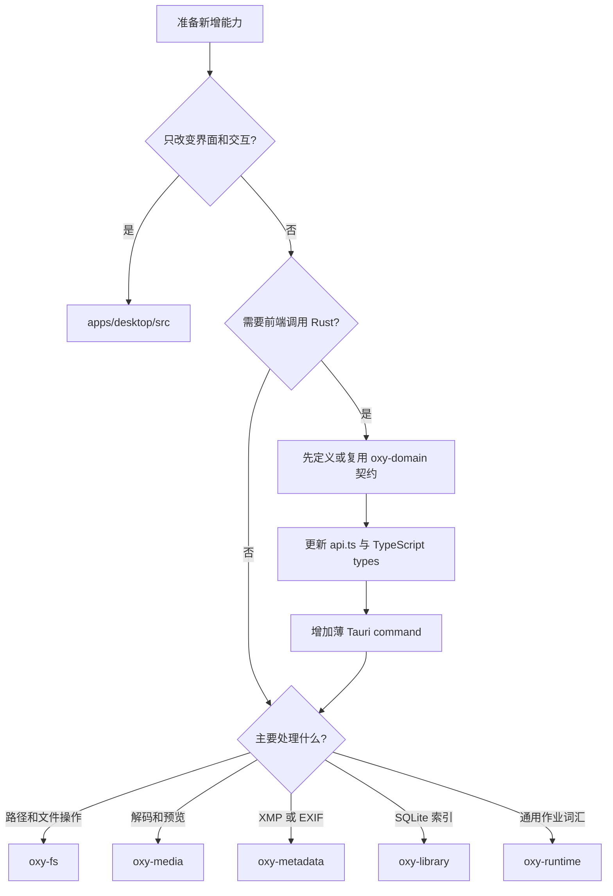
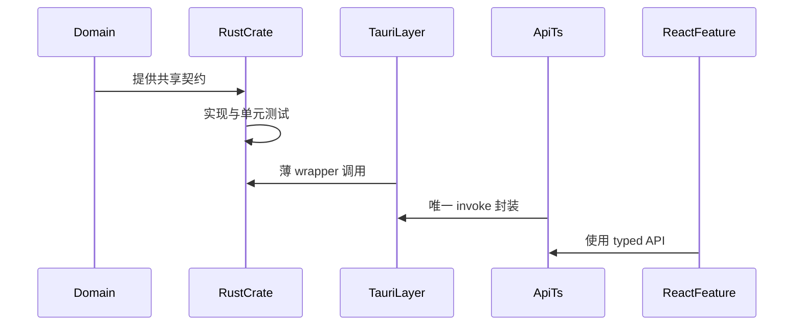
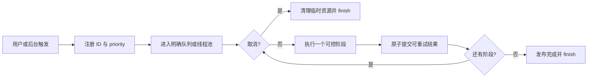

# 06：扩展、调试与验证

本章把架构约束变成可执行的开发步骤。开始前先判断改动属于 UI、IPC、文件、媒体、元数据、
资料库还是通用 runtime；模块归属比函数放在哪里更重要。

## 1. 变更决策树



如果 command 中开始出现可独立测试的循环、缓存、格式 fallback 或 SQL，把它下沉到对应 crate。

## 2. 新增 Tauri command

按以下顺序：

1. 在 `oxy-domain` 定义输入/输出，确认可 serde，字段使用 camelCase；
2. 在真正拥有行为的 crate 中实现和测试；
3. 在 `src-tauri/src/commands/` 对应职责模块增加 `#[tauri::command]` wrapper；
4. 阻塞 IO/CPU 工作使用 `spawn_blocking`；
5. 从 `commands.rs` 导出，并在 `src-tauri/src/lib.rs` 的 `generate_handler!` 注册 command；
6. 在 `apps/desktop/src/types.ts` 对齐类型；
7. 在 `apps/desktop/src/lib/api.ts` 增加唯一 invoke wrapper；
8. 若 browser demo 能合理模拟，补充 demo behavior；
9. 加前端调用测试和 Rust crate 测试；
10. 运行前后端检查。



不要在多个组件里散落裸 `invoke`，否则 command 重命名、参数修订和 demo 模式会难以维护。

## 3. 新增媒体格式

假设要支持一种需要 Rust 解码的新格式，至少检查以下位置：

### 3.1 发现与契约

- `oxy-domain::AssetKind` 增加枚举；
- TypeScript `AssetKind` 同步；
- `oxy-fs::kind_for_extension` 增加扩展名；
- `FORMAT_SUPPORT.md` 记录发现、缩略图、放大镜、元数据和平台成熟度。

### 3.2 预览策略

- 前端 `renderPlan` 为每个平台把三个语义等级映射到 renderer；
- 后端 `pipeline::planner::plan` 根据 `SourceFacts`、请求和后端能力生成包含解码器与尺寸的
  `DecodePlan`；
- `oxy_media::preview` 执行计划中的格式分支和 fallback；
- 为 decoder 定义 cache version；
- 确定 `thumbnail`、`preview`、`full` 各自的产物，必要时显式复用另一等级；
- 决定 full 是单一文件还是类似 HEIF 的 tile/session；
- 接入 `DecodeGate`，除非有充分理由使用独立 lane；
- 支持更高质量缓存复用时，保证 backend tag 一致。

### 3.3 二进制边界

永远不要把生成图字节塞进 `PreviewResult`。单一文件返回 path/URL；增量像素使用受控 protocol
或 cache boundary。新增协议必须定义身份、生命周期、Content-Type、错误和清理策略。

### 3.4 测试

- 最小真实 fixture 与损坏 fixture；
- 大小、方向、色彩和透明度；
- cold/warm cache；
- fallback 可用与不可用；
- visible 与 nearby 的顺序；
- 快速切图、取消和迟到结果；
- Windows/macOS/Linux capability 报告不夸大硬件能力。

## 4. 新增后台任务

先回答五个问题：

1. 谁触发它？
2. 用户离开页面后它还有价值吗？
3. 它与 loupe、visible thumbnail、index 的优先级是什么？
4. 哪些阶段能检查取消 flag？
5. 结果写到哪里，失败后能否安全重试？



仅创建 `JobTicket` 不会自动调度，也不会自动停止函数。worker 必须持有 ticket、检查 flag，
并确保成功和失败路径都调用 finish；可用 RAII guard 封装清理，避免 `?` 提前返回泄漏 registry。

## 5. 新增文件写操作

文件写入风险高于读操作。设计时至少覆盖：

- source/destination 的授权范围和 canonical path policy；
- 文件名是否允许路径分隔符或 `..`；
- 目标已存在时是拒绝、重命名还是明确覆盖；
- sidecar 和其他伴生文件如何处理；
- 跨文件系统 move 失败时是否 fallback 到 copy + delete；
- 多文件操作中途失败时如何报告部分成功；
- trash 是否可恢复；
- 成功后哪些 Rust snapshot 和 React Query 需要失效。

当前 `execute_file_operation` 没有 session root 参数。扩大写操作 UI 前，应优先让授权边界进入
契约，而不是依赖前端不传出界路径。

## 6. 错误设计

crate 内使用带上下文的 typed error，例如包含 path、backend 和 fallback failure。Tauri 层当前
转成字符串，但错误源仍应让开发日志可定位：

```text
差：decode failed
好：LibRaw preview failed for /path/file.nef; system fallback failed: ...
```

不要静默吞掉能改变结果完整性的错误。目录扫描目前会跳过单个无法读取的 `read_dir` entry，
这是为了尽量展示其余文件；涉及写入、缓存提交或安全校验时应显式失败。

## 7. 测试分层

| 层 | 重点 | 位置/工具 |
| --- | --- | --- |
| 纯 TypeScript | queue、stage、状态转换 | Vitest `*.test.ts(x)` |
| React 组件 | 渲染、交互、请求启用条件 | Vitest/Testing Library |
| Rust crate | 路径、分页、缓存键、decoder policy | 就近 `#[cfg(test)]` |
| Tauri 边界 | serde、command 参数、protocol | Rust tests + desktop smoke |
| 真实媒体 | 原生库兼容性和性能 | fixture/bench binaries |
| 跨平台 | native adapters、打包依赖 | CI + 真机验证 |

优先把行为下沉到 crate/纯函数，让大多数测试无需启动桌面窗口。原生 decoder 仍必须用真实
文件和 release build 验证，mock 无法证明 codec、颜色或性能正确。

## 8. 性能验证

先确定改动影响哪个预算：

- 文件夹首屏；
- warm loupe cache；
- cold selected preview；
- RAW full 独立耗时；
- 搜索/过滤帧时间；
- 滚动主线程 long task。

测量报告必须写明平台、release/debug、fixture、冷/热、阶段和统计量。只测 decoder 不含 cache
写入，或只测 Rust 不含浏览器绘制，都不能直接宣称满足端到端预算。

性能敏感改动还要观察：CPU 峰值、RSS、缓存写入量、队列等待时间和快速滚动后的废弃工作。

## 9. 文档与 ADR

以下变化需要更新文档：

- crate 或 IPC 边界变化：本架构文档；
- 新格式/backend/cache 格式：`FORMAT_SUPPORT.md` 和性能文档；
- 首屏、调度、缓存、颜色或取消语义：`PERFORMANCE.md`；
- 难以逆转且有明显取舍的决定：新增 ADR；
- 完成度变化：`ROADMAP.md`。

ADR 应写 Context、Decision、Consequences，明确负面取舍和替代方案，不要写成事后宣传稿。

## 10. 常用验证命令

前端改动：

```bash
pnpm check
pnpm test
pnpm build
```

Rust 改动：

```bash
cargo fmt --all --check
cargo clippy --workspace --all-targets -- -D warnings
cargo test --workspace
```

跨 IPC、Tauri 或共享契约的改动应执行两组。媒体性能还要运行相应 release benchmark，并与
`docs/PERFORMANCE.md` 的条件对齐。

## 11. Code review 清单

### 架构

- [ ] command 是否保持薄？
- [ ] 公共契约是否在 `oxy-domain`，TS 是否同步？
- [ ] 打开/浏览路径是否仍不递归、不解码？
- [ ] 图片字节是否避开 JSON IPC？

### 并发与生命周期

- [ ] 阻塞工作是否离开 async/UI thread？
- [ ] 锁保护什么、持有多久、是否可能形成锁顺序问题？
- [ ] priority 和取消是“pending drop”还是“运行中 cooperative cancel”？
- [ ] 迟到结果能否覆盖新选择？

### 数据安全

- [ ] 路径是否 canonicalize，并在授权根内？
- [ ] 是否避免无意覆盖？
- [ ] sidecar 是否和源文件保持一致？
- [ ] 临时文件和失败路径是否可恢复？
- [ ] 是否把用户数据误当成可重建缓存？

### 验证

- [ ] 有聚焦测试和失败用例？
- [ ] 跨平台 fallback 是否真实可用？
- [ ] 性能声明是否有同条件数据？
- [ ] roadmap、format、performance、ADR 是否需要同步？

## 12. 推荐的调试阅读顺序

遇到“缩略图不显示”：`Thumbnail.tsx → api.ts → get_preview → oxy_media::preview → decoder/cache`。

遇到“目录内容不更新”：`React query key/invalidation → refresh_directory → FsCatalog caches`。

遇到“HEIF 切图串图”：`HeifTileCanvas generation/session filter → events → HeifDecodeService active state`。

遇到“UI 卡顿”：先区分浏览器 long task、在途 invoke、Rust async thread 阻塞、decode gate 排队、
native decoder 和缓存写盘，再做针对性 profiling。

返回：[架构总览](../ARCHITECTURE.md) 或 [专题索引](README.md)。
